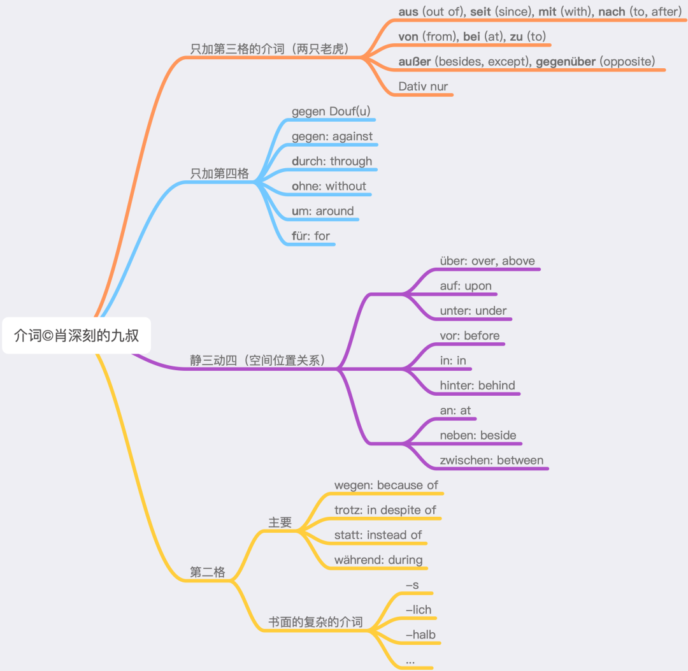

# 介词支配格

找出常见的加第三格的介词（9个），常见的只加第四格的介词（5），再列出静三动四的介词（9个），再加上最常见的第二格介词（4个），合计27个，就掌握了德语介词的90%以上（不是数量，而是知识点）。

### 支配第三格、第四格介词

只加第三格的9个介词用《两只老虎》的调唱一遍9个介词就能记住了。

只加第四格的5个介词用“找块豆腐撞死”（gegen Douf(u)）就能记住了，记不住得撞豆腐了。Douf的每个字母代表一个介词的首字母。

静三动四的9个介词主要和空间位置关系有关，分成3组，设想一个小球和盒子的关系是可以记住的。wo用第三格，wohin用第四格。并且这9个介词在不表示静三动四，而是在用法结构中的时候，几乎全部是加第四格的。

加第二格的介词，常见的是四个。其他的几乎全部是书面的甚至文雅的表达，使用频率低，可以慢慢学，并且很容易看出词根，好理解。

以上就是重点，其他就只有一点点边角料了，比如ab一般加第三格（其实很多时候没有冠词，看不出格），entlang在名词前一般用第二格，在名词后用第四格（可置于名词之前或之后,在名词后支配第四格或第三格,在名词前支配第三格, 偶尔也支配第二格）。

### 支配第二格介词

德语中加第二格的介词常用的只有4个：statt, trotz, wegen, während。对应的英语分别是instead of, in spite of, because of, during. 从英语的of也可以看出来，这是要加第二格（所有格）。

不常见的支配第二格的介词从构成特点可以分为5大类：介词加名词、名词、形容词和分词以及副词、-lich和-s。下文排列的时候考虑了字母顺序、来源、构成、近义和反义。

1、介词加名词构成的有：

anhand, anstatt, anstelle, aufgrund, infolge, aufseiten, vonseiten, mithilfe, um ... willen, zugunsten, zuungunsten, zulasten.

这种构成方式英语里也有，比如instead。有的甚至还能分开写，比如mit Hilfe。这样就更容易理解为什么加第二格了。

2、短语去掉其他成分或上面这种构词去掉了介词，只留下了名词：dank, kraft, zeit, statt, trotz, wegen。比如anstatt变成statt，意思仍一样。再比如dank，来自Dank sei ...。我们最熟悉的一个句子可能是Gott sei Dank，其中Gott是第三格，本义是“愿感谢归于上帝”。

3、介词加名词在语法上相当于形容词或副词，而分词也可以做形容词或副词，因此，形容词和分词以及副词也可以变成加第二格的介词：

während, bar, ... halber, -halb (innerhalb, außerhalb, oberhalb, unterhalb), binnen, inmitten, entlang, inklusive, exklusive, minus, plus, ob, unbeschadet, ungeachtet, unweit, unfern, vermöge.

其中während是第一分词，来自动词währen（持续），英语的during也是第一分词（现在分词），也是来自“持续”；-halb来自die Hälfte（一半），后来产生“边”的含义；inklusive是来自拉丁语的副词；entlang相当于英语along。

4、形容词和副词的一个词尾是-lich：

abzüglich, zuzüglich, bezüglich, hinsichtlich, anlässlich, einschließlich, ausschließlich, vorbehaltlich, seitlich, nörd/öst/süd/westlich.

其中abzüglich和zuzüglich是反义词，与第3部分的minus和plus相对应；einschließlich和ausschließlich是反义词，与第3部分的inklusive和exklusive相对应。

5、构成副词的一个方式是加-s：

abseits, beiderseits, jenseits, diesseits, seitens, längs, links, rechts, eingangs, anfangs, betreffs, angesichts, mangels, mittels, vermittels(t), namens, zwecks.

虽然都带Seite这个词根，但是从第4部分的seitlich，到第5部分的abseits, beiderseits, jenseits, diesseits，都是和空间相关，而seitens和第1部分的aufseiten以及vonseiten一样，指的是参与方。

总结：

加第二格的介词，常见的只有4个，不常见的根据来源和构成可以分为5类。加第二格的介词来自（带介词的）名词或副词（德语的形容词可以做副词，分词是形容词的性质，介词结构相当于形容词或副词）。

补充：

1、可以把von看做是第二格的一种替代形式，在零冠词的时候使用。

2、加第二格的介词标准用法是加第二格，一般也可以加第三格；加代词时则必须用第三格，比如wegen mir。