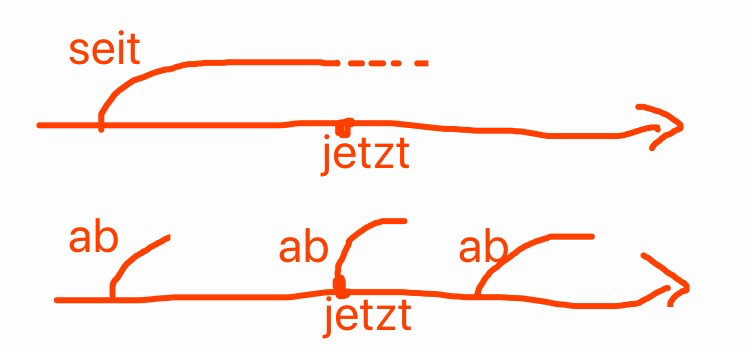
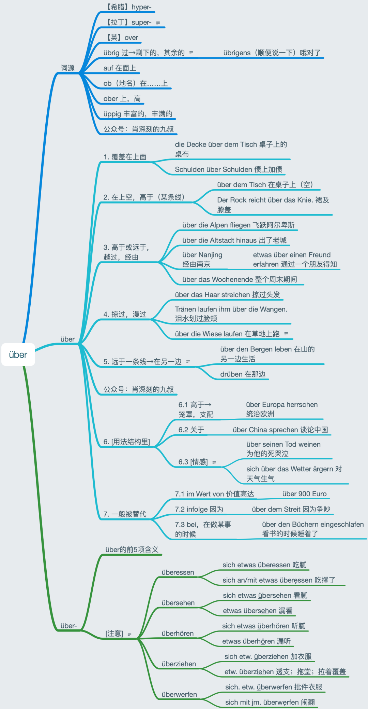
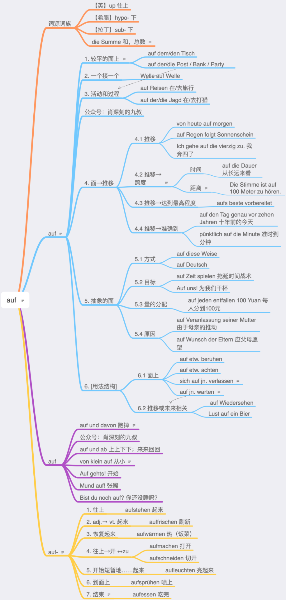
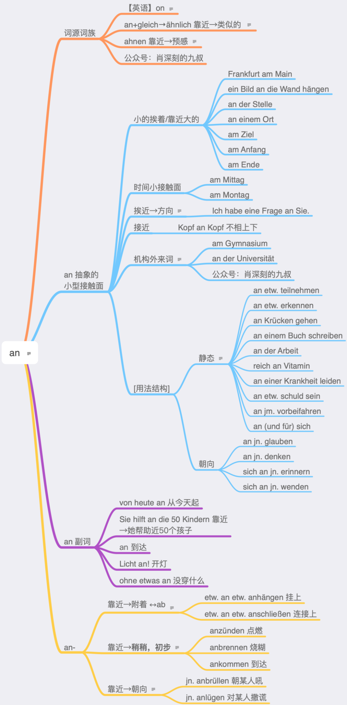
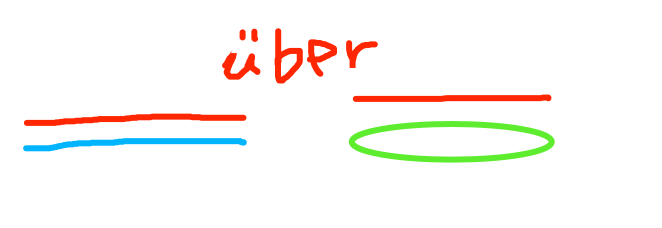
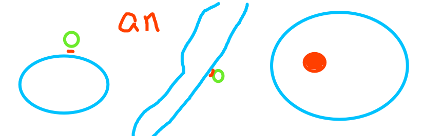
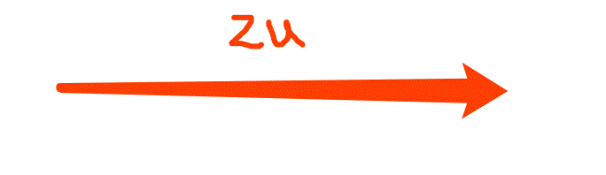
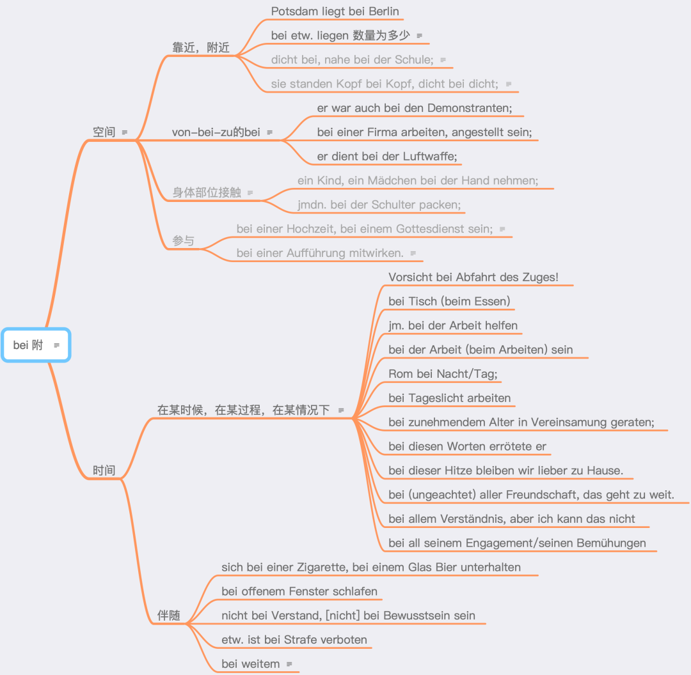

# 介词辨析

### ab

ab的深层含义是“脱离”，其他各项意思皆派生于此。英语的off和德语ab同源，意思也差不多。英语的of也是同源词：“脱离”意味着“来自，是其中一部分”。ab作为介词原则上加第三格，个别时候用第四格也可以（自己用一律用第三格就行），只有一项含义：时间和空间的“从……起”，比如ab morgen。

seit是从过去到现在，并且有可能继续下去，即英语的since；而ab只表示起点，不关心终点，并且起点不一定在过去，从随便哪个点都可以，即英语的from ... on。

ab作为副词从“脱离”分出两个含义：

离开：ab ins Bett 去睡觉。ab und zu/an 离开又过来→时不时。

脱离则往下：Hut ab! 脱帽（致意）→佩服！

ab作为副词可以看做是可分动词省略了动词。

ab-作为可分前缀，可以分为6个小项，但是都可以概括到“脱离”的意思下：

1. 脱离→离开：abfliegen 飞离。
2. 脱离→去除：einen Ast absägen 锯掉一个树枝。
3. 脱离→从表面去除：den Staub abwischen 抹掉灰尘。
4. 脱离→去掉某表面不要的东西：den Tisch abwischen 擦桌子。
5. 脱离→幻影出窍般离开表面：einen Text abschreiben 抄一篇文章。
6. 脱离→往下→关掉：das Fahrrad abstellen 停自行车；den Motor abstellen 关掉发动机。

### von

von的词源不明，可能与俄语介词по同源。ab表示“脱离”，后来ab的一些含义被von替代，形成了分工：ab感觉是动态的，von感觉静态的。也就是说，von表示“起点”，比如von hier aus。

德语von大部分含义都可以用英语的from或of来表达。这不奇怪，毕竟von替代了原始的ab的一些含义，而ab和of, off, from是同出一源的。

表示“来自”德语有两个介词，aus和von。有很多学习者容易混淆这两个词。有绝招可以区分清楚，那就是用词对。aus和in是一对，von - bei - zu是一组。所以，记住这句话就够了：“在某地方”用in的，“来自”用aus，否则用von。比如：in China - aus China, (bei Luxun) - von Luxun stammt dieses Zitat。

von的各项含义都来自“来自”：

ab和von一般没有人混淆。如果要辨析，比较它们介词的含义就够了，因为和ab不一样，von没有可分前缀的用法。ab是时间、次序和空间的“从……起”，比如ab morgen, ab dem 18. Lebensjahr, ab Frankfurt。那么可混淆的点只有“时间”和“空间”。von表示时间的时候会在成对的介词结构里，比如von Morgen bis Abend, von Jahr zu Jahr；von表示空间的时候要么是“来自”，比如von Frankfurt，要么是在成对的介词结构里，比如von mir aus（我（觉得）都行）, von Ast zu Ast。

刚才的例子虽然有von Frankfurt也有ab Frankfurt，但是ab Frankfurt这样的只会用在交通的缩写中，和abfahren或abfliegen等有关。

von是“来自”，ab是“发，出发”。“接-化-发”，全用介词表示就是：auf - um - ab。

之前我们说过ab这个介词的深层含义是“脱离”或“脱离而往下”。既然是脱离，那就有个起点，这个起点由von来引出，所以带ab-的介词会和von的介词结构相互配合，如果需要表示一个起点。比如：

etw. (von etw.) absägen 锯掉

jn. (von etw.) abberufen 召回

(jm.) (von etw.) abraten 建议不要如何

……

甚至sich (von jm.) verabschieden都是加von的。

有了这个认识，那区分“依赖”的两个词就容易了：

abhängig指挂在什么上垂下来，再转义为“依赖”，所以用法结构是von jm./etw. abhängig sein。

angewiesen的词根是weisen（指），而weisen/-weisen主要是加auf（从高往下指）的，所以这里的用法结构是auf jn./etw. angewiesen sein。指着，指望某人某物，就是“依赖”。

其他常见的介词相互配合还有：

auf ... auf- 例如：auf jn. aufpassen 照看

in ... ein- 例如：in etw. eintreten 加入

aus ... aus- 例如：aus etw. ausziehen 搬出

……

也就是说一般用同一个介词带一个结构。

稍难一点的是：

von ... ab- 

以及

auf ... zu- 例如：auf jn. zugehen 朝某人走过去

### aus

从下面的思维导图可以看出，aus的各项含义，无论是做介词还是做前缀，都可以高度统一到一个模糊的意象下。

### über

词源对über的理解还是很有帮助的。拉丁语的super好像有点格格不入，那是因为这是个复合词，s是ex的遗留。

über的前五项含义其实是可以高度地模糊地统一在一起的，也就是高于和远于的静三和动四。和auf不一样，auf强调是在一个比较平的面上。

注意第4项的第三个例句，人也可以掠过的。这一项容易忽略。

第5项如果理解好了，就可以理解rüber了。rüber是在同一个平面的移动。drüben是同一个平面的那里，相当于英语over there。这次词源又立功了。

第1-5项的占位符是wo或wohin。第6项里面的是不可以用这两个词的，在用法结构里必须写出über。第6项的三个小项都有很多例子，把它们高度统一在一起，富于启发性，这是我最自豪的地方之一。

英语about这种“关于”是用über的。情感方面的用法结构介词有两个，一个是über，一个是auf。über是对现存的已有的如何，而auf是对未来的如何。

第7项不太重要，看看就好，记不住也没有关系。

前缀über-有über的前五项含义，不再赘述。

值得注意的是，über-构成的动词有可能可分，也有可能不可分，还有部分动词即可分又不可分。über-构成的动词，有90个左右。可分的，感觉是个短语；不可分的感觉是一个带了前缀微调了意思的词。

特别注意，吃腻看腻听腻3个动词都是可分的。

### auf

介词über的感觉是条线，而auf的感觉是个面。抓住了这一点，就抓住了这两个介词的灵魂。

auf最原始的含义是从下往上，也就是英语up的意思，很多结构和复合词里面都可以用up来理解。

希腊语hypo和拉丁语sub是“下”的意思，是因为本义是从下往上，还没到上面就是“下”。sub的s是前缀ex的遗留。

Summe之所以是总数，是因为古代从下往上算，拉丁语summa是“最上面那个数”的意思，也就是“和，总数”。

1、德语里auf是个面，“较平的面上”可能是介词auf最常见的含义。这是个静三动四的介词。根据词源，估计是先有动四，再出现静三。Post, Bank, Party等事物用auf，是因为最初的这些东西是在平的面上或在户外。

3、因为auf和Party这些事物搭配，后来有了去做什么（活动）和在做什么（过程）的意思。

4.2、和über一样，auf这个面不一定只往上或来到什么上面，还往外推。

4.3、aufs加最高级是一项语法内容。教最高级的时候一般只教am加最高级，因为更广泛。am besten 是作表语和状语；aufs beste 是表示程度的状语，用途较窄。

6.1、verlassen之所以加auf，是因为受auf jn. bauen（信任某人）的影响。warten之所以加auf，是因为warten原本是瞭望的意思。大家应该知道望夫石的故事，瞭望有等待的意思，而从高往下看看的是个面，就是用auf的。所以auf jn. warten不奇怪。

auf作为副词有很多是省略自可分动词。有几个稍难一点：auf und davon 是先跳高一点，然后快速跑开了，看到这个搭配我就想起来《猫和老鼠》里猫这样跑开的画面。

auf-作为前缀应该就只有第7项难理解一点。但是一联系英语up，那就又容易了。英语zip up是从下到上拉上拉链，所以有“结束”的含义也很正常。aufessen就是eat up。话说，其实英语也有可分动词，只不过不像德语这么明显，混到动介搭配当中去了。

### an

介词über的感觉是条线，或者是在上面笼罩着统摄着；auf的感觉是个大的面；an给人的感觉是小型接触面。抓住了这一点，就抓住了这3个介词的灵魂。

an是两个物体挨近形成的一个小接触面，或者用无形的触手抓住，形成的小接触面。一个房间有6个面，除了我们站的那个面用auf，其他5个面都用an。

英语的on和德语的an并不完全重叠，差异挺大的。on-off和an-aus是对应的。put on和anziehen是类似的。ähnlich和ahnen都和an有关系。on为什么变成了那些意思，ich habe keine Ahnung.

介词an的各项意思可以高度地模糊地统一在一起。例子都是精挑细选的，大家看看吧，有疑问可以留言。

做这些是需要灵感，但这些并不是拍脑袋想出来的，是有文献根据的。卷帙浩繁中披沙拣金来的，德语大数据中修炼来的。我挺看不上一些公众号文章，东抄抄词典，西抄抄语法书，或者就着一本语法书使劲抄，搬运工而已。

跟随教师在A1-B1把教材体系学好，之后学会自己查词典和语法书，就会发现99%的词汇书和语法书都是垃圾，相当一部分公众号是垃圾（此处应有配图）。才能明白九叔的好。你觉得我好，还觉得我看不上的人好，那不是真好。

继续说an。Gymnasium, Theater, Universität等希腊语和拉丁语词，习惯上用an，用其他的介词也有可能。

an作副词的时候，除了前两项，后三项都是来自可分动词的省略。

an-作为可分前缀时意思较为明朗。注意“初步，稍稍”的意思是an做介词时没有的。前面说的anziehen表示穿衣服时就是朝某人开始拉。于是产生Anzug这个词，意思是“套装”，注意，西装只是套装的一种。

### zu

介词über的感觉是一条线，或者是在上面笼罩着统摄着；auf的感觉是个大的面；an给人的感觉是小型接触面，zu是一个方向箭头。抓住了这一点，就抓住了这4个介词的灵魂。

介词zu和英语to, too是同源的。甚至还有俄语的до（拉丁转写是do）和zu/to也是同源的，比如在до свидания（直到下一次→再见）中。

zu主要是介词，有副词的用法，是不定式的符号，还有可分前缀的用法，但是所有意思义项都可以高度地统一在一个意象下，那就是一个箭头（→）。把zu理解为一个箭头就可以了。

在详解各项意思之前，我们先把zu的主要意思用示意图总结，找到一目了然的感觉。

zu表示方向，比如：zu mir, zu Bett gehen。注意：zu Bett也可以说成ins Bett，区别是，静三动四的9个介词可以准确地表示相对位置关系，而zu只是方向。有一些用in, auf表达“往某地方”的情况也可以用zu来表达。值得一提的是，von-bei-zu三个介词是一组，在哪里用bei的，来自用von，去用zu。

zu表示附加，比如dazulernen（再学到一些东西）。我在英国的远亲萧伯纳说过一句特别经典的话：Der Nachteil der Intelligenz besteht darin, dass man ununterbrochen gezwungen ist, dazuzulernen. 学习能力强有一点不好，那就是，始终有种压力，要再学点东西。

zu表示搭配，比如Das passt zu dir. 这个很适合你。

zu表示比例，比如1 zu 10。这也可以表示比分。由此再产生加数量的其他用法：以多少份额：zum Teil, zu 70%

以多少价格：zum halben Preis, zu 2 Euro

以多少量：zu 10 Litern

以多少人一起：zu dritt

因为zu表示附加，所以后来也产生了“太，过于”的意思，加形容词。英语的词源词典也是这么解释too的。比如：zu spät。

zu表示目标和目的，比如：zum Ziel, zu welchem Zweck, wozu ...

表示“变成”主要有两个介词，in表示突然变成，zu表示逐步变成，比如：zu Schaum schlagen, sich zu einer Industriemacht entwickeln, zum Staatsfeind erklären ...

带zu不定式很多时候是表示有什么要“去”做，比如：Ich habe noch zu tun. 这感觉是Ich habe viel → tun. Es fängt an zu regnen 感觉是 Es fängt an → regnen.

zu表示对于，比如：zu dem Thema, freundlich zu ihm ...

zu表示“在，处于”相对来说难理解一些，比如：

zu Hause, → 🏡

Humboldt-Universität zu Berlin, → Berlin

Hotel zur Post, → Post 店铺名称习惯用法

zur Zeit, → jetzt

zu Beginn, → Beginn

zu Fuß, zu Pferd, → 🦵，🐎

这部分用法可以看做固定搭配。

### um

介词über的感觉是条线，或者是在上面笼罩着统摄着。

auf的感觉是个大的面。

an给人的感觉是小型接触面。

zu是一个方向箭头。

抓住了这一点，就抓住了这4个介词的灵魂。

um其实以前已经发过了，今天的是verbesserte und erweiterte Version。

德语的介词um往前追溯可以追溯到古希腊时期的amphi，“围绕；两边”的意思，在现代德语里还有这个词根派生的词，比如：die Amphibie 两栖动物（两边都可以栖息）；das Amphitheater 圆形露天剧场（剧场有围绕一圈分两个半圆的座位）。英语里的ambition和ambulance其实也有amphi这个词根，ambition本来指的是“四处走，拉票”因为有“雄心壮志”；ambulance本来指“四处游走”，后来才有“救护车”的意思。

amphi后来一方面掉了后一个音节，前面的元音也变化了，于是成了um；但是另一方面也掉了前一个音节，后面的元音也变化了，于是成了bei。um继承了“围绕”的含义；而bei从“围绕，在某一片”后面慢慢变成了“在附近”。beide这个词是bei加了de（定冠词的一种演变形式），为什么有“两者”的含义？就是因为古代圆形露天剧场是“两个”半圆的座位“围绕”而成的。

um从“围绕”（sich um jn. kümmern）慢慢演变出“为了（获得）”的含义（um Hilfe），毕竟不想要也不会围着转圈圈吧。“围绕”和“为了（获得）”是在动介搭配中的两项含义。

um加时间的时候本来是“大约”的含义（um (das Jahr) 1900），现代德语还有一个固定搭配um die（大约），比如：um die 100 Leute。后来加钟点（um 8 Uhr）表示准确的时间点。

圆比如钟表转一圈就“结束了（die Pause ist um）”。

围绕还可以循环往复一个接一个（Tag um Tag, Schritt um Schritt）。

一个接一个，就多出了一圈，um就有了“差额（um 2 Jahre älter）”的含义。

差了条命（ums Leben kommen）就是丧生了。um表示“死”只在三个表达里出现：umbringen, umkommen 和 ums Leben kommen。尼采有句名言，大家肯定不陌生：Was mich nicht umbringt, macht mich nur stärker. 不能杀死我的，只会使我更强大。umkommen是ums Leben kommen的简略形式。德语有句熟语用了这个词：Wer sich in Gefahr begibt, kommt darin um. 谁向危险而行，就会在危险里丧命。其实这就是“不作死就不会死”的最佳翻译。

um-作为前缀的时候，主要是“围绕”和“改变”两项意思。并且表示“围绕”的时候肯定是不可分动词（umarmen 拥抱），um-不重读；表示“改变”的时候是可分动词（umziehen 搬家），um-要重读。“围绕”派生出“改变”，为什么会有这种突变呢？其实也算不上突变，因为大家注意过没有，妖怪们要变身的时候都有转几圈，“转”着转着就“变”了！

### bei

朗氏词典上bei有18项含义，这些含义其实可以总结成6项，再总结成两项，最后合并成一项“附”。

表示“附近”或“附上”的bei和zu似乎是近义的，其实区别还是明显的。bei是静态的，zu是动态的。德语对动和静很敏感，像极了青蛙🐸。

表示空间上的“附”看似有四个义项，实际上是一项。因为表示“身体接触”和“参与”这两种“近”都有其他更常见的介词用法，用an或auf（个别用in）。所以这两项基本可以忽略。

我们知道，von-bei-zu是一组，分别表示“从某人那里”，“在某人那里”和“去某人那里”，所以bei主要是加人。然而，德国公司起名习惯用创始人的姓，于是bei用到了公司上，后来再泛化到工作和服役的地方。bei Berlin这种可以看做是拟人用法，这样bei表示空间就基本统一在了一起。当然用“近”更能把它们统一在一起，但是von-bei-zu的思路更有启发性。

bei表示时间主要是“在某时候/过程，在某种情况下”的意思，并且这项意思基本上都能够转变成als, wenn或obwohl的从句。不能变从句的，要么是没必要，要么是名词没有太对应的动词或是介词结构里没有动词（意思完整的情况下省略了）。

bei表示时间还有“伴随”的意思，这项意思也基本可以归到空间的“近”。

### nach

nach作为介词本身，含义不多。总结在一个意象下，那就是“在……后”。

### unter

德语unter和英语under（下）同源，意思上还和英语among（在其中）有关系。因为unter相当于拉丁语的infra（下）和inter（之中，之间）的影响。

参见 infrarot（红外线的），der Infraschall（次声），die Infrastruktur（基础设施）；international（国际的），das Internet（互联网）。

unter所有介词的用法都可以概括为infra/under或inter/among。其所有动词前缀的用法也可以同样概括为这两点。

这样我们就会发现，原来unterbrechen的unter是inter/among（中，之间）的意思，和英语（拉丁语外来词）interrupt构词逻辑一致，和汉语“中断”的造词逻辑完全一致！

这样我们干脆再说一下das Interesse（利益；兴趣）这个词。inter是“中，之间”，esse是拉丁语系动词“是”的原形。因为动词原形在德语里原则上是中性，所以Interesse是中性。因为“在其中”，卷入其中，参与其中就是利益攸关方就有“利益”。比如，如果中国在乌克兰有大量侨民和企业，那就有Interesse，我们就会对这里发生的事感“兴趣”。

而英语的understand的under其实也本来是inter。人身在其中，自然“懂”个中滋味。

弄清楚深层逻辑，就不需要死记硬背了。不仅可能符合我们的直觉，并且还很有趣味。

## 表原因

* vor：自然流露（不加冠词）
* aus：刻意为之，出于...