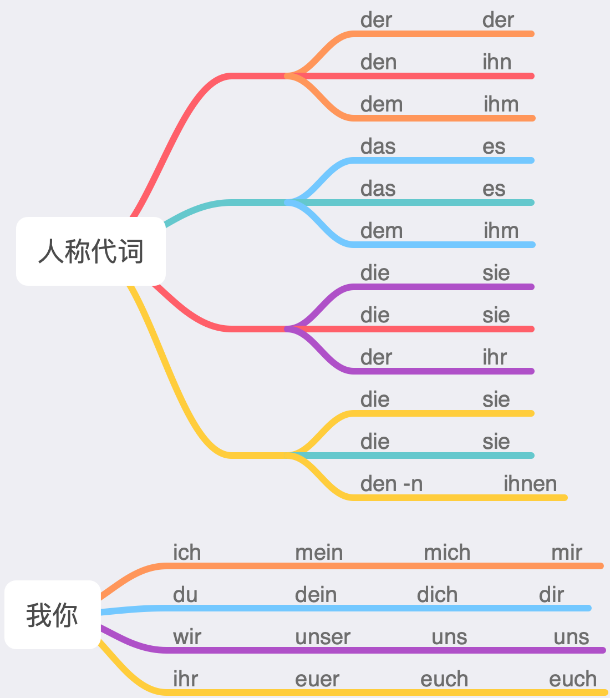
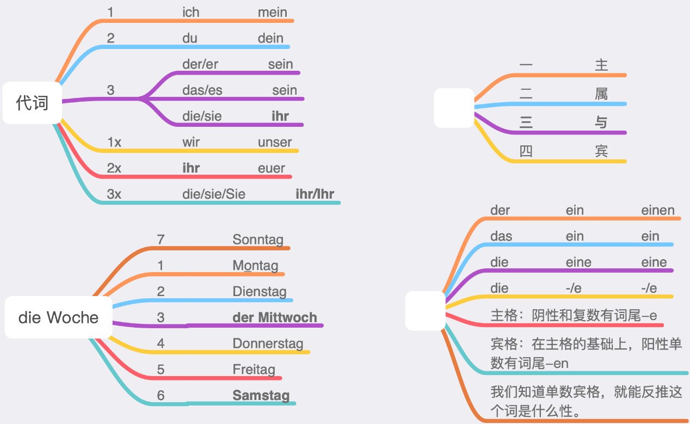

# 代词

### 人称代词

### 反身代词

首先，要理解什么叫反身。反身指的是第三格和第四格宾语（包括介词加的第三格和第四格）和主语所指是同一个人或物的情况。虽然第二格也可算作反身，但是没有专门的反身代词，可忽略。反身代词只有第三人称单复数的sich是初学者需要注意的，其他人称很容易理解。第三人称sich存在的合理性是，多了一个避免歧义的手段：

Otto sagt, dass Karl ihn im Spiegel sieht. 卡尔看的是奥托。

Otto sagt, dass Karl sich im Spiegel sieht. 卡尔看的是卡尔自己。

其次，把反身分成两类：可以类比理解和不方便类比理解的。朴素地理解，不要被「真、假、交互」之类的语法术语绕晕了。

Ich wasche das Auto. 可以洗物；

Ich wasche das Baby. 也可以洗人；

Ich wasche mich. 逻辑上也可以洗自己。

Ich helfe dir. 可以帮助某人；

Wir helfen uns. 逻辑上也可以相互帮助。

Er legt das Buch auf den Tisch. 静三动四，把某物横放到什么地方；

Ich lege mich ins Bett. 逻辑上也可以把自己横放（躺）到什么地方。

Er ist sehr stolz auf seinen Sohn. 可以为某人自豪；

Er ist sehr stolz auf sich. 逻辑上也可以为自己自豪。

Im Kino sitzt ein großer Mann vor mir. 可以有人或物在我前面；

China hat eine lange Geschichte hinter sich. 逻辑上中国也可以有很长的历史在自己身后（中国有着悠久的历史）。

然而：

Du musst dich beeilen. 译：你赶紧的。

Das kann ich mir nicht vorstellen. 译：这个我无法想象。

Ich fühle mich zu dick. 译：我觉得我太胖了。

这三个例句则基本不可能用类比的方式理解，那么需要借助用法模式去记忆：

sich beeilen

sich etw. vorstellen

sich irgendwie fühlen

也就是说：可类比理解的（假反身）按直觉和逻辑来就行，类似于英语的oneself用法，不用着力太多；不可类比理解的（真反身）需要记用法模式，认真背吧。

第三，格的问题：

1、如果是可类比理解的，那该用第几格用第几格，类比着用。

2、一般来说：

2.1 形如 sich V. 的，sich基本是第四格，如果不是，请参考第1点；

2.2 形如sich etw. V. 的，sich基本是第三格，如果不是，请参考第1点。

例如：

sich anziehen （穿衣服）sich是第四格；

sich etw. anziehen （穿具体什么衣服）sich是第三格；

sich etw. überlegen （考虑）sich是第三格，即使etw.变成了一个从句。

sich jm./etw. stellen （使自己面对某人或事物）sich是第四格，因为自己是放置（竖放，站）的对象，某人或事物才是间接宾语。如果实在觉得这句太难，格难以记清，还可以记住一个简洁而又实用的句子：Er hat sich der Polizei gestellt. 译：他自首了。

其实，无论是符合直觉和逻辑，还是用法模式，最终都要落到句子和篇章上，做好：

  词汇

  用法模式

  句子

  场景（感）篇章

五个层面的积累，日积月累，熟而生巧，才是王道。很多同学只知道背单词，主要积累的是词汇这一层，当然学不好。

### 冠词变代词

* 先带着名词，该怎么说就怎么说
* 去掉名词
  * 冠词或不定代词有词尾  -->  保持原样
  * 冠词或不定代词没有有词尾  -->  加示性词尾
  * 没有冠词或不定代词  -->  就用welch-
* 注意
  * 零冠词的代词用welch-
  * 中性的-es可以变为-s

