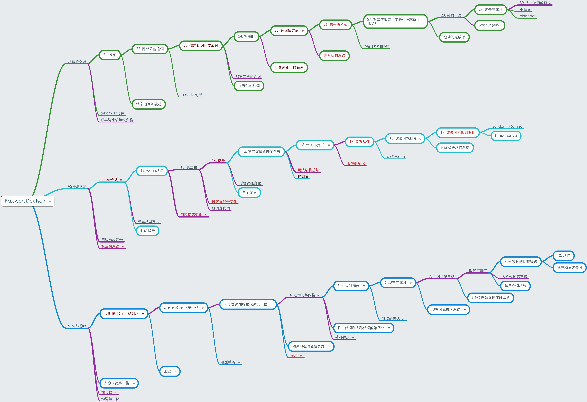
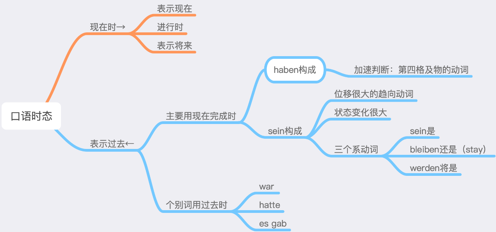

# 其他

### 德语的阶段

最佳的学习德语的路径是这样的：

第一步：迅速吃透A1-B1教材体系

以最快的速度，一步一个脚印，扎实地学完A1-B1整个教材体系，摸到外语的“全象”（很多学习最开始是盲人摸象的感觉）。在这个过程中心无旁骛。要理解，不要纠结（让你纠结的教学不是好教学），要记牢，最好还能朗读和背诵重点课文。不知道大家有没有发现，所有外语尖子生都有背诵教材里所有重点课文的能力。

第二步：看青少年德语新闻

在第一步的基础上，每天都看青少年德语新闻，把德语变成一个获得（第一手）最新信息的频道。每天都积累几个单词或表达，日积月累。学习必须和生活结合起来，变成生活的一部分！相信我，zdf logo是最佳的每日德语新闻习得内容。否则我们也不会坚持了7年，几乎每天都更新带双语字幕的视频。其他每天都更新的德语新闻节目你绝对坚持不了多久，因为太板正，太无聊，太不接（你的）地气。注意：青少年德语新闻只是零食，要加速提高水平，还是要继续啃B2-C2级别。

第三步：看德语肥皂剧

最接近“沉浸”德国现实生活的，就是德语肥皂剧，就是那种几乎每天都更新一集，动不动就更新到几千集的那种电视剧，几乎就是相当于在德国安了一些摄像头，把一个地方一群人的每天生活日常压缩成50分钟给你看。比如Sturm der Liebe这个剧。和美剧比起来，当然没那么吸引人，甚至会让人感觉土气，剧情让人生气，但是，这就是生活。现实生活没有那么多爽文，没有那么多笑料，没有那么多超凡脱俗。你要看的，是什么人在什么语境下说了什么话，要沉浸进去，沉浸体验德国人的生活日常。

注意：不要完美主义

看青少年德语新闻和德语肥皂剧，只是“零食”，不要完美主义，关键是坚持。也不要硬看，水平还没到听懂的程度就先提高级别水平。每天都坚持，学到几个单词或表达就行，不要贪多。不要把所有材料都变成精读精听，几天就耗尽热情，然后不了了之。泛读泛听的目的是为了培养兴趣，培养语感，提高熟练程度，而不是其他的。用德语吸收信息，用德语娱乐，变成生活的一部分，并且日复一日，年复一年地坚持，德语电子词典里的生词本每天都在增长，时不时复习一下。这就是最好的学习模式。

### 基本语法框架

这是德语的基本语法框架，分布在A1-B1三个级别。

- 紫色线条表示和三个性四个格有关。
- 圆角框表示和英语语法近似程度高。
- 红色字体表示学习难度大（鲜红比暗红难度更高）。

剩下的没有这三种标记的，一般是小知识点，理解和记忆都不难。

由上图可见：

1. 德语和英语语法框架总体是类似的。
2. 德语有特色的语法基本都和**三个性四个格**相关，或者说：由三性四格派生出了一些有德语特色的语法，比如形容词变化和关系从句等。
3. 有难度的语法并不多。其中有些标注为红色的知识点，并不是理解难度多么高，而是记忆量比较大。个别是因为和英语差异比较大，因而容易忘。

所以我们总结出，德语的**三大基本功**是：

1. 名词的性（和数）
2. 不规则动词表
3. 名词、动词和形容词的用法结构（Strukturformel）。

三大基本功过硬，德语是不可能差的。

**三性四格**是德语的灵魂，如果没有三性四格，德语就基本成了英语。因此从一开始记准名词的性，是学习德语关键的关键。很多人没有这个心理准备，排斥三性四格，记得模模糊糊，于是基础不扎实，积重难返。

### 口语时态

### 时间表达

### 度量衡

* 度量衡一直用第四格