# 德国州名

受丹麦影响的Schleswig-Holstein，和波兰有关的Mecklenburg-Vorpommern，右边是Brandenburg，然后从右到左三个带Sachsen的，下面两个大州Bayern和Baden-Württemberg，左边两个和Rhein有关的州，中间一个Hessen一个Thüringen。这样走一圈，再加上三个城市州Berlin, Hamburg和Bremen。最后加上西南部被法国割裂过两次的Saarland。

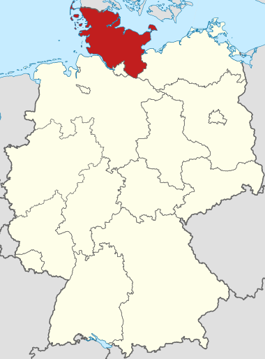

最北边的州Schleswig-Holstein，意译是“泥水湾-林人”。这个州由历史上的两个公国组成。话说，名字中带杠（-）的，一定都是由两部分组成的，姓名方面也一样。Schleswig很有丹麦语的意味，Holstein的Hols其实指的是Holz（木头），而-tein是发音巧合，和Stein“石头”没有关系。

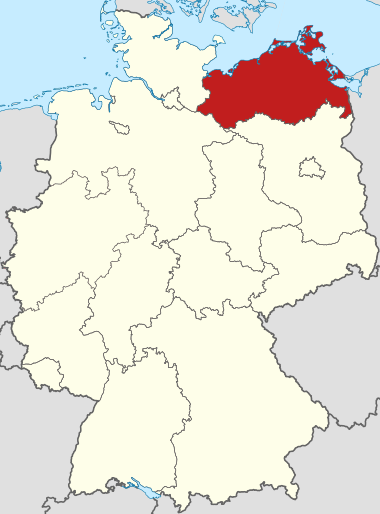

东北的Mecklenburg-Vorpommern，意译是“大堡-前沿海”。mecklen和英语much同源，是大的意思，地名带Burg的，都和“城堡”有关；Vorpommern之后还有Hinterpommern，在波兰。vor是“前”，mer这个印欧语的“海”词根也清晰可见。

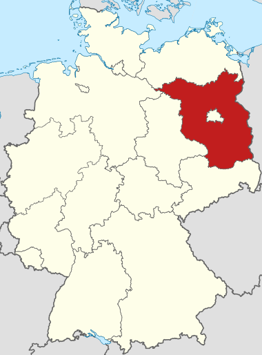

Brandenburg，意译是“泥泞堡”。Branden这个词的词源有争议，我认为来自古捷克语的“泥泞”比较可信。

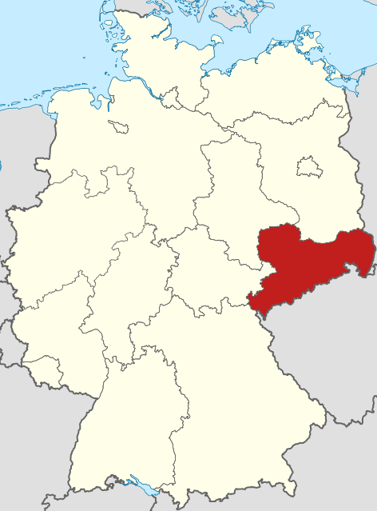

Sachsen，意译是“刀部”。本义是刀，是一个日耳曼部落的名称。

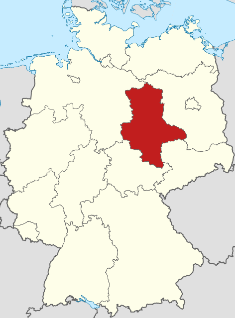

Sachsen-Anhalt，没法意译。Anhalt的词源已经丢失。姑且就叫它“刀部-安哈特”。

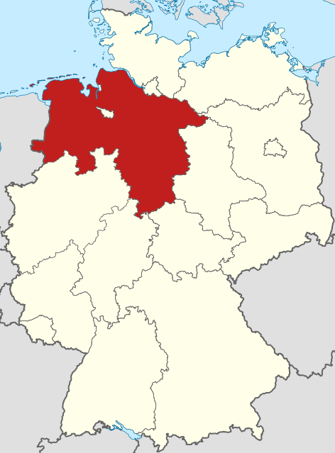

Niedersachsen，意译“低刀部”。

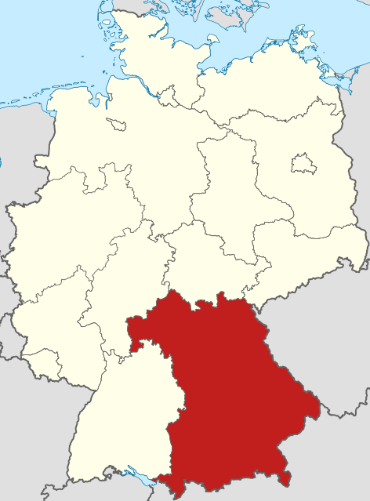

Bayern，意译“牛主”。指的是“拥有牛的人”。和凯尔特语言有关系，所以很难看出词根。

Baden-Württemberg，意译“温泉-男山”。Baden是“洗澡”，叫Baden的地方都有温泉。Württem来自凯尔特语“男山”，后面再加上了德语的Berg（山），类似“天津港”这样的重复。

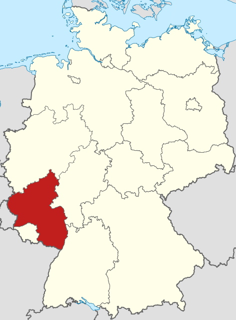

Rheinland-Pfalz，意译“江原-行宫”。Rhein是“流动”的意思，Pfalz和Palast（宫）有词源关系。

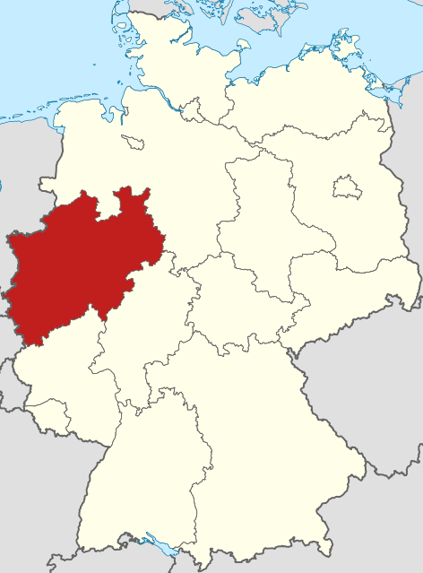

Nordrhein-Westfalen，意译“北江-西平”。Falen指的是“平地”。

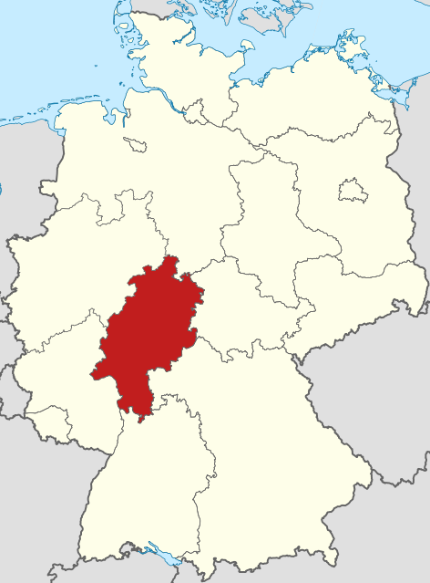

Hessen，没法意译。词源含义已不可考。古称Catti，这个和“全国翻译资格考试”的英文缩写CATTI一模一样。

Thüringen，意译“强部”。本义“强”，是日耳曼部落名称。

Berlin，意译“泥沼”，来自西斯拉夫语。从日耳曼语的角度来说，听起来像Bär+ling，也就是“小熊”，于是硬生生附会成“小熊”。柏林的城徽是“熊”。

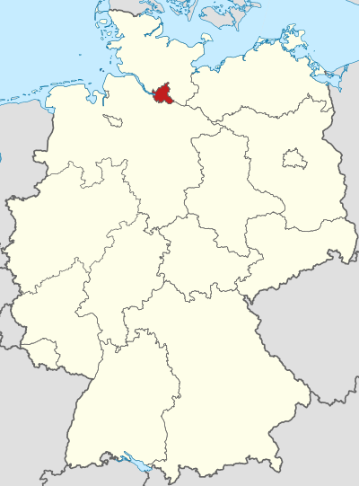

Hamburg，意译“腿堡”。Ham指的是弯曲的腿🦵，在河流的弯曲处。英语ham是“火腿”的意思。河流弯曲处的城堡，一个有名的食物从这个地名得名，那就是Hamburger（汉堡包）。真是个和食物源远流长的地名。

Bremen，意译“延边”。这个和英语brim（边缘）有词源关系。

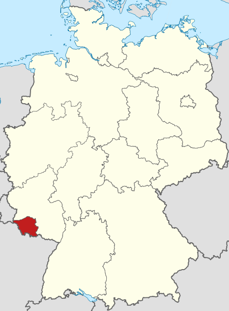

Saarland，意译“流原”。Saar是条河，词源“流水”。