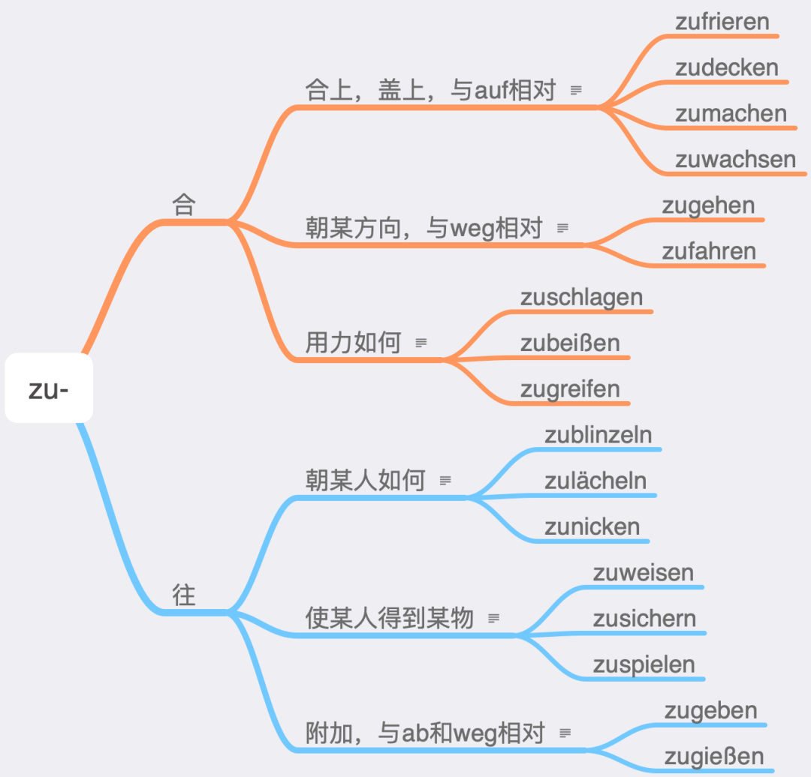

# 动词前缀

不可分的前缀们（不可分前缀非重读，重音在前缀后的动词上）

1 be- 把不及物动词变成及物动词

antworten vi. 回答 → beantworten vt. 使回答malen vi. 画画 → bemalen vt. 在┄上画

2 emp- 表示强调某种感觉或者服务

fehlen 缺少，想念 → empfehlen 推荐fangen 抓住 → empfangen 接待

3 ent-表与基本词的词义相反

decken 盖上 → entdecken 发现spannen 使人紧张 → entspannen 放松，使松弛

4 er-表动作结束，最终结果

bauen 建设 → erbauen建成；arbeiten 工作 → erarbeiten获得，赚的；lernen 学习 → erlernen学到手

5 ge-表示对原动作的强调

gestalten 开始 gefallen 喜欢

6 miss-表与基本词义相反

verstehen 理解 → missverstehen 误解trauen 信任 → misstrauen不相信，不信任

7 ver- 表示原动作的加强或者与原动作相反

bessern 修正 → verbessern 改善，变好suchen 寻找 → versuchen 尝试kaufen 买 → verkaufen 卖sehen 看到 → versehen 看错

8 zer- 表示“弄碎”“破坏”

brechen 折断 → zerbrechen把……打碎stören 打扰 → zerstören 摧毁reißen 撕开 → zerreißen 撕碎，扯碎

大家肯定知道，前缀分为可分前缀和不可分前缀，继而动词也就有可分和不可分之分，而区分二者的重点就是不同时态下的动词变化形式，不可分动词在变过去分词（PII）的时候千万不要在缀后加ge-哦

可分的前缀们

1 ab- 表“掉落，取下，分开，清除，离去”

bauen 建造 → ab/bauen拆除schneiden 剪 → ab/schneiden剪下，切下drängen 挤 → ab/drängen挤开，排挤brennen 燃烧 → ab/brennen烧掉fahren 行驶 → ab/fahren启程，开走

2 an-表示“动作延续”，“向着出发”或“接通，连接”

kommen 来 → an/kommen 到达fragen 问 → an/fragen 询问fliegen 飞 → an/fliegen 飞向，飞往；rennen 跑 → an/rennen 跑向schalten 操作 → an/schalten 打开电器gehen 走 → an/gehen 电器亮着

3 auf-表“向上”或“打开”的含义

gehen 走 → auf/gehen 上升，升高stehen 站立 → auf/stehen 起身，起立packen 打包 → auf/packen 打开（包裹）

4 aus-表示“出来”或“关闭”的含义

füllen 填写 → aus/füllen 填完，填满geben 给 → aus/geben 支出，交付brennen 燃烧 → aus/brennen 停燃，燃光machen 做 → aus/machen 关闭

5 bei-表“附加”“参加”或“贡献”的含义

legen 放 → bei/legen 附送schreiben 写 → bei/schreiben附加上，补注treten 踏，踩 → bei/treten 加入，参加tragen 抬，扛 → bei/tragen 致力于

6 ein- 表由外向内的动作“往里”“进入”

atmen 呼吸 → ein/atmen吸入kommen 来 → ein/kommen 收入

7 fort- 表示“离开”或“继续”的含义

bringen 带来 → fort/bringen带走，拿走treiben 赶 → fort/treiben撵走，赶走bestehen 存在 → fort/bestehen继续存在wirken 有作用 → fort/wirken继续发挥作用

8 mit-表示“一起”或者“随身携带”

arbeiten 工作 → mit/arbeiten 合作，协作nehmen 拿 → mit/nehmen 随身携带

9 nach-表“随后”或“向着某一目标”

lernen 学习 → nach/lernen 补学blicken 望，看 → nach/blicken 目送

10 nieder- 表“向下”“打倒”

biegen 弯曲 → nieder/biegen使向下弯曲schlagen 打 → nieder/schlagen打倒

11 vor- 表“事先”“在……前”“到……前”

vor/arbeiten做准备工作vor/hängen挂在前面vor/fahren向前行驶

12 zu-表“朝向”

zu/schicken寄给，送给zu/schießen射向

剩下的zusammen-和zurück-这两个前缀因为容易区分，小编就没有列出来。

### er-

er-的动词比较少，不到200个。义项也较少，只有3大项。第3项的词不多。

没有同时加er-和-ieren词尾的动词，但是ver-是可以加-ieren后缀的。erfrieren和eruieren不算，因为这里的ieren不是后缀，而是词干的一部分。

er-加比较级构成的词只有两个：erleichtern和erweitern。但是ver-加比较级的有很多。

### ver-

ver-的动词有500多个。er-的第一项只有形容词变动词，而ver-的第一项也有名词并且都是及物的。ver-的最后两项“死亡”和“变及物”词没几个。“差错”这一项全部是反身的。

“死亡”只有图上两个ver-，可以这么说。但是er-有很多，各种死亡。

### be-

be-的动词有近400个。是不是都是及物的呢？我本来是以为是，知道我后来发现了jm./etw. begegnen。应该就这一个特例。be-的词源没有帮助，不要看它。

### bei-

前缀bei-也是“附”的意思。动词前缀是“附上，在一旁”的意思；名词前缀是“次要的，旁的”意思，这和同源的英语by-是一个意思。参见英语bypass（旁道）。

### nach-

nach作为可分前缀，含义还是可以高度概括为“在……之后”。

### zu-

zu用作可分前缀时只有两项含义，并且还都可以统一在箭头这个意象之下。

zugehen和zufahren等可分动词的用法结构都是auf jn./etw. zugehen/zufahren。所以，其实本来不是可分动词，而是auf ... zu的介词结构，“往某上，缩小距离至合上”，只不过一个句子得有一个动词，在这种情况下需要一个趋向动词，放在后面的zu和动词连到一块儿就成了可分动词。