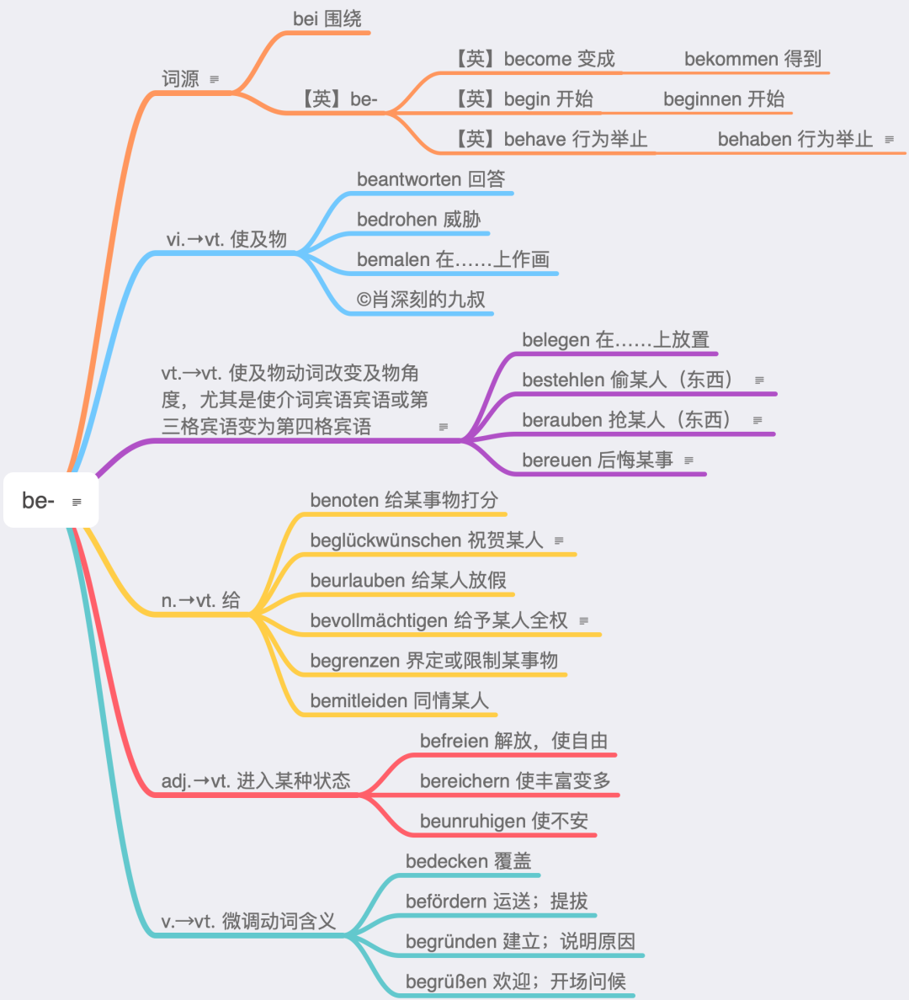
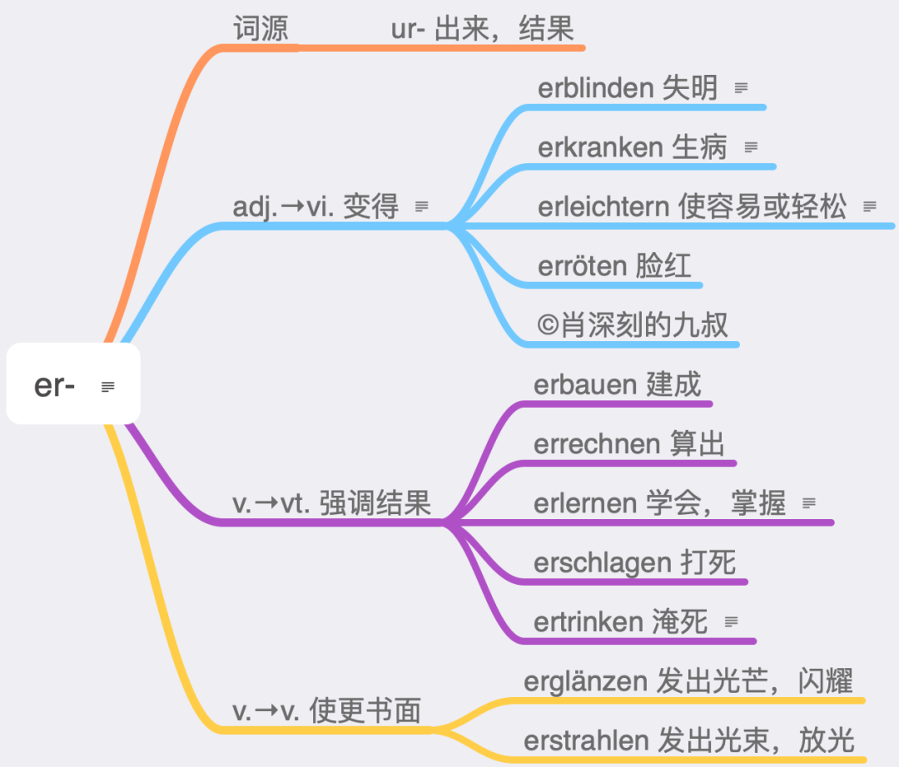
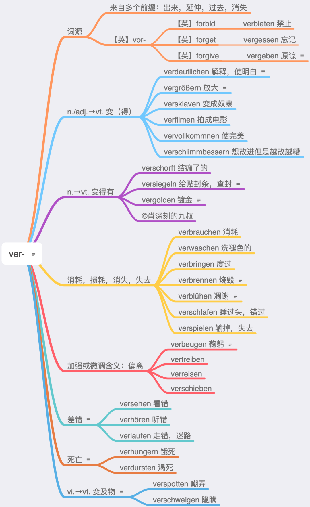
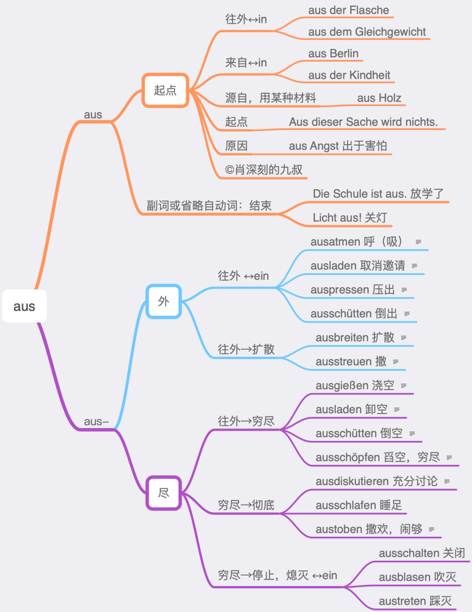
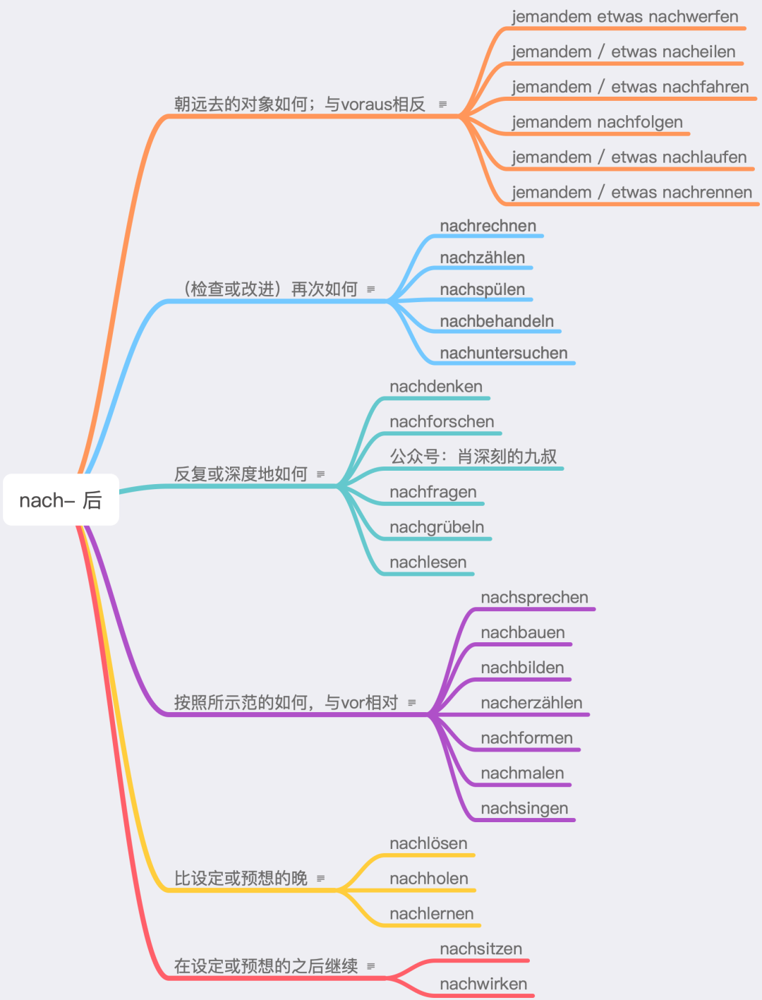
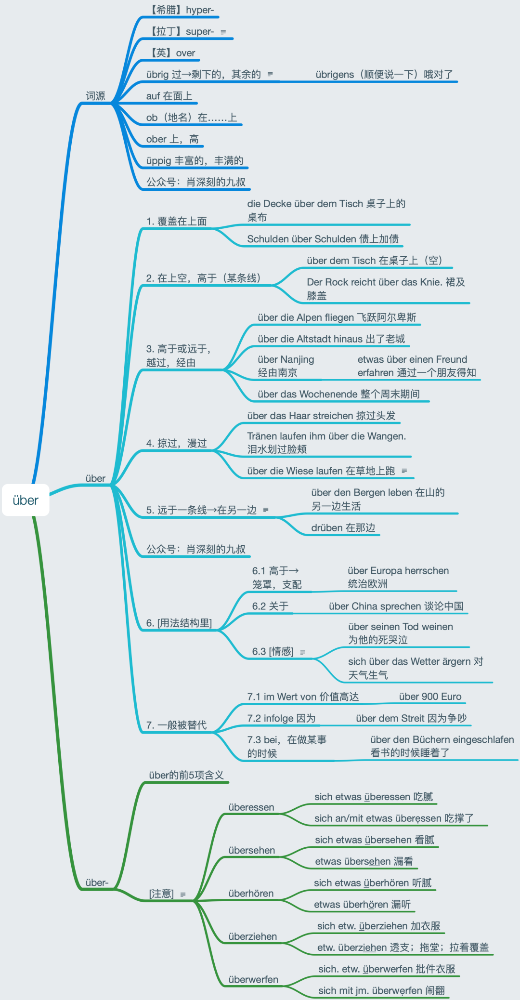
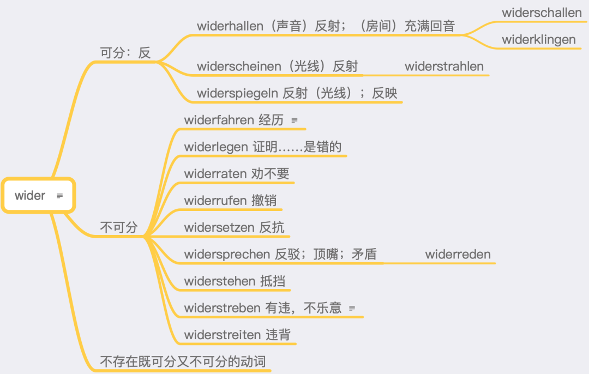
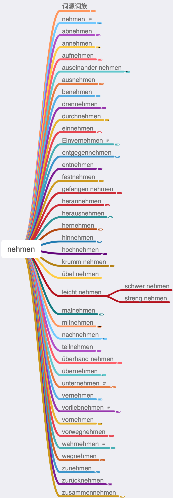
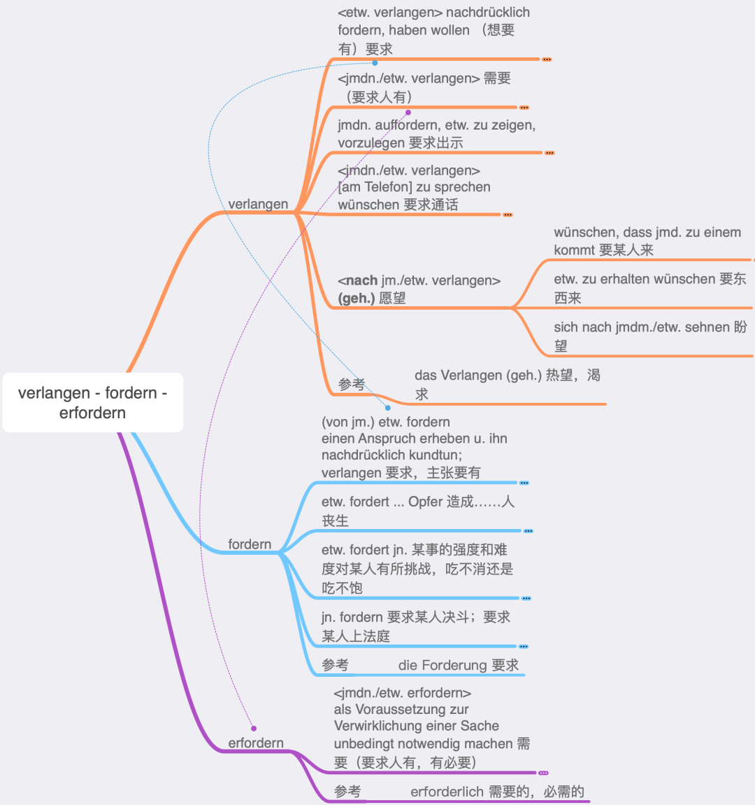

# 动词前缀

前缀分为可分前缀和不可分前缀，继而动词也就有可分和不可分之分，而区分二者的重点就是不同时态下的动词变化形式。不可分动词在变过去分词（PII）的时候千万不要在缀后加ge-哦。不可分前缀非重读，重音在前缀后的动词上。

## 不可分前缀

### be-

把不及物动词变成及物动词。例如：antworten vi. 回答 → beantworten vt. 使回答；malen vi. 画画 → bemalen vt. 在┄上画。

be-的动词有近400个，99%是及物加第四格的。真正的特例只有jm./etw. begegnen（碰见）和js./etw. (G) bedürfen（需要）两个，一个加第三格，一个加第二格。其他的如果不是加第四格，就是用的反身sich第四格，或者是人三物四（很少）。不加宾语的也有，然而是极为生僻的词汇，可以忽略不计。

be-的词源没有帮助，不要看它。

### emp-

表示强调某种感觉或者服务，例如：fehlen 缺少，想念 → empfehlen；推荐fangen 抓住 → empfangen 接待。

### ent-

表与基本词的词义相反，例如：decken 盖上 → entdecken 发现；spannen 使人紧张 → entspannen 放松，使松弛。

### er-

表动作结束，最终结果，例如：bauen 建设 → erbauen建成；arbeiten 工作 → erarbeiten获得，赚的；lernen 学习 → erlernen学到手。

er-的动词比较少，不到200个。义项也较少，只有3大项。第3项的词不多。

没有同时加er-和-ieren词尾的动词，但是ver-是可以加-ieren后缀的。erfrieren和eruieren不算，因为这里的ieren不是后缀，而是词干的一部分。

er-加比较级构成的词只有两个：erleichtern和erweitern。但是ver-加比较级的有很多。

### ge-

表示对原动作的强调，例如：gestalten 开始；gefallen 喜欢。

### miss-

表与基本词义相反，例如：verstehen 理解 → missverstehen 误解；trauen 信任 → misstrauen不相信，不信任。

### ver- 

表示原动作的加强或者与原动作相反，例如：bessern 修正 → verbessern 改善，变好；suchen 寻找 → versuchen 尝试；kaufen 买 → verkaufen 卖；sehen 看到 → versehen 看错。

ver-的动词有500多个。er-的第一项只有形容词变动词，而ver-的第一项也有名词并且都是及物的。ver-的最后两项“死亡”和“变及物”词没几个。“差错”这一项全部是反身的。“死亡”只有图上两个ver-，可以这么说。但是er-有很多，各种死亡。

### zer-

表示“弄碎”“破坏”，例如：brechen 折断 → zerbrechen把……打碎；stören 打扰 → zerstören 摧毁；reißen 撕开 → zerreißen 撕碎，扯碎。

## 可分前缀

### ab-

表“掉落，取下，分开，清除，离去”，例如：auen 建造 → ab/bauen拆除；schneiden 剪 → ab/schneiden剪下，切下；drängen 挤 → ab/drängen挤开，排挤；brennen 燃烧 → ab/brennen烧掉；fahren 行驶 → ab/fahren启程，开走。

### an-

表示“动作延续”，“向着出发”或“接通，连接”，例如：kommen 来 → an/kommen 到达；fragen 问 → an/fragen 询问；fliegen 飞 → an/fliegen 飞向，飞往；rennen 跑 → an/rennen 跑向；schalten 操作 → an/schalten 打开电器；gehen 走 → an/gehen 电器亮着。

真正的特例只有etw. (D) angehören（属于）和etw. haftet jm./etw. an（附着，黏住）这两个特例。而后者其实有更常见的用介词的结构（意思一样）：etw. haftet an jm./etw. an。其他不加第四格的，要么是人三物四，要么是特别容易理解的不加宾语。

### auf-

表“向上”或“打开”的含义，例如：gehen 走 → auf/gehen 上升，升高；stehen 站立 → auf/stehen 起身，起立；packen 打包 → auf/packen 打开（包裹）。

### aus-

表示“出来”或“关闭”的含义，例如：füllen 填写 → aus/füllen 填完，填满；geben 给 → aus/geben 支出，交付；brennen 燃烧 → aus/brennen 停燃，燃光；machen 做 → aus/machen 关闭。

### bei-

表“附加”“参加”或“贡献”的含义，例如：legen 放 → bei/legen 附送；schreiben 写 → bei/schreiben附加上，补注；treten 踏，踩 → bei/treten 加入，参加；tragen 抬，扛 → bei/tragen 致力于。

前缀bei-也是“附”的意思。动词前缀是“附上，在一旁”的意思；名词前缀是“次要的，旁的”意思，这和同源的英语by-是一个意思。参见英语bypass（旁道）。

### ein-

表由外向内的动作“往里”“进入”，例如：atmen 呼吸 → ein/atmen吸入；kommen 来 → ein/kommen 收入。

### fort-

表示“离开”或“继续”的含义，例如：bringen 带来 → fort/bringen带走，拿走；treiben 赶 → fort/treiben撵走，赶走；bestehen 存在 → fort/bestehen继续存在；wirken 有作用 → fort/wirken继续发挥作用。

### mit-

表示“一起”或者“随身携带”，例如：arbeiten 工作 → mit/arbeiten 合作，协作；nehmen 拿 → mit/nehmen 随身携带。

### nach-

表“随后”或“向着某一目标”，例如：lernen 学习 → nach/lernen 补学；blicken 望，看 → nach/blicken 目送。

nach作为可分前缀，含义还是可以高度概括为“在……之后”。

### nieder-

表“向下”“打倒”，例如：biegen 弯曲 → nieder/biegen使向下弯曲；schlagen 打 → nieder/schlagen打倒。

### vor-

表“事先”“在……前”“到……前”，例如：vor/arbeiten做准备工作；vor/hängen挂在前面；vor/fahren向前行驶。

### zu-

表“朝向”，例如：zu/schicken寄给，送给；zu/schießen射向。

zu用作可分前缀时只有两项含义，并且还都可以统一在箭头这个意象之下。

zugehen和zufahren等可分动词的用法结构都是auf jn./etw. zugehen/zufahren。所以，其实本来不是可分动词，而是auf ... zu的介词结构，“往某上，缩小距离至合上”，只不过一个句子得有一个动词，在这种情况下需要一个趋向动词，放在后面的zu和动词连到一块儿就成了可分动词。

## 可分和不可分兼有

即可分又不可分的前缀有三对：静三动四介词中一对反义的über和unter，词源一对同义的wider和wieder，只加第四格的一对um和durch。最靠谱的方式还是靠重音：重音在前缀，可分；重音在动词，不可分。über, unter, um, durch四个作前缀的动词，规律性并不强（有也记不住的），还是老老实实一个一个积累。

###  über-

值得注意的是，über-构成的动词有可能可分，也有可能不可分，还有部分动词即可分又不可分。über-构成的动词，有90个左右。可分的，感觉是个短语；不可分的感觉是一个带了前缀微调了意思的词。特别注意，吃腻看腻听腻3个动词都是可分的。

词源对über的理解还是很有帮助的。拉丁语的super好像有点格格不入，那是因为这是个复合词，s是ex的遗留。

über的前五项含义其实是可以高度地模糊地统一在一起的，也就是高于和远于的静三和动四。和auf不一样，auf强调是在一个比较平的面上。

注意第4项的第三个例句，人也可以掠过的。这一项容易忽略。

第5项如果理解好了，就可以理解rüber了。rüber是在同一个平面的移动。drüben是同一个平面的那里，相当于英语over there。这次词源又立功了。

第1-5项的占位符是wo或wohin。第6项里面的是不可以用这两个词的，在用法结构里必须写出über。第6项的三个小项都有很多例子，把它们高度统一在一起，富于启发性，这是我最自豪的地方之一。

英语about这种“关于”是用über的。情感方面的用法结构介词有两个，一个是über，一个是auf。über是对现存的已有的如何，而auf是对未来的如何。

第7项不太重要，看看就好，记不住也没有关系。

前缀über-有über的前五项含义，不再赘述。

### wider-

wider-为前缀的动词，Duden收录了17个。可以看出：除了表“反射”的几个词是可分的，其他都是不可分的。

### wieder-

wieder-为前缀的动词，Duden收录了46个。有一个wiederholen即可分又不可分，但是可分的这个义项朗氏没有收录，频度太低，所以学习者可以把wiederholen看作是一个不可分动词。除了四个表示“恢复”的动词不可分，其他都是可分的。然而，四个表示“恢复”的动词朗氏词典也都没有收录。也就是说，不可分的wieder-几乎只有一个。

## 前缀辨析

不管是哪个带前缀的动词，有多少项含义，都肯定和前缀和动词的基本含义相关。

### nehmen

放到一起还挺壮观的。放到一起也就好辨析近义词了。

其实genehmigen“（官方）批准”也是和nehmen相关的，指的是可以genommen（接受）的。vornehm是放到前面的，就是“体面的，优雅的”。nehmen的一个古老名词是-nunft，比如Vernuft（理性）。这个词是这么来的nehmen（接）→wahrnehmen（注意→感知）→vernehmen（听）→Vernunft（听老人言→理性）。

nehmen在Duden中有24大项含义，加上小项就更多了，但是不管是“拿、夺、取”还是“吃”，都可以按英语take来理解。

nehmen, einnehmen, nachnehmen都有吃的意思。“吃药”主要用einnehmen，用nehmen也可以；“吃喝进食”用einnehmen和nehmen都偏文雅；nachnehmen是“再加点吃喝”，毕竟nach作为前缀有“之后如何”的意思，比如：Nimm dir doch noch etwas Reis nach. （你）再加（吃）点米饭啊。汉语有“吃我一拳”，英语有I'm taking  fire，德语有Er musste mehrere Haken nehmen（吃了好几记勾拳）。

不管是哪个带前缀的动词，有多少项含义，都肯定和前缀和动词的基本含义相关。比如abnehmen：

上图中所有义项都和nehmen（take）以及ab（off）相关，并且只和它们相关。ab (off) 类似于汉语的“下，掉，走”。

auf和ab是一对反义词，auf (up) 是“上，起，来”。aufnehmen今天还保留了最原始的含义“从地上捡起，拿起”，再从“拿起”产生“抱起”→接收→使加入→吸收→接受（作品）等意思。

an是“靠近，初步，稍稍”的意思，所以annehmen有“接受，愿意”的意思。annehmen和aufnehmen有的时候会难以区分：annehmen主要是“接受”，aufnehmen主要是“接收”。annehmen有“收养”的意思，毕竟an有同化的感觉，而aufnehmen有“容纳”的意思，毕竟auf是拉人上来的感觉。annehmen和aufnehmen都有“录取”的意思。

### fordern

fordern（要求）派生自vorder（前）。vorder是vor的古老的比较级。再往前来一点 → 要求。如果要求别人出来（herausfordern）那就是“挑战”了，这使我想起《三国演义》里的骂阵。

fördern（促进）派生自现代德语中已经消失的一个比较级fürder（更远，往前），与英语further（促进）同源。弄远一点，推向前进→促进。fürder的原级是fort（往前，离开），与vor同出一源。

德语vor - vorder - vorderst, fort - fürder。英语fore - further - first, forth - further, far - farther。

fördern因为来自fürder（更远，往前），所以最早还有“运送”的含义，今天这项含义已经改用befördern来表达；“把矿石运送带出来”，所以fördern也有“开采”的含义。

“促进”基本只有fördern，但是“要求”有好几个，怎么区分呢？

简单来说，verlangen是“想要有”那种“要求”，和“渴望”有关，参见它的名词Verlangen（热望，渴求）；fordern更像是“主张要有”那种“要求”，参见它的名词Forderung（要求）；erfordern更像是“有必要”那种“需要”，参见它的形容词erforderlich（需要的，必需的）。思维导图里的例句被折叠起来了，打开的话字儿可能就看不清了。

很多同学都对加各种前缀的动词非常头疼，比如各种-fordern：

其实如果理解介词的深层含义的话，把这些词摆到一起理解，都是小菜一碟。要理解介词的深层含义，就要把介词的各项意思高度统一在一个意象下，并且把各项词义的发展脉络理出来。

总结：

fordern和fördern都来自vor，不过走了不同的道路。德语中还有大量的意想不到的词来自vor（比如fremd），英语中也有大量的同源词（比如from, prime）。

## 特例

- (jm.) etw. gewährleisten（保障，确保）是名词+动词的结构，不可分。

- schlafwandeln（梦游）名词+动词的结构，不可分。

- etw. absorbiert etw.（吸收）介词+动词结构，不可分。

- etw. absolvieren（结束）介词+动词结构，不可分。

- etw. aus etw. abstrahieren（从……抽象出）介词+动词结构，不可分。
