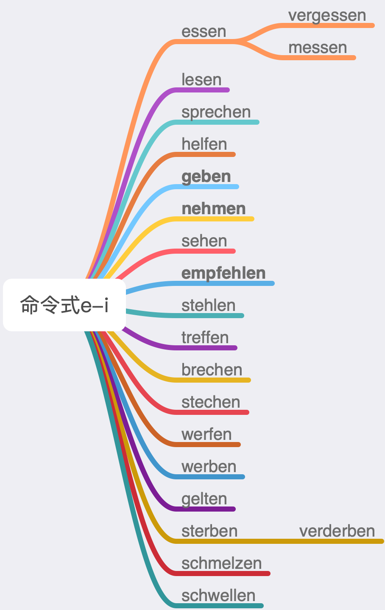

# 命令式

大的框架，三点：

1. 对du的命令式：动词**原形**词干（如mach）①
2. 对ihr的命令式：动词原形词干+(e)t 或者说，和**现在时**形式完全一样。
3. （前一段这么说是为了整齐，好理解。后面“或者说”更精确，因为seid确实不是＋t词尾。）
4. 对Sie的命令式就是陈述句把动词提前②③。

初步练习掌握之后再补充3点：

① 现在时du人称产生 e→i/ie(h) 换字母的（比如sprechen → sprichst），对du的命令式继续产生这种换字母（刻意避免“换音”和“变音”这样的术语。并且指明就是e变成“衣”）。这样的动词总共就21一个，常见的就前面9个，即essen, vergessen, lesen, sprechen, helfen, geben, nehmen, sehen, empfehlen。

nehmen是唯一一个长音变短音的（/e:/ - /ɪ/），geb-变gib-还是长音。empfehlen是不规则的，但是注意fehlen是规则动词。

② 系动词sein对Sie的命令式是个例外，是seien。

③ 对du和ihr的命令式一般省略人称代词，除非刻意强调（很稀少）。

然后总结一下：

命令式有两个注意，一是**几个动词e变“衣”**（i/ie(h)），一是**特例seien Sie**。

其他的细节，比如对du的命令式要加-e（比如arbeite），werden就是用werde，对wir的命令式和对Sie的命令式一样……都不需要一次说完，在实践中具体碰见这样的例子再临时补充。
