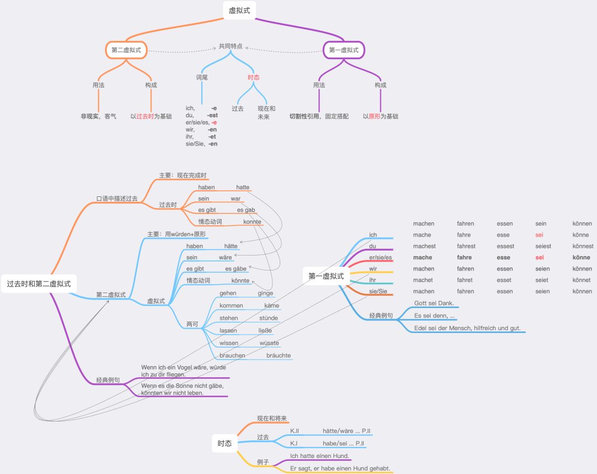

### 第二虚拟式

* 从过去是变化来的，加e并变音
* 主要用würden+原型: würde, würdest, würde, würden, würdet, würden
* 虚拟式
  * haben: hätte
  * sein: wäre
  * es gibt: es gäbe
  * 情态动词
    * können, kann, konnte, könnte
    * dürfen, darf, dufte, düfte
    * müssen, muss, musste, müsste
    * möchten, möchte, wollte
    * wollen, will, wollte
    * sollen, soll, sollte
* Wenn es die Sonne nicht gäbe, könnten wir nicht leben.
* Wenn ich ein Vogel wäre, würde ich zu dir fliegen.

