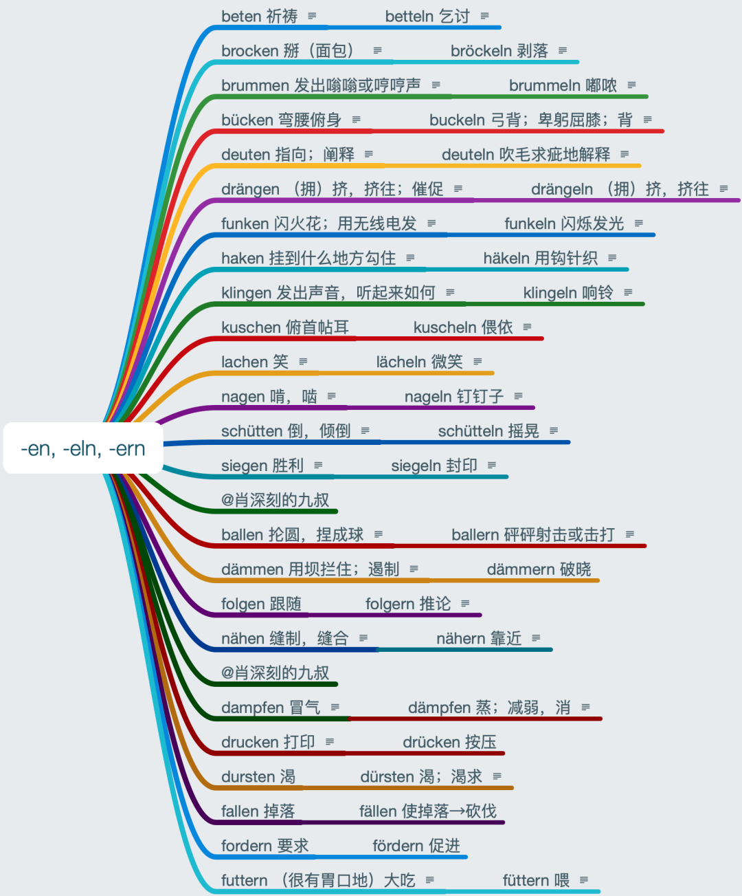

# 词汇辨析

### 感觉

spüren来自Spur（痕迹），最早指的是打猎“追踪……的痕迹”，后来演变为“感觉”（顺着痕迹去闻的样子）。现代德语里还有einen Fuchs spüren（追踪一只狐狸）这样的用法。但是主要是“（身体）感觉”，比如einen Schmerz im Bein spüren（腿感到痛）。后来还派生出“觉察”的意思，不一定是身体上的感觉，但是和“痕迹”有点关系，比如：Er spürte sofort, dass etwas nicht stimmte.  他立即觉察到有什么不对劲。还有一项罕用的“感受到”可以忽略，基本被它取代：

verspüren是“感受”的意思，可以是“身体感受”，比如Schmerz verspüren（感受到痛）；也可以是“内在感受”，比如Angst verspüren（感受到害怕）。

fühlen词源上来自“触觉”，所以主要是“（触觉）感受到”的意思，比如einen Schmerz  fühlen。这个义项和spüren的“（身体）感觉”以及verspüren的“身体感受”差别不是太大。但是fühlen还有“（试着）摸”的意思，比如den Puls fühlen（把脉）。还有“（精神）感受到”的意思，比如Er fühlte, dass er auf dem richtigen  Weg war. 他感觉自己在正确的路上。另外，还有sich irgendwie fühlen（觉得如何）这个用法结构，比如Er  fühlt sich nicht wohl 他觉得自己（身体）不舒服。

anfühlen是“触摸（以便评价）”，比如den Stoff anfühlen 摸布料。最主要的用法是sich irgendwie anfühlen（摸上去怎么样）和sich irgendwie anhören（听上去怎么样）是一个句型，比如Der Stoff fühlt sich weich an. 这个料子摸上去很软。

empfinden主要是“（情感）感受到”，比如Angst  empfinden（感到害怕）。在这个例句中和verspüren差异不大。但是对某人心动有爱意只能用empfinden，比如Er empfindet nichts für sie. 他对她没感觉。也有普通的“感受到”的意思，比如Schmerz empfinden  感到痛。这和前三个差异不大。因为主要是“（情感）感受到”，所以有empfindlich（敏感的；容易受伤的）和empfindsam（感情细腻的）。

那位同学还提到了wahrnehmen，其实这个是最好区别的，wahrnehmen是“感知”。有句名言“存在即是被感知”，就是这个“感知”，指的是五种感官感知。

总结：

spüren主要是（身体）感觉；

verspüren主要是“（内在）感受”；

fühlen主要是“（触觉）感受到”和“觉得”；

anfühlen主要用在“摸起来是什么感觉”中；

empfinden主要是“（情感）感受到”。

如果加同样的宾语，含义会有一点点Nuance（色差）。

### 持续

wahren和währen没有词源关系，währen和gewähren没有词源关系，gewahren和gewähren当然也没有词源关系。

währen是“持续”的意思，来自Wesen（持续，存在）。有句熟语说Ehrlich währt am längsten 诚实走得最久。während是währen的第一分词，由“持续”变成了“在……期间”的意思。

wahren来自已经消失在历史长河中的一个名词Wahr（注意）。词义产生了如下变化：注意→保护→看管→维持。wahren主要是“维持”的意思，用法很书面，比如den Schein wahren 维持表面，维持住面子。

gewähren来自wahr（（给）好意→值得信任的→真的）。gewähren保持了比较原始的含义“给”，一般用在jm. etw. gewähren（给某人某物）这个结构中，用法比较书面，比如jm. (einen) Rabatt gewähren/geben 给某人打折。Gewähr（担保）和不可分动词gewährleisten（保障）是派生自gewähren的。

gewahren来自gewahr（感知到，认识到），而gewahr来自Wahr（注意），并且ge**wahr**和英语a**ware**同源近义。所以wahren和gewahren确实是有关系的。jn./etw. gewahren也还是“感知到，认识到”的意思，用法非常书面，sie hat ihn nicht gewahrt 她没有看见他。

总结：

währen 持续 ← Wesen （持续）存在

gewähren 给 ← wahr （给）好意

wahren 维持 ← Wahr 保护 ← 注意

gewahren 感知到，认识到 ← Wahr 注意

### -en, -eln, -ern

电脑技术估计看出来了，强迫症应该看了舒适。德语教学能力体现在什么地方呢？其实这些汉语意思完全没有抄词典，而是根据内心大数据和杜登德语解释精挑细选的，比德汉词典要精准精当，可以放心记。

知识点：-en加字母l变成-eln是所谓的Iterativ（叠动动词），也就是反复进行。

当然，nageln和siegeln这两个动词不是，他们是由相应的名词Nagel和Siegel变过来的，与nagen和siegen可以说没有什么关系。

对有些词我再多说几句：

掰面包（想起了西安的羊肉泡馍）用brocken少一些，一般用einbrocken。

bruckeln“弓背”的意思可能不容易理解。养过猫的都知道，猫睡完觉一般是要弓背的，类似于人的伸懒腰。

buckeln的卑躬屈膝这个义项有一个经典表达：Nach oben buckeln und nach unten treten. 媚上欺下。

### lassen

第一项意思是英语的let（让），这在词源上也是同源的，比如：

- Lass mich bitte ausreden. 让我把话说完。
- Er kann keinen Fremden in die Wohnung lassen. 他不能让陌生人进屋。

lassen可以看做是情态动词，而第二句可以看做是省略了实义动词，因为意思已经很明确，不加动词反而更好。

由let这个意思，转变视角，派生出了sich v. lassen（字面意思：让自己被如何）这种被动的替代形式。比如：

- Die Tür lässt sich nicht öffnen. 门打不开。
- Das lässt sich nicht beweisen. 这个没法证明。

第二项意思是英语的leave（让处于某种状态）。有的时候也能用let翻译。这项含义更接近lassen的本义“放手”。比如：

- Tu, was du nicht lassen kannst. 不能放手的，总念念不忘，那你就做吧。
- Lass sie in Ruhe! 放开那个女孩！
- Lass die Großtuerei. 放下→别装逼了。
- Er kann vom Alkohol nicht lassen. 他戒不了酒。
- Sie können voneinander nicht lassen. 戒不了彼此→他俩无法分开。
- Wo hast du denn den Schlüssel gelassen? 你把钥匙放/落哪儿了？
- Ich kann dir das Buch bis morgen lassen. 书放你这儿，明天还我就行。
- Wir haben alles beim Alten gelassen. 我们让一切保持了原样。

对，lassen要么是let，要么是leave，要么是这两项意思引申出来的。就是这么简单。

这两项含义还可以统一到一起，因为本来就是从一个源头出来的。我们也可以想象，“发货，发火，发财，发糕，发试卷，发展，发现，发表……”的“发”也都是一个来源，我们对自己的母语能做到精准又模糊的高度统一。但是这么多含义，学汉语的外国人肯定头疼不已。

lassen最原始的含义是“松弛”，因“乏力，松弛”而“放手”，因“放手”而“退让”，于是产生了“让”的意思。也就是说因为mürbe，所以产生了“让”。突然发现，没有一本德汉词典把mürbe解释清楚了。mürbe确实很难，是“软磨硬泡的目的或结果状态”。这样大家不知道理解了没有？模糊的基础是精准，而精准本身就不容易做到。

英语late和let都来自这个词源。因为（心态）松弛，所以很容易“晚”和“迟到”。

德语gelassen（镇定的），也是一种心态松弛。lasch（无力的，懒洋洋的）也是来自这个词源，心态松弛到一定负面程度了。
