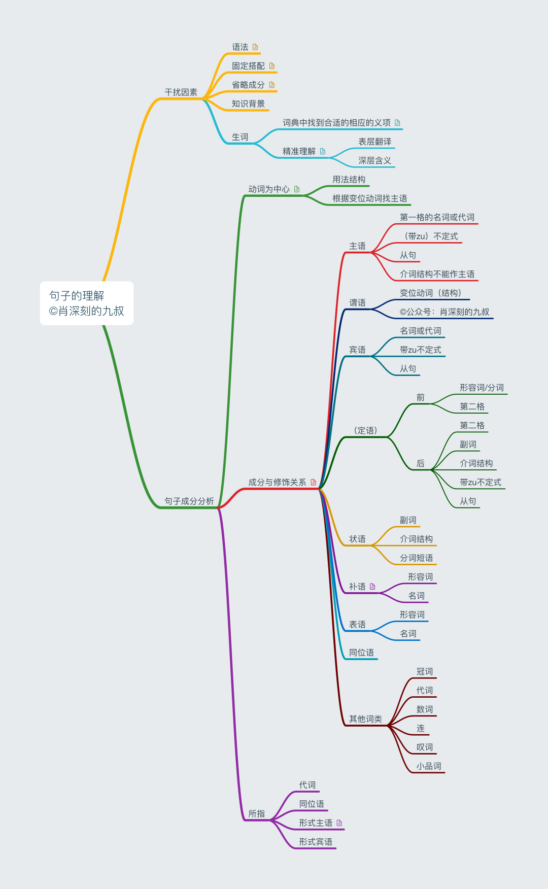
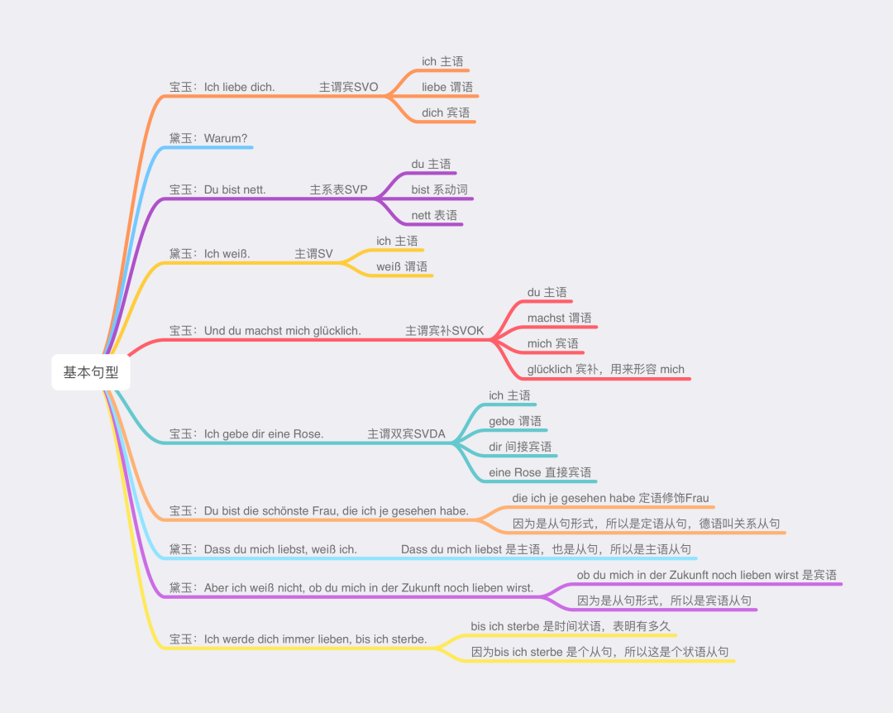
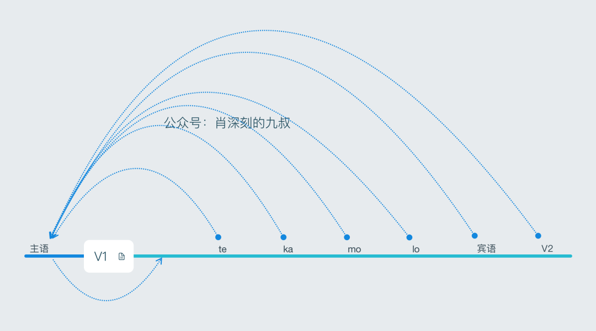
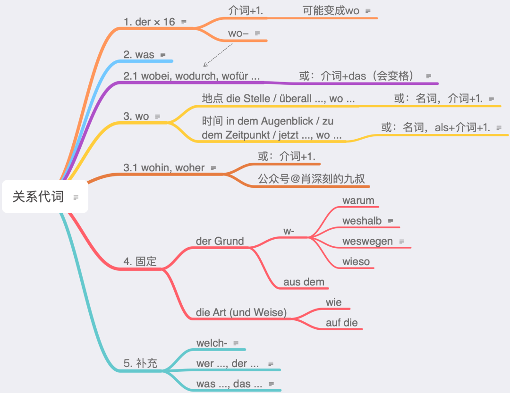

# 句法

## 构成

### 句子成分

德语的句子理论上必须有动词，一般来说也必须有主语。省略句可能会缺成分，但是按规则可以补全。德语句子成分只有“主谓宾状补表”6种。词类主要是“名动形数冠代副介连小叹”11种，“小”指的是“小品词”（其实就是语气词）。

### 基本句型

德语也可以算是5种基本句型，所有一切句子都是在这5种句型基础上变化的，包括从句。整个句子作成分就是从句，从句作什么成分，就叫什么从句。比如作主语，那就是主语从句。德语的从句，理论上都有一个引导词，理论上变位动词都放在最后一位。有这两个特点，所以特别好辨别，比辨别英语从句容易很多。

### 语序

除了动词第二位不能动，其他的成分都可以提前。当然，一次只提前一个成分，把主语挤到变位动词后，其他的成分保持原来的位置。

te,ka,mo,lo：时间（temporal, Wann?）、原因（kausal, Warum?）、情状（modal, Wie?）、位置（lokal, Wo?）

## 第三格

按照拉丁语的惯例，第一格是主格，第二格是属格（所有格），第三格是与格，第四格是宾格。与英语相比，德语多出了一个第三格，总是造成理解的困难。

第三格的用法可以总结如下：

1. 静三动四：牵涉到九个介词 über, auf, in, unter, vor, hinter, neben, an, zwischen。
2. 人三物四：间接宾语，比如 Ich gebe dir ein Buch.
3. 介词固定加第三格：aus, seit, mit, nach // von, bei, zu // außer, gegenüber
4. 形容词用法，对“第三格”来说：Mir ist kalt. Es ist mir kalt.
5. 动词固定加第三格，比如 Ich helfe dir.

前四种逻辑简单，好理解，第五种情况是难点，也是我们今天要讲的重点。

动词加第四格我们可以理解为主语对对象的直接作用，比如 Sie schlägt ihn. 她打他。而**动词加第三格的情况我们可以理解为主语对对象的间接作用**，比如 Ich helfe dir. 我帮你。

这种“间接作用”是不是很玄学的感觉？其实是这样的，我们还是拿helfen举例：拉丁语相应的动词是assistere，到英语中变成了assist，as来自于一个介词，而词根sist是“站”的意思。德语中有个仿译词beistehen，照字面意思翻译了assistere。assistere在拉丁语中是加第三格的，beistehen也是加第三格的，这很符合逻辑，stehen要加第四格或者理解为直接作用实在是太荒谬了。其实helfen本来是加第四格的，莱辛和歌德的作品中还出现过这样的句子。可能是受assistere和beistehen的影响太大，慢慢就只加第三格了。

这样我们也就很容易理解 jm. entkommen 逃脱，没被某人抓住，很容易理解jm. hinterherlaufen 追某人，追求某人。这些词根毕竟是不及物的，它们的派生词或复合词加第三格顺理成章。

jm. danken（感谢某人）也是类似的道理，danken来自于denken，本来是“心里会记着某人”的意思，无论是“想”还是“感谢”对客体都是间接作用。嗯，又有点玄学了。心理和精神方面的动词加的格或介词确实还很难找到一说就恍然大悟的解释，我继续努力。

还有一部分加第三格的介词可以看做是后补充的句子成分。第四格基本是不可或缺的，第三格宾语可以看作是后补充的句子成分。比如：Du fehlst mir. 我想你：Du fehlst. 你不在。对于谁有感受呢，mir。再比如Das schmeckt mir. 我喜欢这个味道：Das schmeckt (gut). 这个味道好。对于谁来说呢，mir。

上面这种情况在其他语言里面也有，比如：

拉丁语：Nomen mihi est Marcus. 我的名字是马库斯：Nomen est Marcus. 名字是马库斯，再补一下，mihi (mir)。

日语：は前面和主格差不多，が前面的和第三格差不多。

汉语：王冕死了父亲。

汉语翻译成日语：王冕が父に死なれた。

再翻译成德语：Wang Mian (第三格) ist der Vater weggestorben.

* 阳性和中性名词单数第三格可以加-e，显得古朴。

## 人三物四

都是名词，第三格在前；一个是代词，代词在前；都是代词，第四格在前

* Die Mutter des Kindes gibt dem Studenten ein Buch.
* Sie gibt ihm ein Buch.
* Sie gibt es dem Studenten.
* Sie gibt es ihn.

Ich zeig's dir. (Ich zeige es dir.)

## 两个四格

Das traue ich mich nicht. 是吧sich trauen, etw. zu tun中etw. zu tun变成了das。

fragen有(jn.) (etw.) fragen这个用法结构。这里的etw.是一个问句，比如：Er fragte (sie), ob sie mit ihm ins Kino gehe. 

带zu不定式和从句是可以“压缩”成一个was或etwas的，压缩之后可能出现两个第四格。

加两个第四格的动词，基础教学一般只教kosten和nennen。在此之外，是还有加两个第四格的动词，但是一般是带zu不定式和从句是可以“压缩”成一个was或etwas之后产生的，其他名词做宾语很少。

还有heißen和schimpfen这种加两个第四格的，比如Sie schimpft ihn einen Betrüger（她骂他是骗子）。但是这种动词都可以归到nennen之下，意思和用法很像。

lehren也是可以加两个第四格的，比如：Er lehrt mich die französische Sprache。只不过Er unterrichtet uns in Franzöisch更常见一点。所以大家一般忽略了lehren也是加两个第四格的。

(jn./jm.) (etw.) abfragen/abhören这种两可的情况教学的时候一般忽略就行了，因为几乎不可能用错，不用教。这个词用人三物四越来越流行，因为确实也更符合直觉。

还有一个特别常用的表达：Das geht dich einen Dreck an（关你屁事）。这明显是加两个第四格的。

## 否定

* nicht
  * 否定什么成分，放什么前面
  * 否定动词放最后
* kein

## 状语

### 第二格做状语

* 第二格做状语不能自己造
* 时间
  * eines Abends
  * eines Tages
* Schweren Herzens verließ er die Stadt. 

## 关系从句

关系代词就有5个大类，大类里面可能有小类，并且还可能有需要注意的细节。

会der×16/der和它的15个变体加上was和wo，最多再加第5点的wer ..., der ...和was ..., das ...两个句型，在基础阶段就够用了。

* 定冠词
  * der, die, das, die
  * den, die, das, die
  * dem, der, dem, den -n
  * des, der, des, der
* 关系代词
  * der, die, das, die
  * den, die, das, die
  * dem, der, dem, **denen**
  * **dessen, deren, dessen, deren**
* Ein Student ist ein Mann, der an der Uni studiert.
* Das ist der Mann,  der Chinesisch spricht.
* Das ist die Frau, der ich geholfen habe.
* Das sind die Leute, denen ich danke.
* Ich habe dem Kind, mit dem mein Sohn in die Schule geht, geholfen.

## 句子变化

|   连词    |       介词       |       副词       |              |
| :-------: | :--------------: | :--------------: | :----------: |
|  während  |   während + G    |  währenddessen   |  在...期间   |
|   bevor   |     vor + D      |   davor/zuvor    |  在...之前   |
|  nachdem  |       nach       |      danach      |  在...之后   |
|   seit    |       seit       |     seitdem      |  从...以来   |
|  obwohl   |    trotz + G     |     trotzdem     |     尽管     |
| (an)statt |  (an)statt + G   |   stattdessen    |    而不是    |
|   weil    |    wegen + G     | deswegen/deshalb |     因为     |
| als/wenn  |       bei        |        da        |   当...时    |
|   damit   |      zu/für      |      um zu       | 目的（为了） |
|   indem   | dadurch dass + G |      durch       | 方式（通过） |

## 小品词

* 句中；不能重读
* doch：加强陈述和祈使语气
* ja：众所周知
* denn：疑问语气
* eben：就是这样
* einfach：就
* eigentlich：其实

## 生僻现象

语中有一些比较生僻的语法，比如：

Absentiv（可怜汉语翻译都还没有，就叫它“离缺时”好了）：用系动词加动词原形，表示现在或刚才做什么了，例：Er ist schwimmen. 他游泳去了。Ich war einkaufen. 我去买东西了/我刚才在买东西。虽然语法书上一般没有，但是这种现象口语中很常见。

Genitivus absolutus（就叫它“第二格作状语”好了）：这个和“第四格作状语”很不一样，“第四格作状语”是有能产性的，也就是大家可以自己按逻辑来造，但是“第二格作状语”没有能产性，只能见一个记一个（总共也没有几个），建议大家归到“固定搭配”里。例：schweren Herzens 怀着沉重的心情。

am-Progressiv（叫它“am进行时”好了）：德语没有进行时态，和汉语一样靠时间状语，但是口语里有一个可以视作“进行时”的替代形式：Er ist am Arbeiten. 他正在工作。

freier Dativ（自由第三格）：句法上不需要，但是可以加的第三格，例：Dass du mir ja nicht zu spät kommst! 别给我迟到了。这个感觉和汉语的“给我”神同步。还在电视剧中见过Stirb mir bitte nicht (weg)! 不要死。

德语中还有一些容易错的句子：

Aller Anfang ist schwer. 万事开头难。

这是古德语的遗留。现代德语基本全部用复数了，比如alle Studenten。

Aller guten Dinge sind drei. 好事成三。

这个用英语比较好理解：Of all good things there are three. 都用of了，那当然用第二格。

Stille Wasser sind tief. 静水流深

水域中一团团的水是可以用复数的，只不过使用复数的情况很少见，所以这句熟语很容易错。水确实很难看做一团一团的，但是德国人可以。他们甚至可以把空气都看作一团一团的，所以才有an die Luft（去呼吸新鲜空气）这种搭配，因为室内室外明显是两团空气。注意和in die Luft（（爆炸）升空）不一样。

以上现象如果好好思考一下，还是好理解的，但是下面的就不好解释了：

Du hast gut reden/lachen. 你站着说话不腰疼。

haben加动词原形，这是什么现象？我所有解释的努力都失败了。

Er legt sich schlafen. 他躺下睡觉。

legen加动词原形，这是什么现象？加不带zu不定式的词里似乎没有legen啊。

Meine Uhr ist verloren gegangen. 我的表丢了。

gehen不是加动词原形吗，怎么这里加第二分词了？头脑里检索遍了自己的德语大数据，也只有jn. gefangen nehmen与之类似。但是jn. gefangen  nehmen是能够解释的，gefangen可以视为副词，或视为补语，类似etw. geschenkt bekommen。

Beigefügt/beiliegend erhalten Sie den Katalog. 附件中有产品目录。

其实不管是第一分词beiliegend还是第二分词beigefügt，都是不符合语法规则的，因为无法进行句型转换（逻辑主语无法保持是Sie），但是很多德国人这么用，没有办法。

Mexiko-Stadt ist die größte Stadt der Welt, gefolgt von Shanghai und Peking. 墨西哥城是世界上最大的城市，上海和北京紧随其后。

这个folgen是加第三格的，所以理论上是无法这样构成被动态的。但是这个gefolgt von有很多德国人这么用。可能是受英语followed by的影响。
