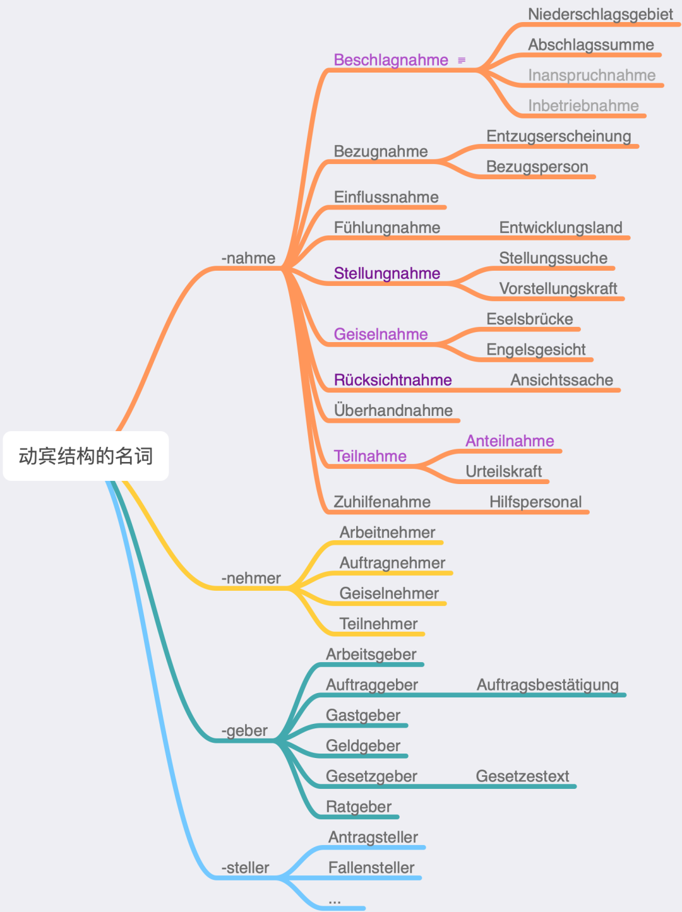

# 名词复合中缀

复合词中间加s这种现象德语叫做Fugen-s（中缀s），同属于中缀的还有好几个，但是，可以说Fugen-s是最常见的中缀（如果不算不添加字母的“零中缀”）。有数据为证：

中缀一般来自古德语的第二格，比如des Bundes Tag → Bundestag, der Sonnen Strahl → Sonnenstrahl；或者来自复数词尾，比如Wörterbuch。不过现在有部分复合词已经不能按第二格或复数关系来理解，有些不是第二格也加了Fugen-s。但是了解这一点对我们掌握Fugen-s还是有很大帮助的。

一、需要加s的情况

Liebe这个词之所以这么复杂，是因为古德语和中古德语有das Lieb和die Liebe两个词。“爱的……”一般用Liebes-，后来不表示所属关系也这样看齐了，比如liebesfähig。

Hilfe做限定词的复合词看上去很复杂，其实可以找出逻辑：一般情况，尤其是所属关系要加s；hilflos和hilfreich这对反义词不加；Hilfeleistung和Hilfestellung来自动宾结构，所以不加s。

Geschichte做限定词的复合词的逻辑：表示历史用Geschichts-（古德语曾有过中性的“历史”），表示故事用Geschichten-。

词尾越长越好确定加不加s。-at, -tät, -heit, -keit, -schaft这几个以t结尾的词尾肯定是加中缀s的。-um, -tum, -ing, -ling 这几个鼻音结尾的词尾也是加中缀s的。-ung几乎全是加的，但是有两可的情况，见第二部分（动宾关系）。-ion只有一个特例，那就是Kommunion做限定词的几个复合词是不加s的。

二、不加s的情况

阴性名词第二格不是加词尾s的，所以，大部分阴性名词构成复合词也不需要加中缀s。

Kriegführung是来自动宾结构的（前面还提到过Hilfeleistung），但是这方面个别特例，比如Kriegserklärung, Beitragszahlung，因为第二格和动宾结构两个规则在这里产生了交集，所以出现了这种复杂情况，类似的例子verfassung(s)gebend。Arbeit构成复合词几乎全是要加s的，但是Arbeitnehmer和Arbeitgeber不用加，因为勉强也算动宾结构，严格来说不是，因为后面得是动词的某种变化，比如词干或-ung，还有很强的动词性。

动宾结构不加中缀的暴力破解：

1. 把动宾结构的-nahme统统找出来。找出来后发现确实都没有加中缀。上图中有些词比较生僻，只需要注意蓝色字体的词就行。

2. 第一步找出的词，是不是因为词尾特点根本就不加中缀？答案是否定的，没加-nahme的时候都有中缀-s-。当然，Einfluss因为词尾特点不可能再加中缀-s-了。

3. 有没有其他类似-nahme的动宾结构。有，但是不多，勉强找到-nehmer, -geber和-steller。

词尾-er和-el之后总体是不加中缀s的。-er仅有几个特例，因为比较生僻，就不列出来了。-el方面需要注意Engel这个词，所属关系很强的话要加s，比如Engelsgesicht；所属关系不强或其他情况不加s，比如Engelmacherin（动宾关系变来的），engelschön；有个别Engel构成的复合词可加s也可不加s，两可。

词尾-sch, -(t)z, -s, -ß因为加中缀s不好发音，所以不加中缀s。另外，词尾-st也不加中缀-s。 

三、两可的情况

某种税（Steuer）和某种街（Straße）可加也可不加中缀s，比如Einkommen(s)steuer, Bahnhof(s)straße。

本来不加中缀-s的短限定词，本身变成复合词后，会加中缀-s，比如：Hoftor → Bahnhofstor, Nachtstunde → Mitternachtsstunde。这造成同一个词有的时候加s，有的时候不加的印象。

四、总结

要不要加中缀s，一看所属关系（第二格），二看动宾关系，三看词尾，四看发音。综合作用下，也有两可的情况。
