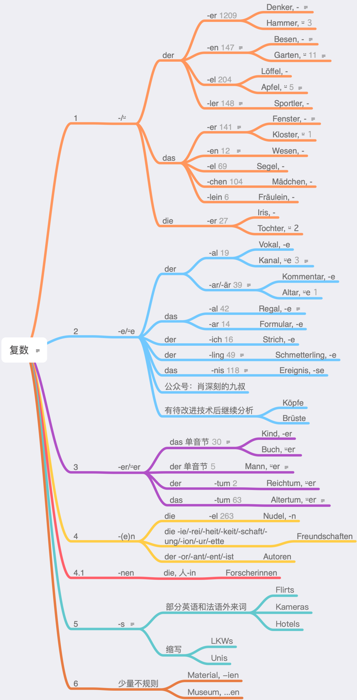

# 名词复数

德语名词主要加五种词尾（包括零词尾），前三种有变音的可能性，而变音的数量不多。首先重读的元音得有a, o, u或au，其次得是高频词，才有变音的资格，所以就特别少（见上表的数字）。

意思是人，词尾为-in的，复数肯定加-nen。这是第四条规则的补充。和复数加-se的情况一样，是因为发音关系造成的变体，并不是单独的规则。Bus, 直接接e，那s就变成浊音了。

第六条是少量的外来词词尾，主要是希腊语和拉丁语。毕竟曾经一度他们的古文是这些。

第二条并没有分析完，因为算法遇到了瓶颈。等我解决了算法问题，再出改进版。
