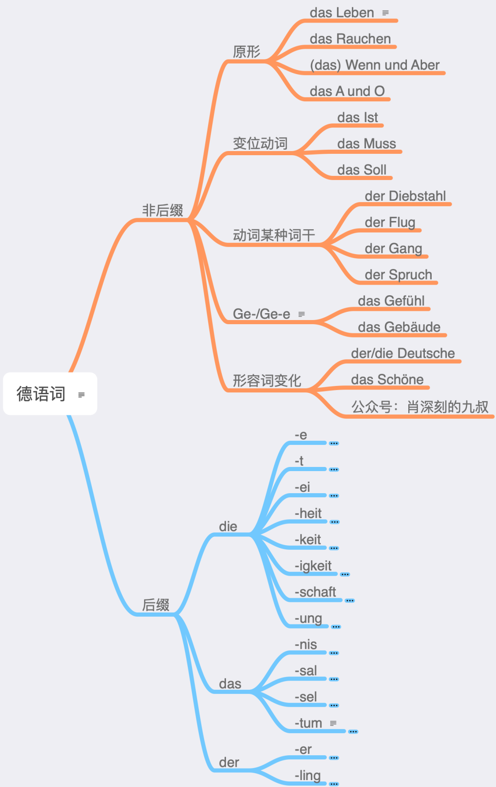
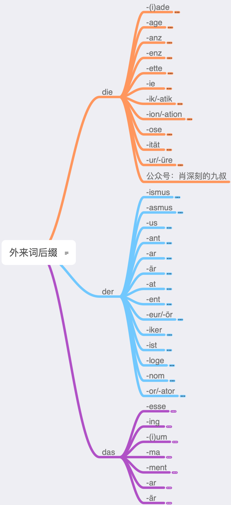
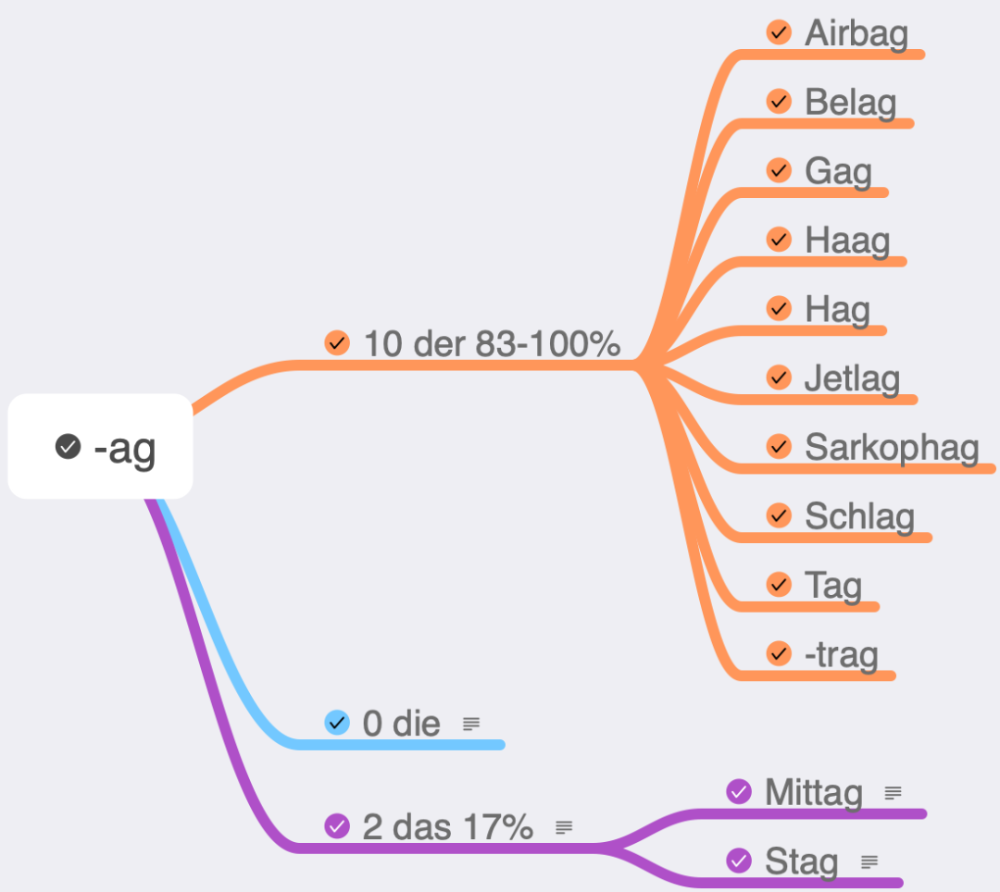

# 名词的性

## 名词构词

暴力穷举Langenscheidt对外德语词典中所有的名词。

| der       | 7321  |
| --------- | ----- |
| das       | 3671  |
| die       | 9421  |
| die (Pl.) | 159   |
| 名词合计  | 20482 |
| 词典词条  | 32584 |

德语自源词阴性的词尾构词能力最强大，比如ung和heit，见下图：

外来词词尾中，也是阴性的词尾构词能力最强大。

## 名词性判断

名词的性属靠三重判断：一词尾，二含义，三联想。

很多词尾是有确定的性属的，尤其是抽象名词的词尾，字母越多越可靠。

含义对性属的影响还是有的，只不过不像词尾那么明显。有的时候需要追溯词源，这个比较难。

「联想」不是指的「Hand是五指姑娘」「Brief是男的写的」这种「歪门邪道」。「联想」指的是外来词和新造词定性属的时候会联想到已有的什么德语词。为什么说前面那种是歪门邪道，是因为那种方式虽然有趣也有效，但是不符合以德语为母语者判断性属的方式，更重要的原因是：合理的能帮助到别人的奇思妙想一定是极少的，大部分编造其他人都会认为太牵强，没有帮助，与其记住这种没有逻辑的理据或故事，还不如多记几个例句。

以德语为母语的人是对词尾、含义和联想进行综合判断的。知乎上有人做过这样的试验（是谁我忘了，请帮我补充）：拿一些罕见的名词要德国人猜性属，他们绝大部分是能猜对的，也有个别猜错的情况。问德国人怎么判断的，不外乎词尾、含义和联想三种情况。

怎么具备这种综合判断能力？只能靠慢慢积累。一下排出一大片词尾，固然气度不凡，但是对初学者并没有什么用处。从教学角度的说，应该是讲到某个单词的时候说「这样的词尾大多是某某性的」，反复强化，才有用；一下给出一梭子，一下消化不了，收藏，然后就没有然后了。

然而，就是这种词尾总结，网上一抓一大把的这种，公众号上寻常见的这种，充满硬伤。如此不严谨，简直对不住我大德意志严精细的Klischee（刻板印象）。比如

提到的这种：

 

  阴性包括：

  -ung -ur -ik -tät -e -heit -keit -a -in -schaft

  -ade -age -ette -ie -enz -sis -ei

  阳性包括：

  -er -ent -at -oge -ist -ant -ot -ekt -ich -ig -ling

  -s -and -är -ast -eur -ier -iker -ismus -or

  中性包括

  -chen -o -lein -tel -lum -ing -um -ma -me 以及所有与动词原型同型的名词，比如 das Essen 与 essen

  这只是一般规律，比如der Affe 猴子，也有很多以-e 结尾的词是阳性的

 

  「-ung结尾的是阴性」，这种说法不严谨，der Sprung, der Aufschwung ... 不是阴性。合适的提法是：带-ung后缀（因为也有词干以-ung结尾）的名词是阴性。「-ur结尾的是阴性」？das Abitur, das Dur, der Merkur, der Flur, der Schwur, das Futur ... 都不是阴性。合适的提法是：以-ur结尾的名词基本上是阴性。「-ik结尾的是阴性」？der auch das Aspik, der Atlantik, der Katholik ... 不是阴性啊。合适的提法是：以-ik结尾的名词基本上是阴性。「-e结尾的是阴性」这条明显不对，还有大量的以-e结尾的阳性弱变化名词呢，还有Ge-e环缀构成的一大片中性名词呢，另外还有少量其他反例。「-a结尾的是阴性」这条不靠谱，das Thema, das Klima, der Gorilla, der Guerilla, der Puma可都是常见词啊。

  「-in结尾的是阴性」这条总结得不对，大量化学物质Protein, Heroin, Koffein, Benzin是中性的，另外还有der Cousin, der Jasmin, der Baldachin, der Delphin很多反例。

  「-schaft结尾的是阴性」，不对。带-schaft后缀的派生词才是阴性。der Ruderschaft, der Stiefelschaft这种词是复合词不是阴性。

 

肖九叔走心的总结（将对特例进行暴力穷举）：

 

一、属于阳性名词的:

 

\1. 大多数以-er结尾的表示人或机械的名词，如Arbeiter, Fernseher。der Finger, 手指 der Fehler, 错误der Leiter, 领导人

例外： die Butter, 黄油，die Mutter 母亲，das Fenster, 窗户，die Leiter, 梯子

\2. 几乎所有表示星期，日，月，四季，方位，自然现象（风，雨，雪，雾）Mittwoch, Tag, Juni, Osten, Nebel。

 

\3. 大多数以-en, -ig, -ich结尾的名词，如Boden, Honig, Stich。der Kranich, 鹤der Pfirsich, 桃子der Teppich, 地毯

 

\4. 几乎所有动词词干形式的词，如Kauf, Gang。例外：Fahrt, Arbeit ...

 

\5. 以下词尾：

 

大多 -or, 如der Autor der Autor, 作者, 作家

der Katalysator, 催化剂der Reaktor, 反应堆

例外 : das Gegentor, 失球，das Chlor, [化]氯

 

 

大多 -and/ant 如Doktorand, Praktikant （实习生）der Mandant, （律）当事人

 

表示人的后缀 -ent 如der Student der Absolvent, 毕业生，

 

der Dirigent, (乐队)指挥 , der Patient, 病人

 

-ismus 如der Idealismus （理想主义）

 

-ist 如 der Artist, 艺术家 der Optimist, 乐观主义者der Realist, 现实主义者

 

所有非外来词的 -ling 如 der Schmetterling （蝴蝶）

der Feigling, 胆小鬼

der Lehrling, 学徒

der Zwilling, 双胞胎 

例外：das Recycling, 回收利用 , das Bowling, 保龄球

 

大多 -us 如Bonus （红利），Virus*

 

–ner 

der Rentner, 退休者der Schaffner, 乘务员der Zöllner, 海关人员

例外 : das Banner, 旗帜 ，die Wiener (Wurst) , 维也纳香肠

 

所有表示人和工具的法语词尾-eur，如Friseur。

 

去掉1365个-ung阴性和几十个英语-ing中性，g结尾的词至少90%是阳性。并且ag结尾是阳性的确定性更大（字母越多越好判断）。中性的两个-ag在C1以下不太可能碰到，所以说-ag几乎是100%阳性。这样学生就不会害怕der/das/die了。

二、属于阴性名词的:

 

\1. 数字直接大写变成的名词，如die Eins, die Zwei 等。

 

\2. 多数以e结尾表示非生物的名词，如Tasche。例外：Käse

 

\3. 以下词尾：

 

大部分-a 如die Kamera

 

绝大部分 -ei 如die Backerei，例外如：der Papagei。 die Bäckerei, 面包房die Bücherei, 书店die Druckerei, 打印店 例外： der Papagei 鹦鹉

 

-heit 如 die Gesundheit die Frechheit, 放肆 die Geborgenheit, 安全 

die Trunkenheit, 醉酒

 

-keit 如 die Einigkeit 统一 die Einigkeit, 统一die Einsamkeit, 孤独 die Müdigkeit, 疲劳

 

大多 -ik 如 die Grammatik die Fabrik, 工厂 die Klinik, 医院，诊疗所

die Politik, 政治 

例外：der Atlantik, 大西洋, der Katholik, 天主教徒

 

表示人的 -in 如 die Studentin 女学生 die Köchin, 女厨师 die Sekretärin, 女秘书die Türkin 土耳其女人

 

绝大部分 -ion 如die Produktion，例外如der/das Lampion, der Skorpion（待暴力穷举） die Aktion, 行动die Diskussion, 讨论die Information, 信息 

 

抽象名词后缀 -schaft 如 die Freundschaft die Feindschaft, 敌对

die Freundschaft, 友谊

die Meisterschaft, 冠军; 精通 

例外：der Ruderschaft 船的舵柱，der Stiefelschaft，鞋帮

 

-tät（已暴力穷举） 如die Universität

 

-ität  die Aggressivität, 攻击 die Aktivität, 吸引die Humanität, 人性 

 

后缀 -ung 如die Wohnung die Endung, 结尾 die Entfernung, 远离

die Hoffnung, 希望 

例外：der Sprung, 跳跃，der Aufschwung, 繁荣

 

-thek（已暴力穷举）如die Bibliothek

 

多数 -anz 如die Toleranz 宽容 die Allianz, 联合die Arroganz, 傲慢die Bilanz, 结算表

 

大多数 -ur 如die Natur, die Frisur die Diktatur, 独裁

die Rasur, 剔除（毛发）

die Rezeptur, 配方

例外：das Abitur, 高中毕业考试，der Flur, 走廊

 

基本上所有的-ie。die Demokratie, 民主

die Fotografie, 摄影

die Prämie, 奖金

 

基本上所有的-enz。die Intelligenz, 智力 die Konferenz, 会议die Prominenz, 名人

 

所有的-sis，比如die Skepsis。

 

所有作为后缀的-ei，例如die Bäckerei。

 

acht这3个字母在末尾是阴性的概率特别大：

三、属于中性名词的：

 

\1. 幼小的人和动物，如das Kind, das Kalb, das Küken。

 

\2. 大多数化合物，如Hormon, Protein, Melamin, Glutamat。

 

\3. 几乎所有的金属和化学元素的名称，如das Eisen, das Gold。

 

颜色名词：Himmelblau, 天蓝Rosarot, 玫瑰红Weiß, 白色

 

\4. 几乎所有名词化的动词原形，如das Leben, das Fernsehen。

名词化的动词：

das Essen, 吃饭

das Lernen, 学习

das Reisen, 旅游 

 

\5. 所有其他名词化的词类（数词除外）如das Ich自我, das Blau, das Muss。

 

名词化的形容词：

das Gute, 好的东西

das Böse, 坏的事物

ps：此处指的是变格后的形容词直接作名词用。 如果转化后的名词指代的是事物，则名词的词性都为中性，形容词的变格词尾同样要保留，例如: das Alte，das Süβe。若转化后的名词指代的是人，名词的词性与人的自然属性相同，名词的词尾与形容词的变格词尾相同，例如: eine Arme，die Bekannten, der Chinesische

 

\6. 带小称后缀-chen, -lein, -el的名词，如Mädchen, Vöglein, Aschenputtel。

 

\7. 大多数带前缀ge-的名词，如Gebäude, Getränk。

 

\8. 以下词尾：

 

几乎所有 -ett（已暴力穷举） 如das Bankett 宴会

 

多数 -ma 如das Klima 气候

 

几乎所有 -ment（已暴力穷举） 如 das Fundament 基础

das Argument, 论点

das Dokument, 文件

das Element, 元素

 

大部分 –um 如das Eigentum 财产 

das Datum, 日期

das Publikum, 公众

das Stadium, 阶段

 

-tum

das Brauchtum, 民间习俗

das Christentum, 基督教

das Eigentum, 所有物，财产 ...

例外：der Irrtum, 错误；der Reichtum, 财富

 

-zeug（已暴力穷举） 如das Spielzeug

 

–nis 

das Ergebnis, 结果

das Tennis, 网球 

例外：die Fahrerlaubnis, 驾驶执照，die Wildnis, 荒野

 

–o 

das Auto, 汽车

das Konto，账户 

例外: die Avocado, 油梨，der Euro, 欧元

 

 

四、其他

 

\1. 以-el结尾的词分属三种性，如果是阴性，复数加-n；阳性和中性一般单复数同形。要特别注意der Mantel的复数是Mäntel。

 

\2. 以-nis结尾的词基本是中性，一小部分是阴性（die (Er)kenntnis, die Ersparnis, die Erlaubnis, die Fäulnis, die Finsternis）；如果有复数，则加-se。已暴力穷举，请参见下文。

 

\3. 带ge-前缀的名词有一部分是阳性和阴性（已暴力穷举）。

 

\4. 以-t, -d结尾的名词，复数大多加-er。

 

五、暴力穷举下的规则

 

\1. -sam结尾的名词除了das Gewahrsam（和das Gefängnis近义）全是阳性。其实也没几个：

 

der Balsam

 

der Bisam

 

der Gehorsam

 

der Gewahrsam（和Schutz; Haft近义）

 

der Sesam

 

\2. -ett 结尾的名词全是中性，除了以下几个词：

 

der Kadett, -en, -en

 

der Kornett

 

der/das Scherbett（说明德国人也在der和das之间摇摆）土耳其清凉饮料

 

der Seekadett

 

die Skelett（联想die Schrift）细骨架字体

 

\3. -ling结尾的词，来自英语的是das（以-ing结尾的英语词在德语里属中性），来自荷兰语的是die，非外来语是der。

 

来自荷兰语：

 

die Helling

 

die Kaveling

 

die Reling

 

die/der/das Soling

 

die Wieling

 

来自英语：

 

das Bowling

 

das Feeling

 

das Recycling

 

以及其他十余个词

 

\4. -nis作为后缀，除了以下这些阴性的词（其中相当一部分是表达感受的），全部是中性的：

 

Anerkenntnis/Erkenntnis/Kenntnis（注意：das Bekenntnis）, Bangnis, Bedrängnis, Befugnis, Beklemnis, Bekümmernis, Besäufnis, Beschwernis, Besorgnis, Betrübnis, Bewandtnis, Bitternis, Düsternis, Empfängnis, Erlaubnis, Erschwernis, Ersparnis, Fahrnis, Fährnis, Fäulnis, Finsternis, Gebührnis, Kümmernis, Säuernis, Säumnis, Verdammnis, Verderbnis, Wildnis, Wirrnis.

 

\5. Ge- 作为名词前缀，只有18个词是阳性，其中相当一部分是弱变化，只有17个词是阴性，2个只有复数形式，剩下都是中性：

 

阳性

 

der Gebrauch, die Gebräuche

 

der Gedanke, -ns, -n

 

der Gefährte, -n, -n

 

der Gefallen, -

 

der Gehalt, -e

 

der Gehilfe, -n, -n

 

der Gehorsam

 

der Gemahl, -e

 

der Geruch, Gerüche

 

der Gesang, Gesänge

 

der Geschmack, Geschmäcke

 

der Gesell, -en, -en

 

der Geselle, -n, -n

 

der Gespiele, -n, -n

 

der Gespons, -e

 

der Gestank

 

der Gewahrsam（意思是Schutz; Haft的时候是阳性，意思是das Gefängnis的时候是中性）

 

der Gewinn, -e

 

阴性

 

die Gebärde, -n

 

die Gebühr, -en

 

die Gebührnis, -se

 

die Geburt, -en

 

die Geduld

 

die Geest, -en

 

die Gefahr, -en

 

die Gegend, -en

 

die Gemeinde, -n

 

die Genese, -n

 

die Genesis

 

die Geschichte, -n

 

die Geschwulst, Geschwülste

 

die Gestalt, -en

 

die Gewähr, -

 

die Gewalt, -en

 

die Gezeit, -en

 

只有复数形式

 

(Pl.) die Gebrüder

 

(Pl.) die Geschwister

 

\6. -ig结尾的词，有7个阳性，基本都是常见词：Essig, Honig, Käfig, König, Odermennig, Pfennig, Zeisig。

 

中性（4个）

 

Reisig, Sechsundsechzig（这个词真的好生奇怪）, das/der Zabig, Zuwenig

 

阴性

 

Achtzig 等表示“几十”的数字

 

\7. -acht 结尾的词，有12个阴性，4个阳性（除了Schacht都来自动词的某种词干）。

 

阴性

 

Acht, Andacht, Eintracht, Fracht, Gracht, Jacht, Macht, Nacht, Pacht, Pracht, Schlacht, Tracht,

 

阳性

 

Bedacht, Betracht, Schacht(Schaft), Verdacht

 

\8. -tum结尾的词，除了der Irrtum, der Reichtum两个阳性，全是中性。

 

\9. -ment结尾的词，除了der Komment, Konsument, Moment, Piment, Zement五个阳性词，全是中性。

 

\10. 发音为[i:]或[iə]的-ie性属为阴性；发音为[i]的英语词性属一般为阳性。特例：das Knie, das Genie, das Groupie, das Curie（单位名称，从意义上属于中性）, das Walkie-Talkie（会联想到das Telefon）。

 

动词原形变来的名词，理论上是中性，比如das Essen。这一条规律很容易发现，很容易总结。

 

由动词的某种词干变成的名词，理论上是阳性，比如der Schlaf (schlafen), der Gang (gehen)。这一条规律就难发现很多了。

 

我们今天要说的是：动词的某种词干加-t或-d，变成名词，理论上是阴性。刚好三个性就凑齐了。学习者自己发现这一条规律，几乎是不可能的。

 

加-d的比如：

 

jagen 打猎 - Jagd 打猎

sollen 应该 - Schuld 债；罪责

（欠（方言“该”）了人东西，就是债；罪责也是一种债）

taugen 中用 - Tugend 美德

（中用，就是具有美德）

 

...

 

这样把一些不是动词词干加-d的都带成了阴性：

 

gegen 反 - Gegend 这一片儿

jung 年轻的 - Jugend 年轻

...

 

加-t非常多，比如：

 

kommen 来 - Zukunft 未来

fahren 车/船行驶 - Fahrt 车/船行驶

fahren 车/船行驶 - Furt 河中浅滩

fliehen 逃 - Flucht 逃

fließen 水流 - Flut 洪水

gebären 生 - Geburt 出生

schwellen 肿 - Geschwulst 肿瘤

stellen 立 - Gestalt 形

（这3个-t/st的阴性特征如此明显，以至于盖过了Ge-的中性特征）

glühen 红/白热 - Glut 红/白热

jagen 追逐；打猎 - Jacht 快艇 🚤

klieben 劈开（生僻词）- Kluft 鸿沟

können 能 - Kunst 技艺，艺术

mögen 可能 - Macht 力量，权力

laden 装载 - Last 重压

nähen 缝 - Naht 线缝

pflegen 护理 - Pflicht 义务

predigen 布道 - Predigt 布道

ruhen 安静 - Rast 休息

sähen 播种 - Saat 播种；种子

schlagen 打 - Schlacht 战役

schreiben 写 - Schrift 写，文字

stehen 立 - Stadt 城市

suchen 找 - Sucht 瘾

tun 做 - Tat 行为

tragen 穿 - Tracht 节日盛装

ziehen 拉 - Zucht 培育