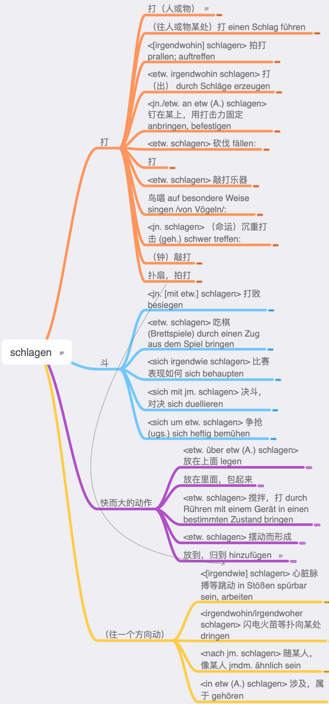

# 词汇

## 高频词

### 名词

| Noun                  | Translation           | Example                                                      | Example translation                                          |
| --------------------- | --------------------- | ------------------------------------------------------------ | ------------------------------------------------------------ |
| das Jahr              | year                  | Das Jahr geht zu  Ende                                       | The year is  coming to an end                                |
| das Mal               | time                  | Helmut ist schon  zum zweiten Mal in Schweden                | Helmut is in  Sweden already for the second time             |
| das Beispiel          | example               | Ich könnte zum  Beispiel früher kommen                       | I could come  earlier, for example.                          |
| die Zeit              | time                  | Ich habe keine  Zeit                                         | I don't have  time                                           |
| die Frau              | woman, wife, Mrs      | Im Komitee waren  nur vier Frauen                            | There were only  4 women on the committee                    |
| der Mensch            | human being, man      | Stammt der  Mensch vom Affen ab?                             | Is human being  descended from apes?                         |
| das Kind              | child                 | Unser Kind geht  schon in den Kindergarten                   | Our child  already goes to kindergarten                      |
| der Tag               | day                   | Sonntag ist der  schönste Tag der Woche                      | Sunday is the  best day of the week                          |
| der Mann              | man                   | Siehst du den  Mann dort?                                    | Do you see that  man there?                                  |
| das Land              | land, country, state  | Dänemark ist ein  kleines Land in Europe                     | Denmark is a  small country in Europe                        |
| die Frage             | question              | Antworte mir  bitte auf meine Frage                          | Please answer my  question                                   |
| das Haus              | House                 | Mein Bruder baut  sich ein Haus                              | My brother's  building himself a house.                      |
| der Fall              | fall, case            | Ich habe so  einen Fall noch nicht erlebt                    | I've never seen  a case like this before.                    |
| die Leute             | people                | Viele Leute  beobachten den Unfall, aber keiner half         | A lot of people  were watching the accident, but nobody helped. |
| die Arbeit            | work                  | Es wartet viel  Arbeit auf uns                               | A lot of work  awaits us                                     |
| das Prozent           | percent               | Diese Prüfung  zählt zehn Prozent der Gesamtnote             | This exam counts  for ten percent of the overall grade.      |
| das Hand              | hand                  | Ich habe mir die  linke Hand gebrochen                       | I broke my left  hand                                        |
| die Stadt             | city, town            | Köln ist eine  Stadt in Deutschland                          | Cologne is a  city in Germany                                |
| der Teil              | part                  | Im ersten Teil  des Buches werden die Charakter vorgestellt  | The characters  are introduced in the first part of the book |
| das Problem           | problem               | Wir werden das  Problem lösen                                | We will solve  the problem                                   |
| die Welt              | world                 | Eine Reise um  die Welt is teuer                             | A trip around  the world is expensive                        |
| die Recht             | right, law            | Nach  europäischem Recht ist das verboten                    | According to  European law this is forbidden.                |
| das Ende              | end                   | Das Ende des  Films war traurig                              | The end of the  movie was sad                                |
| die Schule            | school                | Sie geht noch  zur Schule                                    | She still goes  to school                                    |
| die Woche             | week                  | In der nächsten  Woche sind Prüfungen                        | Next week, exams  are scheduled                              |
| der Vater             | father                | der Vater von  Andrea ist gerade vierzig geworden            | Andreas father  already turned 40                            |
| die Seite             | side, page            | Das Buch hat  zweihundert Seiten.                            | The book has 200  pages                                      |
| das Leben             | life                  | Sie versucht,  den Tieren das Leben zu retten                | She's trying to  save the lives of the animals.              |
| die Mutter            | mother                | Meine Mutter ist  Chefin eines Konzerns                      | My mother is the  head of a group of companies.              |
| der Grund             | reason, basis         | Du hast keinen  Grund, böse zu sein                          | You have no  reason to be angry.                             |
| das Auge              | eye                   | Max hat sehr  schöne Auge                                    | Max has very  beautiful eyes                                 |
| das Wort              | word                  | Ich habe das  letzte Word nicht verstanden                   | I didn't get the  last word                                  |
| der Geld              | money                 | Ich habe kein  Geld                                          | I don't have  money                                          |
| die Sache             | thing, matter         | Die Sache hat  sich erledigt                                 | The matter has  been settled.                                |
| die Art               | type, kind            | Löwe sind eine  Art Katzen                                   | Lions are a kind  of cats.                                   |
| der Bereich           | area, region          | In diesem  Bereich ist Frau Bitter expertin                  | Ms Bitter is an  expert in this area.                        |
| der Weg               | path, way             | Der Weg biegt  später nach links ab                          | The road turns  left later                                   |
| die Stunde            | Hour                  | Der Zug hatte  zwei Stunden Verspätung                       | The train ran 2  hours late                                  |
| der Name              | name                  | Mein Name is  Charlotte                                      | My name is  Charlotte                                        |
| die Geschichte        | history, story        | Abends liest die  Oma den Kindern Geschichten vor            | In the evening,  grandma reads stories to the children.      |
| die  Gesellschaft     | society, company      | Eine  multikulturelle Gesellschaft muss tolerant sein        | A multicultural  society must be tolerant                    |
| der Kopf              | head                  | Mir tut der Kopf  weh                                        | My head hurts                                                |
| das Paar              | pair, couple          | Agnes hat zwei  Paar schöne Schuhe gekauft                   | Agnes bought two  pairs of beautiful shoes                   |
| die  Möglichkeit      | possibility           | Nach der  Konferenz haben Sie die Möglichkeit, essen zu gehen | After the  conference, you will have the opportunity to eat out |
| das  Unternehmen      | enterprise, company   | Das Unternehmen  ging in Konkurs                             | The company went  bankrupt.                                  |
| das Bild              | picture               | Renates Büro  hängt voller Bilder                            | Renate's office  is full of pictures.                        |
| das Buch              | book                  | Friedrich hat  das Buch schon zweimal gelesen                | Friedrich has  read this book already two times              |
| das Wasser            | water                 | Das Wasser ist  zu kalt zum Baden                            | The water is too  cold for swimming                          |
| die Stelle            | place                 | Wir treffen uns  an der gleichen Stelle wie letzte Woche     | We'll meet at  the same place as last week.                  |
| der Form              | form, shape           | Das Lindenblatt  hat die Form eines Herzens                  | The lime leaf  has the shape of a heart                      |
| die  Entwicklung      | development           | Die Firma hat  eine eigene Abteilung für Forschung und Entwicklung | The company has  its own department for research and development. |
| der Monat             | month                 | Mit sechs  Monaten bekommen Babys die ersten Zähne           | Babies get their  first teeth when they're six months old    |
| die Familie           | family                | Die ganze  Familie wohnt in einem Dorf zusammen              | The whole family  lives together in one village.             |
| der Morgen            | morning               | Am Morgen  scheint die Sonne ins Schlafzimmer                | In the morning  the sun shines into the bedroom              |
| der Abend             | evening               | Im Winter wird  es Abends früh dunkel                        | In winter it  gets dark early in the evening                 |
| die Aufgabe           | task, assignment, job | Lösen Sie bitte  die folgenden Aufgaben                      | Please solve the  following tasks                            |
| die  Universität, Uni | university            | Die Universität  wird 60 jahre alt                           | University turns  60 years old                               |
| der Sinn              | sense, meaning        | Mann soll das  Leben mit allen Sinnen genießen               | Man shall enjoy  life with all his senses                    |
| der Staat             | state                 | Die Steuern  bekommt der Staat                               | The state gets  the taxes                                    |
| das Ziel              | destination, goal     | Hamburg war das  Ziel seiner Reise                           | Hamburg was the  destination of his journey                  |
| der Freund            | friend, boyfriend     | Franziska wohnt  mit ihrem Freund zusammen                   | Franziska lives  with her boyfriend                          |
| das Thema             | subject, topic, theme | Ich würde gern  das Thema wechseln                           | I'd like to  change the subject.                             |
| die Person            | person                | Dieser Tisch ist  ab 20 Uhr für acht Personen reserviert     | This table is  reserved from 20 o'clock for eight persons.   |
| die Nacht             | night                 | Sie haben die  ganze Nacht getanzt                           | They've been  dancing all night.                             |
| der Ding              | thing                 | Gib mr mal das  Ding da!                                     | Give me that  thing!                                         |
| der Raum              | room, space           | Das Wohnzimmer  ist der größte Raum in der Wohnung           | The living room  is the largest room in the apartment        |
| der Blick             | view, look, glance    | Von der  Turmspitze hat man einen schönen Blick über die ganze Stadt | From the top of  the tower you have a beautiful view over the whole city. |
| der Platz             | place, room, square   | Ich habe nicht  genug Platz                                  | I don't have  enough room                                    |
| die Zahl              | number                | Eine große Zahl  von Jugendlichen raucht                     | A large number  of young people smoke                        |
| das System            | system                | Neben der  Demokratie gibt es noch andere politische Systeme | There are other  political systems besides democracy         |
| die Uhr               | hour, watch           | Es ist genau  zehn Uhr                                       | It's ten o'clock  exactly.                                   |
| die Eltern            | parents               | In den Ferien  fahren wir mit den Eltern an die Ostsee       | During the  holidays we will go with our parents to the Baltic Sea |
| die Straße            | street                | Die Straße wird  neu gebaut                                  | The road is  newly built                                     |
| die Minute            | minute                | Der Kuchen muss  zwanzig Minuten backen                      | The cake must  bake for twenty minutes.                      |
| die Gruppe            | group                 | Zu den Workshops  treffen wir uns in kleinen Gruppen         | For the  workshops we gather in small groups                 |
| das Wert              | value                 | Die Aktie hat an  Wert verloren                              | The share price  has lost value                              |
| die Gesicht           | face                  | Sie hat ein  rundes, immer freundliches Gesicht              | She has a round,  always friendly face.                      |
| die Sprache           | language              | Die deutsche  Sprache hat den Ruf, schwierig zu sein         | The German  language has the reputation of being difficult.  |
| der Anfang            | beginning             | Am Anfang war  das Wort                                      | In the beginning  was the word                               |
| der Ort               | place, town, location | Bad Harzburg ist  ein kleiner Ort im Harz                    | Bad Harzburg is  a small town in the Harz Mountains          |
| der Moment            | moment                | Warte noch einen  Moment!                                    | Wait a minute!                                               |
| die Folge             | result, consequence   | Die Folge davon  war, dass er arbeitslos wurde               | The result was  that he lost his job                         |
| das Interesse         | interest              | Sind  Studiengebühren im Interesse der Studenten?            | Are tuition fees  in the interest of students?               |
| die Rolle             | role, roll            | Gustav Gründgens  überzeugte in der Rolle des Faust          | Gustav Gründgens  was convinced in the role of Faust         |
| die Tür               | door                  | Sein Name steht  an die Tür                                  | His name is on  the door.                                    |
| der Schüler           | student               | Alle Schüler  treffen sich donnerstags in der Aula           | All students  meet in the auditorium on Thursdays.           |
| die Bedeutung         | meaning, significance | Was hat das für  eine Bedeutung?                             | What does that  mean?                                        |
| der Text              | text                  | Der Text ist zu  Lang                                        | The text is too  long                                        |
| das Ergebnis          | result, outcome       | Die  Projektgruppe stellt ihre Ergebnisse vor                | The project  group presents its results                      |
| der Krieg             | war                   | Die Soldaten  ziehen in den Krieg                            | The soldiers go  to war                                      |
| die Weise             | way, manner           | Auf welche Weise  lösen wir das Problem am schnellsten?      | What is the  quickest way to solve the problem?              |
| die Regierung         | rule, government      | Die Regierung  sitzt in Berlin                               | The government  is in Berlin                                 |
| der Stück             | piece                 | Ich möchte noch  ein Stück Kuchen                            | I'd like another  piece of cake.                             |
| die Wohnung           | apartment, flat       | Die Wohnung ist  im dritten Stock                            | The apartment is  on the third floor                         |
| das Gespräch          | conversation          | Ein vernünftiges  Gespräch war nichts mehr möglich           | A reasonable  conversation was no longer possible            |

### 动词

| Verb                | Translation                    | Example                                                      | Example translation                                          |
| ------------------- | ------------------------------ | ------------------------------------------------------------ | ------------------------------------------------------------ |
| sagen               | to say                         | Conny sagt ihrem  Man die Wahrheit                           | Conny tells her  husband the truth                           |
| machen              | to make                        | Ich mache meine  Hausaufgaben                                | I am doing my  homework                                      |
| geben               | to give                        | Ich gebe dir das  Buch                                       | I am giving you  the book                                    |
| kommen              | to come                        | Wir kommen  morgen zu dir                                    | We will come to  you tomorrow                                |
| gehen               | to go                          | Wir gehen ins  Kino                                          | We are going to  the movies                                  |
| wissen              | to know                        | Woher weißt du  das?                                         | Where do you  know this from?                                |
| sehen               | to see                         | Mark sieht ohne  Brille nichts                               | Mark sees  nothing without his glasses                       |
| stehen              | to stand,                      | Der Maler steht  auf dem Balkon                              | The painter  stands on the balcony                           |
| finden              | to find                        | Wir finden keine  Lösung                                     | We are failing  to find a solution                           |
| bleiben             | to stay, remain                | Du kannst bis  morgen bleiben                                | You can stay  till tomorrow                                  |
| liegen              | to lie                         | Der Kranke liegt  im Bett                                    | The patient lies  in bed                                     |
| heißen              | to be called                   | Sie heißt Anja                                               | Her name is Anja                                             |
| denken              | to think                       | Wir denken an  dich                                          | We think of you                                              |
| nehmen              | to take                        | Kannst du den  Koffern nehmen?                               | Can you take the  suitcase?                                  |
| tun                 | to do                          | Wir tun nur  unsere Pflicht                                  | We're just doing  our duty                                   |
| glauben             | to believe                     | Glaubst du uns?                                              | Do you believe  us?                                          |
| halten              | to hold                        | Er hält eine  Blume in der Hand                              | He is holding a  flower in his hand                          |
| nennen              | to name, call                  | Sie nennen ihren  Sohn Max                                   | They will call  their son Max                                |
| mögen               | to like                        | Ich mag Äpfel                                                | I like apples                                                |
| zeigen              | to show                        | Der Stadtführer  zeigt den Touristen die Stadt               | The city guide  shows the tourists the city                  |
| führen              | to lead                        | Die Straße führt  ins nächste Dorf                           | The road leads  to the next village                          |
| sprechen            | to speak                       | Ich spreche mit  dir                                         | I am speaking  with you                                      |
| bringen             | to bring                       | Er bringt seiner  Freundin Blumen                            | He is bringing  flower to his girlfriend                     |
| leben               | to live                        | Tobi lebt in  Berlin                                         | Tobi lives in  Berlin                                        |
| fahren              | to drive, ride, go             | Jan fahrt gern  Fahrrad                                      | Jan likes to  ride a bike                                    |
| meinen              | to think, have an opinion      | Was meint ihr zu  dieser Idee?                               | What do you  think about this idea?                          |
| fragen              | to ask                         | Max hat nach dir  gefragt                                    | Max asked for  you                                           |
| gelten              | to be valid                    | Dieser Fahrplan  gilt nicht mehr                             | This timetable  is no longer valid                           |
| stellen             | to place, set                  | Ich stelle den  Teller auf den Tisch                         | I am putting a  plat on the table                            |
| spielen             | to play                        | Die Kinder  spielen draußen                                  | The children are  playing outside                            |
| arbeiten            | to work                        | Er arbeitet seit  zwei Jahren in dieser Firma                | He has been  working in this company for two years           |
| brauchen            | to need                        | Brauchst du  Hilfe?                                          | Do you need  help?                                           |
| folgen              | to follow                      | Ich folge deinem  Rat                                        | I follow your  advice                                        |
| lernen              | to learn                       | Sie lernt  Deutsch                                           | She is learning  German                                      |
| bestehen            | to exist                       | Die Firma  besteht seit 2004                                 | The company  exists since 2004                               |
| verstehen           | to understand                  | Jan versteht  kein Englisch                                  | Jan does not  understand any English                         |
| setzen              | to set, place, put             | Wenn man die  Daten zueinander in die Beziehung setzt, kommt man zu interessanten  Ergebnissen | If you connect  the data together, you get interesting results. |
| bekommen            | to get, receive                | Wir bekomme  selten Post                                     | We rarely get  mail                                          |
| beginnen            | to begin                       | Max beginnt im  Herbst sein Studium                          | Max begins his  studies in autumn                            |
| erzählen            | to tell                        | Die Mutter  erzählt ihren Kindern ein Märchen                | The mother tells  her children a fairytale                   |
| versuchen           | to try, attempt                | Ich versuche,  die Prüfung dieses Mal zu bestehen            | I will try to  pass this exam this time.                     |
| schreiben           | to write                       | Romeo schreibt  Julia einen Liebesbrief                      | Romeo is writing  a love letter to Juliet                    |
| laufen              | to run                         | Erwin läuft  jeden Tag fünf Runden im Park                   | Erwin runs five  laps in the park every day                  |
| erklären            | to explain                     | Der Lehrer  erklärt seinen Schülern eine chemische Formel    | The teacher  explains a chemical formula to the students     |
| entsprechen         | to correspond, match           | Der Anzug  entspricht nicht meinen Vorstellungen             | The suit doesn't  match my expectation.                      |
| sitzen              | to sit                         | Auf dem Sofa  sitzt der Kater und putzt sich                 | The cat sits on  the sofa and cleans itself                  |
| ziehen              | to pull, move                  | Man muss an der  Tür ziehen, um sie zu öffnen                | You must pull  the door to open it                           |
| scheinen            | to shine, seem, appear         | der Sonne  scheint                                           | The sun is  shining                                          |
| fallen              | to fall                        | Lass die Vase  bitte nicht fallen!                           | Please don't let  the vase fall!                             |
| gehören             | to belong                      | der Koffer  gehört mir                                       | The suitcase  belongs to me                                  |
| entstehen           | to originate, develop          | Wirbelstürme  entstehen über dem Meer                        | Hurricanes form  over the sea                                |
| erhalten            | to receive                     | Den Brief habe  ich am Mittwoch erhalten                     | I received the  letter on Wednesday                          |
| treffen             | to meet                        | Wir treffen uns  morgen Mittag auf dem Markt                 | We will meet  each other tomorrow noon at the market.        |
| suchen              | to search, look for            | Ich habe meinen  Sonnenbrille stundenlang gesucht            | I have searched  for my sunglasses for hours                 |
| legen               | to lay, put                    | Die Mutter legt  das Baby ins Bett                           | The mother puts  the baby on the bed                         |
| vorstellen          | to introduce, imagine          | Der Manager  stellt das neue Konzept vor                     | The manage is  introducing the new concept                   |
| handeln             | to deal, trade, be about       | Der Roman  handelt von einer modernen Familie                | The novel is  about a modern family                          |
| erreichen           | to achieve, reach              | Nach vier  Stunden erreichten wir den Berggipfel             | After four hours  we reached the mountaintop                 |
| tragen              | to carry, wear                 | Sie trägt im  Sommer gern Kleider                            | She likes to  wear dresses in summer.                        |
| schaffen            | to manage, create              | Ich schaffe  meine Arbeit nicht                              | I'm not managing  to do my job                               |
| lesen               | to read                        | Antina liest  gern Game of Thrones Bücher                    | Antina likes to  read Game of Thrones books                  |
| verlieren           | to lose                        | Die Kirche  verliert an Einfluss                             | The church is  losing its influence                          |
| darstellen          | to depict, portray             | Das Bild stellt  eine Winterlandschaft dar.                  | The image  depicts a winter landscape                        |
| erkennen            | to recognize, admit            | Ich kann es  nicht erkennen, ich sehe schlecht               | I cannot quite  see it, I have a poor eyesight               |
| entwickeln          | to develop                     | Schmetterlinge  entwickeln sich aus Raupen                   | Butterflies  develop from caterpillars                       |
| reden               | to talk                        | Ich möchte jetzt  nicht darüber reden                        | I don't want to  talk about it now                           |
| aussehen            | to appear, look                | Sie sieht aus  wie ihre Großmutter                           | She looks like  her grandmother                              |
| erscheinen          | to appear                      | Die ersten  Sterne erscheinen am Himmel                      | The first stars  are appearing in the sky                    |
| bilden              | to form, educate               | Den Höhepunkt  des Festes bildet das abendliche Feuerwerk    | The highlight of  the festival is the evening fireworks show |
| anfangen            | to begin                       | Das Theaterstück  fängt gleich an                            | The play's about  to start                                   |
| erwarten            | to expect                      | Unser Chef  erwartet großes Engagement von seinen Mitarbeitern | Our boss expects  great commitment from his employees        |
| wohnen              | to live                        | Mark wohnt schon  dreizehn Jahre in Deutschland              | Mark has been  living in Germany already for 14 years        |
| betreffen           | to affect, concern             | Das betrifft  alle Abiturienten dieses Jahrgangs             | That concerns  all high school graduates of this year's class |
| warten              | to wait                        | Die Kinder  warten voller Ungeduld auf Weihnachten           | The children are  waiting impatiently for Christmas.         |
| vergehen            | to pass (about time)           | Wie die Zeit  vergeht.                                       | How the time  flies.                                         |
| helfen              | to help                        | Kinder sollten  im Haushalt helfen                           | Children should  help with the household                     |
| gewinnen            | to win, gain                   | Sie möchte eine  Medaille gewinnen                           | She wants to win  a medal                                    |
| schließen           | to close                       | Schließen Sie  jetzt bitte die Augen                         | Please close  your eyes                                      |
| fühlen              | to feel                        | Sie fühlt sich  schlecht                                     | She is not  feeling well                                     |
| bieten              | to offer                       | Nach dem Vortrag  bietet sich die Gelegenheit zu einem Stadtrundgang | After the  lecture you will have the opportunity to take a tour of the city. |
| interessieren       | to interest                    | Das fünfte  Kapitel interessiert uns heute besonders         | The fifth  chapter is especially interesting for us today    |
| interessieren  sich | to be interested               | Hans  interessiert sich für Architektur                      | Hans is  interested in Architecture                          |
| erinnern            | to remind                      | Ich werde dich  daran erinnern                               | I will remind  you about it                                  |
| erinnern sich       | to remember                    | Ich kann mich  nicht daran erinnern                          | I cannot  remember it                                        |
| ergeben             | to result in                   | Vier plus vier  ergibt acht                                  | 4 plus 4 equals  8                                           |
| anbieten            | to offer                       | Die Firma bietet  einen rabatt von 10% an                    | The company is  offering a 10% discount                      |
| studieren           | to study                       | Nach ihrem  Abitur will Melanie Psychologie studieren        | After her  graduation, Melanie wants to study psychology     |
| verbinden           | to connect, link               | Verbinden Sie  ihre Smartwatch mit dem Handy                 | Connect your  smartwatch to your mobile phone                |
| ansehen             | to look at, watch              | Ich sehe mir  gleich die Nachrichten an                      | I'm about to  watch the news.                                |
| fehlen              | to lack, be missing, be absent | Es fehlt die  Unterschrift                                   | The signature is  missing                                    |
| bedeuten            | to mean                        | Was bedeutet  das?                                           | What does that  mean?                                        |
| vergleichen         | to compare                     | Vergleich doch  mal die Preise                               | Please compare  the prices one more time                     |
| steigen             | to climb, increase             | Die Aktien  steigen                                          | The stocks are  rising                                       |
| verlassen           | to leave                       | Wir verlassen  das Haus um 8 Uhr                             | We will leave  the house at 8                                |
| verlassen sich      | To depend, rely on             | Ich verlasse  mich auf dich                                  | I rely on you                                                |

### 形容词

| Adjective        | Translation            | Example                                                      | Example translation                                          |
| ---------------- | ---------------------- | ------------------------------------------------------------ | ------------------------------------------------------------ |
| ganz             | whole, entire          | Ich habe eine  ganze Pizza gegessen                          | I ate an entire  pizza                                       |
| groß             | big, large             | Berlin ist eine  große Stadt                                 | Berlin is a big  city                                        |
| gut              | good                   | Das Eis schmeckt  gut                                        | The ice cream  tastes good                                   |
| neu              | new                    | Ruben braucht  neue Schuhe                                   | Ruben needs new  shoes                                       |
| erste            | first                  | Der erste Zug  fährt um sechs Uhr ab                         | The first train  leaves at six o'clock                       |
| lang             | long                   | Heute war ein  langer Tag                                    | Today was a long  day                                        |
| klein            | small, little          | Ein kleines Auto  passt in jede Parklücke                    | A small car fits  into every parking space                   |
| alt              | old                    | Neben dem Haus  steht ein alter Baum                         | Next to the  house is an old tree                            |
| hoch             | high, tall             | Der Brocken ist  ein hoher Berg                              | The Brocken is a  high mountain                              |
| einfach          | simple, easy           | Pudding kochen  ist eine einfache Aufgabe                    | Pudding cooking  is a simple task                            |
| letzte           | last                   | Pauline kam als  letzte ins Ziel                             | Pauline was the  last one to finish                          |
| gleich           | same                   | Da haben die  Eltern die gleiche Meinung                     | The parents have  the same opinion                           |
| möglich          | possible               | Ist es möglich,  später zu bezahlen?                         | Is it possible  to pay later?                                |
| eigen            | own                    | Auch Kinder  dürfen ihre eigene Meinung haben                | Even children  can have their own opinion                    |
| schön            | beautiful              | Ein Buch ist ein  schönes Geschenk                           | A book is a  beautiful gift                                  |
| spät             | late                   | Es ist schon  spät                                           | It's getting  late                                           |
| wichtig          | important              | Eine wichtige  Besprechung fällt heute aus                   | An important  meeting has been cancelled today               |
| weitere          | additional, further    | Gibt es noch  weitere Fragen?                                | Are there any  further questions?                            |
| genau            | exactly                | Wie spät ist es  genau?                                      | What time is it  exactly?                                    |
| jung             | young                  | Da stand ein  junger Mann vor der Tür                        | There was a  young man at the door                           |
| kurz             | short                  | Isabel hat kurze  Haare                                      | Isabel has short  hair                                       |
| stark            | strong                 | Angela ist eine  starke Frau                                 | Angela is a  strong woman                                    |
| richtig          | correct                | Das richtige  Antwort wusste niemand                         | Nobody knew the  right answer                                |
| verschieden      | different, diverse     | Ihre Töchter  sind sehr verschieden                          | Her daughters  are very different                            |
| bestimmt         | specific, certain      | Ich suche ein  bestimmtes Buch                               | I'm looking for  a certain book                              |
| besser           | better                 | Sie kann besser  schwimmen als wir                           | She can swim  better than we can                             |
| schnell          | fast                   | Ein schnelles  Auto verbraucht auch meist viel Benzin        | A fast car also  usually uses a lot of petrol                |
| sicher           | safe, secure           | Diese Methode  ist absolut sicher                            | This method is  absolutely safe                              |
| nächste          | next                   | Nächste Woche  ist Ostern                                    | Next week is  Easter                                         |
| politisch        | political              | Markus ist  politisch sehr aktiv                             | Markus is  politically very active                           |
| klar             | clear                  | Boris hat klare  Vorstellungen von seinem Traumberuf         | Boris clearly  knows what his dream job is                   |
| schwer           | difficult, heavy       | Esel können  schwere Lasten tragen                           | Donkeys can  carry heavy loads                               |
| einzeln          | individual             | Die  Geburtstagsgäste kamen alle einzeln                     | The birthday  guests all came one at a time                  |
| bekannt          | well-known             | Heike Makatsch  ist eine bekannte deutsche Schauspielerin    | Heike Makatsch  is a well-known German actress               |
| leicht           | light, easy            | Kinder erziehen  ist keine leichte Aufgabe                   | Raising children  is not an easy task                        |
| rund             | round                  | Das Rad ist  nicht mehr hanz rund                            | The wheel is not  round any more                             |
| frei             | free                   | Der Platz neben  mir ist noch frei                           | The place next  to me is still free                          |
| früh             | early                  | Sechs Uhr  morgens? Das ist aber sehr früh!                  | Six o'clock in  the morning? That's very early!              |
| unterschiedlich  | different, variable    | Zum Bahnhof  gelangt man mit unterschiedlichen Verkehrsmitteln | The train  station can be reached by various means of transport |
| schlecht         | bad                    | Die Menschen  sind schlecht, alle denken nur an sich         | People are bad,  everyone thinks only about themselves       |
| deutlich         | clear                  | Kristin hat eine  deutliche Aussprache                       | Kristin has a  clear pronunciation                           |
| allgemein        | general                | Es ist allgemein  bekannt, dass Paris in Frankreich liegt    | It's well known  that Paris is France                        |
| einzig           | only, single           | Gina ist das  einzige Mädchen in der Klass                   | Gina is the only  girl in the class                          |
| gemeinsam        | common, mutual         | Ein gemeinsamer  Feind stärkt die Gruppe                     | A common enemy  strengthens the group                        |
| nahe, nah        | near, close            | Weihnachten  rückt immer näher                               | Christmas is  getting closer and closer                      |
| voll             | full                   | Die Flasche ist  noch ganz voll                              | The bottle is  still quite full                              |
| direkt           | direct, straight       | Wir gehen auf  direktem Weg nach Hause                       | We're going  straight home                                   |
| international    | international          | Die Universität  hat einen internationalen Anspruch          | The university  has an international claim                   |
| sozial           | social                 | Bei  Spendenaktionen wird gern an das soziale Gewissen der Spender appelliert | In fundraising  campaigns, the social conscience of the donor is often appealed to |
| beste (r,s)      | best                   | Meine Mutter  macht den besten Currywurst der Welt           | My mother makes  the best currywurst in the world            |
| rot              | red                    | Rote Socken  passen nicht zu blauen Schuhen                  | Red socks do not  match blue shoes                           |
| offen            | open                   | Die Flasche ist  schon offen                                 | The bottle is  already open                                  |
| meiste           | most                   | Am meisten hat  mir Richard gefallen                         | I liked Richard  the most                                    |
| besondere  (r,s) | special                | Barbara ist eine  ganz besondere Frau                        | Barbara is a  very special woman                             |
| öffentlich       | public                 | Die Sitzung der  Parlaments ist öffentlich                   | The sitting of  Parliament shall be open to the public       |
| halb             | half                   | Wir gehen halb  eins essen                                   | We're going to  eat half past 12                             |
| wahrscheinlich   | porbably               | Es wird  wahrscheinlich eine Stunde dauern                   | It'll probably  take an hour                                 |
| wesentlich       | essential, fundamental | Das ist ein ganz  wesentlicher Unterschied                   | That is a very  important difference                         |
| ähnlich          | similar                | Max sieht seinem  Bruder ähnlich                             | Max looks like  his brother                                  |
| häufig           | frequent               | Hier werden  häufige Wörter gesammelt                        | Common words are  collected here                             |
| schwarz          | black                  | Dort stand es  schwarz auf weiß                              | There it was in  black and white                             |
| völlig           | complete               | Das ist völlig  Überflüssig                                  | It's completely  unnecessary                                 |
| gering           | low, small             | Das ist ein  geringes Problem                                | It's a minor  problem                                        |
| schwierig        | difficult              | Bowling ist  schwieriger, als ich dachte                     | Bowling's harder  than I thought                             |
| praktisch        | practical              | Ich finde kein  praktisches Beispiel                         | I can't find a  practical example                            |
| personlich       | personal               | Ich persönlich  fand den Film gar nicht so schlecht          | Personally, I  didn't think the movie was so bad             |
| modern           | modern                 | Moderne Autos  haben Airbags serienmäßig                     | Modern cars have  airbags as standard                        |
| tief             | deep                   | DasBaby schläft  so tief, dass es nichts hört                | The baby sleeps  so soundly that it hears nothing            |
| tatsächlich      | real, actual           | Er hat doch  tatsächlich geheiratet!                         | He actually got  married!                                    |
| zusätzlich       | additional             | Zusätzlich zu  seinem Studium absolvierte er noch drei freiwillige Praktika | In addition to  his studies, he completed three voluntary internships |
| wirtschaftlich   | economic, financial    | China hat viele  wirtschaftliche Probleme                    | China has many  economic problems                            |
| interessant      | interesting            | Interessante  Diplomarbeiten sind selten                     | Interesting  diploma theses are rare                         |
| relativ          | relative               | Meine Wohnung  ist relativ klein                             | My apartment is  relatively small                            |
| gleichzeitig     | simultaneous           | Sie sprangen  gleichzeitig von der Brücke                    | They jumped off  the bridge at the same time                 |
| grün             | green                  | Die Bäume werden  grün                                       | The trees turn  green                                        |
| weiß             | white                  | Schneewittchens  Haut war weiß wie Schnee                    | Snow White's  skin was white as snow                         |
| gesamt           | whole, entire          | Die gesamte  Universität musste evakuiert werden             | The entire  university had to be evacuated                   |
| speziell         | special, specific      | Das ist eine  sehr spezielle Frage                           | That's a very  specific question                             |
| entscheidend     | decisive               | Der  entscheidende Vorteil für Investition lag in den Steuervergünstigung | The decisive  advantage of investment lay in the tax concession |
| eng              | narrow, close          | Er ist ein enger  Verwandter                                 | He's a close  relative                                       |
| technisch        | technical              | Das ist ein  technisches Problem                             | It's a technical  problem                                    |
| langsam          | slow                   | Faultiere  bewegen sich sehr langsam                         | Sloths move very  slowly                                     |
| ständig          | constant               | Ich denke  ständig an dich                                   | I'm always  thinking about you                               |
| notwendig        | necessary              | Das ist jetzt  nicht mehr notwendig                          | This is no  longer necessary                                 |
| rein             | pure, clean            | Das ist ja  reines Wasser!                                   | That's pure  water!                                          |
| wissenschaftlich | scientific, scholarly  | Wissenschaftliche  Aufsätze sind oft schwer zu lesen         | Scientific  essays are often difficult to read               |
| falsch           | false, wrong           | Ich habe eine  falsche Adresse angegeben                     | I gave a wrong  address                                      |
| fremd            | foreign                | Ich will eine  fremde Sprache lernen                         | I want to learn  a foreign language                          |
| selten           | rare                   | Jens schaut  selten fern                                     | Jens rarely  watches TV                                      |
| normal           | normal                 | Heute ist ein  ganz normaler Tag                             | It's just a  normal day today                                |
| wahr             | true                   | Das kann doch  nicht wahr sein                               | This can't be  true                                          |
| privat           | private                | Das ist meine  private E-Mail Adresse                        | That's my  private e-mail address                            |
| tot              | dead                   | Wagner ist seit  121 Jahren tot                              | Wagner has been  dead for 121 years                          |

## 词族

* Ich habe es nicht eilig.

  * Eile mit Weile
  * Sie eilte die Treppen hinauf.
  * eine glückliche Ehe führen

* ewig
  * die Ewigkeit
  * für immer, seit eh und je

* die Haft（拘留；监禁）, der Hafen

  * verhaften（逮捕），haften（抓→用针/图钉别住，用线或订书针装订好），die Haftung（担责），das Heft（柄，本子），heftig [hɛf**d**iç]（激烈的）

* heben（举），der Hebel（操纵杆），der Heber（千斤顶，虹吸管），der Urheber（发起者；作者），die Hefe（酵母），die Hebamme（接生员）

  * erheben（举起；使升格）其实是heben的书面版，aufheben本来是一个简单的德语词，指的是“拾起；举起；保存”，而“保存”一般是“束之高阁”，所以又产生了“不用了，撤销了”的含义。

* kapieren（抓住→理解）, die Kapazität（容量）、die Kapsel（胶囊）、der Kasten（箱子）、die Kasse（收银台）

  * das Konzept（概念），der Begriff（概念），过程是die Konzeption（构想），konzipieren（构思）

* die Heimat（家乡）

  * das Elend（不幸，痛苦）

  * die Heirat（结婚）

  * einheimisch（本地的），geheim（秘密的），heimlich（秘密的、悄悄的），unheimlich（阴森可怕的），geheuer（阴森可怕的），das Ungeheuer（怪兽）

  * heimtückisch（阴险的），tückisch，die Tücke

  * heimgehen 有“回家”的意思，也可以委婉地表示“死”。

    heimsuchen 是“侵袭，侵扰”的意思，感觉是“负面的事情找到了所在的地方”，新闻提到灾祸的时候特别常见：Ein Erdbeben hat die Gegend heimgesucht. 这个地区发生了地震。

    heimzahlen 是“报复”的意思，感觉是“付回去”。Seine Gemeinheit werde ich ihm heimzahlen. 他好卑鄙，我会回敬的。

* lieben
  * erlauben（允许），Urlaub（休假），bleiben（留下）
  * glauben（相信），der Glaube（信仰）
  * der Verlaub（允许）是一个特别实用的词，只出现在mit Verlaub中，我翻译成“不是我说”。比如：Das ist mir, mit Verlaub (gesagt / zu sagen), zu frech. 这个，不是我说啊，有点太无耻了。
  * die Erlaubnis（允许）最初是联想到die Genehmigung（许可），所以是阴性
  * der Gläubiger（债权人，债主），beglaubigen（公证）
  * loben（爱→认可→赞扬），verloben（订婚），geloben（宣誓）
  * liebenswert（令人喜欢的）或liebenswürdig（令人喜欢的，友爱的）
  * der Liebling（亲爱的，最喜欢的）可以sich verlieben（爱上）
* der Weg

  * weg, wegen
  * die Straße, der Pfad [pfaːt], die Gasse, die Sackgasse
  * die Route, der Router, die Routine
  * treten, die ausgetretenen Pfade verlassen (跳出惯性思维)
* scheuen（畏惧）

  * scheu（羞怯的）, schüchtern（腼腆的）
  * die Scheu（羞怯）,  der Abscheu（厌恶，嫌弃）, abscheulich（令人厌恶的）, scheußlich（难看的，不堪的；让人反感的）
  * scheuchen（惊走，轰走；赶往某地方）, verscheuchen（惊走，轰走）
* der Durst（渴）

  * die Dürre（干旱；旱灾），dürr（干枯的；干巴的）
  * verdorren（枯萎，干枯），dörren（使枯萎，干枯）
  * die Terrasse（梯田；露台），das Territorium（领土）
  * das Parterre [partɛr] 来自法语，意思是“一楼；（剧院等）池座”
  * die Terrakotta（陶；陶制的东西），der Toast（吐司）
* der Doktor（博士）

  * die Doktrin（教条），doktrinär（教条的，教条主义的），“教条主义的”更常见的词是dogmatisch（教条的, 教条主义的），der Dogmatismus（教条主义）
  * das Dokument（文档）
  * dozieren（在大学里上课；用给人上课一样的口吻说话），Er doziert gern über Erziehung. 他喜欢对儿童教育高谈阔论。
  * dezent（得体的）
  * orthodox（正统的；东正教的），paradox（悖论的）的名词是das Paradox（悖论）是para（反）加dox-（观念，看法）。
* walt, val 强

  * ambivalent（矛盾心理的，矛盾感情的）,äquivalent（等值的）
  * der Anwalt一般会分成Rechtsanwalt（律师）和Staatsanwalt（检察官）
  * die Gewalt（暴力）来自“强”，派生出gewaltig（强有力的；巨大的），bewältigen（搞定），überwältigen（用体力制服）还有vergewaltigen（强暴）
  * verwalten（管理）, die Verwaltung（管理部门）
* der Bann（绝罚，开除教籍；魅力，魔力）

  * bannen（绝罚；迷住；驱鬼），verbannen（驱逐，流放）
  * der Bandit, -en（强盗，土匪）
* die Fabel（寓言）

  * infantil（儿童的；天真的），die Infanterie [[ɪnfantəˈriː]（步兵（部队））
  * fatal [faˈtaːl]（糟糕的；灾难性的）
  * die Konfession（宗派），der Professor [proːfɛsoːr]（教授）
* fließen（流动）

  * der Fluss（河流），flüssig（流动的），die Flüssigkeit（液体），die Flut（洪水）
  * das Flott（漂浮物，adj. 漂浮的，轻快的），die Flotte（舰队），das Floß（筏），die Flosse（鳍）
  * fliegen（飞），der Flug（飞），fliehen（逃走），flattern（拍打翅膀，变化无常，车轮打滑）
* die Prüfung（考试）

  * prüfen（检查，考查）
  * die Probe（检验；样品），Probefahrt（试驾），Probezeit（试用期），Blutprobe（血样）
  * proben（排练），probieren（尝试；品尝），der Proband（受试者）
* schn（口鼻部）

  * schnarchen（打鼾）
  * der Schnupfen（感冒），schnuppern（闻，嗅）
  * schnaufen（大喘气），der Schnaufer（喘气，呼吸），schnäuzen（擤鼻涕）
  * schnorren（讨来，讨来价值不太高并且不用还的东西）
  * der Schnurrbart（髭须），die Schnuppe（烛花，流星）
* der Hals

  * die Kehle
  * der Nacken, hartnäckig
* sitzen

  * der Sitz，die Sitzung
  * besitzen（拥有），setzen，besetzen（占，占领），das Gesetz（法律，规则）
  * besessen（着魔了）
  * kein Sitzfleisch haben（坐不住），sitzen bleiben（留级）
  * die Residenz（官邸），das Sediment（沉积物）
  * siedeln（拓荒），der Siedler（拓荒者）
  * das Gesäß（屁股），der Sessel（单人沙发），der Sattel（马鞍），der Insasse（居住者，乘客）
* 自杀

  * sich das Leben nehmen
  * js. Leben ein Ende setzen
  * Selbstmord begehen
  * sich töten
* edel

  * der Adel
  * das Edelmetall
  * Edel sei der Mensch, hilfreich und gut.
* übrig

  * übrigens, apropos
  * überflüssig
* brechen

  * die Fraktur

    * das Fragment
    * der Refrain

  * bersten

    * prasseln

  * brechen

    * der Bruch
    * der Brocken
    * die Brache

      * brachliegen

    * radebrechen

  * die Bresche
  * die Pracht
  * prägen
  * -brechen

    * aufbrechen
    * ausbrechen
    * durchbrechen
    * einbrechen
    * verbrechen
    * zerbrechen
* der Kumpan, -e

  * der Kumpel
  * der Kompagnon, die Kompanie
  * panieren
  * der Genosse, genießen
  * der Kamerad, -en, die Kamera, die Kammer
  * der Geselle, der Saal, der Salon, die Gesellschaft
* gebären

  * geboren
  * die Geburt, die Gebärmutter
  * die Bahre

    * fruchtbar, die Bürde

  * entbehren, unentbehrlich
* abtörnen

  * Wie abtörnend!
  * der Abtörner
* fangen

  * das Fangspiel, Fang mich doch!
  * anfangen, emgfangen
  * das Unterfangen, der Umfang, das Gefängnis
* -dder

  * zerfleddert （书）破旧
  * fleddern, falttern 顺手牵羊
  * beschnoddern 吹捧
  * kladderadatsch  咔啦啦的声音
  * pladdern 噼里啪啦
  * schmaddern 雨雪纷飞
  * schnedderengteng 嗒嗒滴嗒
  * schreddern 粉碎
  * verheddern 缠住
  * der Widder 白羊座
* die Feder

  * der Fittich, -e: jn. unter js. Fittiche nehmen 罩着某人
  * das Flittchen（骚货）
  * Flitterwochen（蜜月）
  * Turteltaube（斑鸠, 腻歪的情侣）, turteln（腻歪，撒狗粮）
* zicken

  * die Ziege 山羊
  * 之字形，或Z字形，德语是der Zickzack。Zicke后来指“母山羊”，也指Z字形的跳跃。
  * “作”就是Zicken machen，或者干脆就用动词zicken。“作女”就是Zicke
  * der Leichtsinn 轻率，作；leichtsinnig 轻率的，作的
  * 因为“作”而失去，可以用**sich etw. verscherzen**，比如：Er hat sich eine Gelegenheit verscherzt. 他把一个机会作掉了
  * “作死”可以用mit dem Feuer spielen。玩火嘛，就容易出事。
  * “作死就会死”则是有现成的熟语：Wer sich in Gefahr begibt, kommt darin um. 
* die Schwelle

  * das Schwellenland, die Schwellenangst
  * schwellen, jm. schwillt der Kamm
  * die Schwellung是“肿胀”这种现象，也可能是“肿块”。 同源的die Schwiele是“茧”，一般是手上或脚上磨出来的
  * die Geschwulst（肿瘤）
* rasseln （金属质的）窸窣作响

  * die Rassel（沙锤），die Rasselbande （一群淘气的吵闹的孩子）
  * 英语rattlesnake（响尾蛇）的rattle（响）就是来自rasseln
  * 德语的“响尾蛇”是Klapperschlange，用的是klappern（啪啦啪啦响）。相关的德语熟语是Klappern gehört zum Handwerk. （酒香也怕巷子深）
  * (he)runterrasseln是流利但缺乏感情地背
  * der Säbel是“军刀”，那么mit dem Säbel rasseln当然就是“耀武扬威，以武力恫吓”。也可以变成一个词das Säbelrasseln
  * der Massel 狗屎运，vermasseln 搞砸，der Schlamassel 霉运境地
  * prasseln 噼里啪啦，niederpasseln 噼里啪啦落下，auf jn. einprasseln扑面而来
  * quasseln 喋喋不休，die Quasselstrippe 喜欢煲电话粥的人，die Quasselbude 橡皮图章
* stumpf（钝）

  * abstumpfen可以及物etw./jn. abstumpfen（使物变钝；使人麻木（不仁）），也可以不及物etw./jd. stumpft ab（物变钝；人变得麻木（不仁））
  * ein stumpfer Winkel
  * der Stümper（半吊子）
  * stumpfsinnig（麻木的；迟钝的，呆的）
  * 和拉丁语的brutus（迟钝的，呆的）同源的德语词有brutal（呆→动物→残暴的）和brutto（粗略）。brutto也用来表示“毛（重）”或“税前（工资）”等意思，非常实用。对了英语GDP用德语表示是BIP (Bruttoinlandsprodukt)
  * stumpf的名词是der Stumpf（截短之后的残余部分），这个词不如它的同源词der Stummel（截短之后的残余部分）常用。Stummel也表示“烟蒂”，或者也可以说der Zigarrettenstummel（烟蒂）。“烟蒂”也可以用die Kippe (das Fenster auf Kipp stellen)
  * Stumpf最重要的同源词是der Stab（棍子），因为后者衍生出很多重要的词。der Buchstabe（字母）就含有这个词根，字面意思是“山毛榉棍子”
* der Trofen

  * 和der Tropfen（滴）同源的一个名词是der Tropf（点滴）。der Tropf就是打点滴输液那个点滴，常用am Tropf hängen（打点滴）。
  * Tropfen其实就是英语的drop。英语动词也是drop，德语的把首字母小写就得到了tropfen。(nur) ein Tropfen auf dem / den heißen Stein（热石头上的一点水）和成语“杯水车薪”意思是一样的。
  * 泪滴是Tränentropfen
  * 一小滴一小滴地滴，可以用tropfen变的词tröpfeln
  * triefen（滴着流），比如triefend nass形容湿哒哒的，形容“像落汤鸡”也可以。
  * triefen派生出一个名词是die Traufe（屋檐，檐水）。这里有一个重要的成语：vom Regen in die Traufe kommen 从雨里来到屋檐下淋屋檐水。对应的汉语是：爬出苦井，又入火坑。
* wr- 旋转

  * der Wurm（蠕虫），die Wurst（香肠），die Wirren（纷乱 pl），das Werk（作品）
  * werfen（扔，投），wringen（拧），werden（变成），würgen（扼，掐（脖子）），wehren/wahren（保护）
  * der Wert（价值），die Würde（尊严），unwirsch（没好气的）
  * reiben（摩擦）
* die Acht, -en （八）

  * die Acht（注意），achten（注意），die Achtung（注意；立正）
  * beachtlich（可观的）
  * erachten（认为，看作），meines Erachtens / nach meinem Erachten 我认为
  * verachten（鄙视），die Verachtungskette（鄙视链）
  * beobachten（观察）
* biegen（弯曲）

  * abbiegen（拐弯）
  * Bügel（马镫），Steigbügel，Kleiderbügel（衣架）
  * bügeln（熨烫），das Bügeleisen（熨铁→熨斗）
  * der Bogen（拱），der Regenbogen（雨+拱→彩虹），der Bogenschütze（弓+射→射手）
  * Prüfungsbogen（试题纸，试卷），Fragebogen（问卷）
  * beugen（弯曲），vorbeugen（前+弯曲→预防）
  * sich verbeugen（鞠躬），sich bücken（弯腰，俯身）
  * die Bucht（湾）
* der Akt（行为）

  * die Aktion（行动），aktiv（活跃的），der Agent（特工），die Agenda（议事日程），die Aktie（股票）
  * agieren（行动），reagieren（反应），Reaktion（反应），das Reagenz 试剂
  * der Acker（耕地）
  * das Amt（局），der Beamte（公务员）
  * aktuell（最新的），aktualisieren（更新）
  * die Achse（轴），die Achsel（腋窝），exakt（精准的）

* kraulen（爬，撸）

  * krempeln（撸（袖子）），kriechen（爬）
  * Kranken，krank
  * die Krücke（拐杖），krumm（弯的、扭曲的）
  * der Kranz（花环），die Kraft（力量），die Kralle（爪子）
* der Ring（戒指）

  * ringen（摔跤），erringe（通过努力而赢得）
  * das Ringelspiel（旋转木马）
  * die Ringelbume（金盏花）
  * der Rang（阶，级）
  * rangieren表示“排位”高还是低，arrangieren（安排，布置）
  * der Ranger（护林员），die Ranch（大牧场，大农场）
  * 

## 词汇辨析

### 感觉

spüren来自Spur（痕迹），最早指的是打猎“追踪……的痕迹”，后来演变为“感觉”（顺着痕迹去闻的样子）。现代德语里还有einen Fuchs spüren（追踪一只狐狸）这样的用法。但是主要是“（身体）感觉”，比如einen Schmerz im Bein spüren（腿感到痛）。后来还派生出“觉察”的意思，不一定是身体上的感觉，但是和“痕迹”有点关系，比如：Er spürte sofort, dass etwas nicht stimmte.  他立即觉察到有什么不对劲。还有一项罕用的“感受到”可以忽略，基本被它取代：

verspüren是“感受”的意思，可以是“身体感受”，比如Schmerz verspüren（感受到痛）；也可以是“内在感受”，比如Angst verspüren（感受到害怕）。

fühlen词源上来自“触觉”，所以主要是“（触觉）感受到”的意思，比如einen Schmerz  fühlen。这个义项和spüren的“（身体）感觉”以及verspüren的“身体感受”差别不是太大。但是fühlen还有“（试着）摸”的意思，比如den Puls fühlen（把脉）。还有“（精神）感受到”的意思，比如Er fühlte, dass er auf dem richtigen  Weg war. 他感觉自己在正确的路上。另外，还有sich irgendwie fühlen（觉得如何）这个用法结构，比如Er  fühlt sich nicht wohl 他觉得自己（身体）不舒服。

anfühlen是“触摸（以便评价）”，比如den Stoff anfühlen 摸布料。最主要的用法是sich irgendwie anfühlen（摸上去怎么样）和sich irgendwie anhören（听上去怎么样）是一个句型，比如Der Stoff fühlt sich weich an. 这个料子摸上去很软。

empfinden主要是“（情感）感受到”，比如Angst  empfinden（感到害怕）。在这个例句中和verspüren差异不大。但是对某人心动有爱意只能用empfinden，比如Er empfindet nichts für sie. 他对她没感觉。也有普通的“感受到”的意思，比如Schmerz empfinden  感到痛。这和前三个差异不大。因为主要是“（情感）感受到”，所以有empfindlich（敏感的；容易受伤的）和empfindsam（感情细腻的）。

那位同学还提到了wahrnehmen，其实这个是最好区别的，wahrnehmen是“感知”。有句名言“存在即是被感知”，就是这个“感知”，指的是五种感官感知。

总结：

spüren主要是（身体）感觉；

verspüren主要是“（内在）感受”；

fühlen主要是“（触觉）感受到”和“觉得”；

anfühlen主要用在“摸起来是什么感觉”中；

empfinden主要是“（情感）感受到”。

如果加同样的宾语，含义会有一点点Nuance（色差）。

### 持续

wahren和währen没有词源关系，währen和gewähren没有词源关系，gewahren和gewähren当然也没有词源关系。

währen是“持续”的意思，来自Wesen（持续，存在）。有句熟语说Ehrlich währt am längsten 诚实走得最久。während是währen的第一分词，由“持续”变成了“在……期间”的意思。

wahren来自已经消失在历史长河中的一个名词Wahr（注意）。词义产生了如下变化：注意→保护→看管→维持。wahren主要是“维持”的意思，用法很书面，比如den Schein wahren 维持表面，维持住面子。

gewähren来自wahr（（给）好意→值得信任的→真的）。gewähren保持了比较原始的含义“给”，一般用在jm. etw. gewähren（给某人某物）这个结构中，用法比较书面，比如jm. (einen) Rabatt gewähren/geben 给某人打折。Gewähr（担保）和不可分动词gewährleisten（保障）是派生自gewähren的。

gewahren来自gewahr（感知到，认识到），而gewahr来自Wahr（注意），并且ge**wahr**和英语a**ware**同源近义。所以wahren和gewahren确实是有关系的。jn./etw. gewahren也还是“感知到，认识到”的意思，用法非常书面，sie hat ihn nicht gewahrt 她没有看见他。

总结：

währen 持续 ← Wesen （持续）存在

gewähren 给 ← wahr （给）好意

wahren 维持 ← Wahr 保护 ← 注意

gewahren 感知到，认识到 ← Wahr 注意

### -en, -eln, -ern

电脑技术估计看出来了，强迫症应该看了舒适。德语教学能力体现在什么地方呢？其实这些汉语意思完全没有抄词典，而是根据内心大数据和杜登德语解释精挑细选的，比德汉词典要精准精当，可以放心记。

知识点：-en加字母l变成-eln是所谓的Iterativ（叠动动词），也就是反复进行。

当然，nageln和siegeln这两个动词不是，他们是由相应的名词Nagel和Siegel变过来的，与nagen和siegen可以说没有什么关系。

对有些词我再多说几句：

掰面包（想起了西安的羊肉泡馍）用brocken少一些，一般用einbrocken。

bruckeln“弓背”的意思可能不容易理解。养过猫的都知道，猫睡完觉一般是要弓背的，类似于人的伸懒腰。

buckeln的卑躬屈膝这个义项有一个经典表达：Nach oben buckeln und nach unten treten. 媚上欺下。

### lassen

第一项意思是英语的let（让），这在词源上也是同源的，比如：

- Lass mich bitte ausreden. 让我把话说完。
- Er kann keinen Fremden in die Wohnung lassen. 他不能让陌生人进屋。

lassen可以看做是情态动词，而第二句可以看做是省略了实义动词，因为意思已经很明确，不加动词反而更好。

由let这个意思，转变视角，派生出了sich v. lassen（字面意思：让自己被如何）这种被动的替代形式。比如：

- Die Tür lässt sich nicht öffnen. 门打不开。
- Das lässt sich nicht beweisen. 这个没法证明。

第二项意思是英语的leave（让处于某种状态）。有的时候也能用let翻译。这项含义更接近lassen的本义“放手”。比如：

- Tu, was du nicht lassen kannst. 不能放手的，总念念不忘，那你就做吧。
- Lass sie in Ruhe! 放开那个女孩！
- Lass die Großtuerei. 放下→别装逼了。
- Er kann vom Alkohol nicht lassen. 他戒不了酒。
- Sie können voneinander nicht lassen. 戒不了彼此→他俩无法分开。
- Wo hast du denn den Schlüssel gelassen? 你把钥匙放/落哪儿了？
- Ich kann dir das Buch bis morgen lassen. 书放你这儿，明天还我就行。
- Wir haben alles beim Alten gelassen. 我们让一切保持了原样。

对，lassen要么是let，要么是leave，要么是这两项意思引申出来的。就是这么简单。

这两项含义还可以统一到一起，因为本来就是从一个源头出来的。我们也可以想象，“发货，发火，发财，发糕，发试卷，发展，发现，发表……”的“发”也都是一个来源，我们对自己的母语能做到精准又模糊的高度统一。但是这么多含义，学汉语的外国人肯定头疼不已。

lassen最原始的含义是“松弛”，因“乏力，松弛”而“放手”，因“放手”而“退让”，于是产生了“让”的意思。也就是说因为mürbe，所以产生了“让”。突然发现，没有一本德汉词典把mürbe解释清楚了。mürbe确实很难，是“软磨硬泡的目的或结果状态”。这样大家不知道理解了没有？模糊的基础是精准，而精准本身就不容易做到。

英语late和let都来自这个词源。因为（心态）松弛，所以很容易“晚”和“迟到”。

德语gelassen（镇定的），也是一种心态松弛。lasch（无力的，懒洋洋的）也是来自这个词源，心态松弛到一定负面程度了。

### Schlagen

### 同音名词

德语中约有36组同音词。有的同音词性不一样；有个别同音词性一样但是复数不一样；有极个别同音词性一样，复数也一样。常见并且易混淆，那就是天然的重点难点知识点。

上面这个思维导图中，右边的词相对来说频度更高，左边使用频度实在太低的词，我标成了灰色。

die Band, -s 不太算der/das Band的同音词，因为那个是英语词，发音其实不一样。

## 英德词对

### 英语ea

#### 4个/eɪ/

break 断，破 - brechen断，破

great 伟大的 - groß 大的

steak 牛排 - das Steak 牛排

yea（古）是 - ja 是

#### 3个/ə:/（r会明显影响元音发音）

earnest 热切的 - der Ernst 严肃

earth 土；地球 - die Erde 土；地球

learn 学习 - lernen 学习

#### 2个/ɑ:/

heart 心 - das Herz 心

hearth 壁炉炉膛；壁炉边 - der Herd 灶

#### 24个/e/或/ɛə/

bear 承受；忍受；携带；生育 - gebären 生

bear 熊 - der Bär 熊

bread 面包 - das Brot 面包

breast 胸部；乳房 - die Brust 胸部；乳房

breath 呼吸 - der Brodem（雅）（难闻的）雾气或热气

dead 死的 - tot 死的

deaf 聋的 - taub 聋的

death 死 - der Tod 死

feather 羽毛 - die Feder 羽毛

head 头 - das Haupt 头

heaven 天堂 - der Himmel 天空

lead 铅 - das Lot 铅锤；垂线

lead /li:d/ 引领 - leiten 引领

leather 皮革 - das Leder 皮革

meadow 草地 - die Matte（瑞士）高山牧场

pear 梨 - die Birne 梨

ready 准备好的 - bereit 准备好的

stead 站立→位置→替代 - statt 站立→位置→替代

swear 发誓 - schwören 发誓

sweat 流汗 - schwitzen 流汗

thread（纺成股的）线 - der Draht 金属线

tread 走；踩；踏 - treten 走；踩；踏

treasure 宝物; 珍宝 - der Tresor 保险箱

weapon 武器 - die Waffe 武器

weather 天气 - das Wetter 天气

#### 68个/i:/或/ɪə/

appeal 恳求；呼吁；吸引；上诉 - der Appell 呼吁；集合（拉丁语借词）

beacon 烽火；灯塔 - die Bake 航标；灯标

bead 珠子；念珠 - das Gebet 祈祷

beam 梁；光束 - der Baum 树（参见德语的der Beamer “投影仪”）

bean 豆 - die Bohne 豆

beard 脸颊和下巴的胡子 - der Bart 脸颊和下巴的胡子

beaver 海狸 - der Biber 海狸

clean 精致→干净的 - klein 精致→小

cleat（船上的）系索耳，羊 - der Kloß 丸子

cleave 劈开；切断 - klieben（南德）劈开

deal 部分→分配；交易 - der Teil 部分

dear 贵的；亲爱的 - teuer 贵的（参见英语darling “亲爱的”）

dream 梦 - der Traum 梦

ear 耳朵 - das Ohr 耳朵

ear 穗 - die Ähre 穗

east 东方 - der Osten 东方

Easter 复活节 - das Ostern（通常用复数）复活节

eat 吃 - essen 吃

fear 害怕 - die Gefahr 危险

feature 特征 - das/die Feature 专题节目（英语借词）

flea 跳蚤 - der Floh 跳蚤

gleam 发光 - glimmen 发出微光

heal 治愈 - heilen 治愈

heap 一堆 - der Haufen 一堆

hear 听 - hören 听

heat 变热 - heizen 加温

heat 热，高温 - die Hitze 热，高温

heath 荒野；石楠 - die Heide 荒野；石楠

heathen 荒野的人→异教徒 - der Heide 异教徒

heave 举起 - heben 举起 hieven 拉；举起

leaf 叶子 - das Laub 叶子

lean 倚靠 - lehnen 倚靠

leap 跳跃 - laufen 走；跑

mead 蜂蜜酒 - der Met 蜂蜜酒

meal 餐 - das Mal 次 das Mahl（雅）餐

meal 粗磨粉 - das Mehl 面粉

mean 意思是 - meinen 认为

meat 肉 - das Mett 肉糜

neat（古）牛之类的动物 - der Genosse 养了同样家畜的人→同志

pea（古英语）孔雀 - der Pfau 孔雀

preach 布道 - predigen 布道

reach 达到 - reichen 达到

read 建议→解释→阅读 - raten 建议

real 真实的 - real 真实的（发音不一样）

scream 叫喊 - schreien 叫喊

sea 湖→海 - der See 湖；die See 海

seam（衣服的）线缝 - der Saum 镶边

season 季节 - die Saison 时令，季（法语外来词）

sheaf（禾）捆；束 - der Schober（南德）干草垛，禾垛 der Schopf 一绺头发

shear 剪（羊）毛 - scheren 剪

shears 大剪刀 - die Schere 剪刀

smear 涂抹 - schmieren 涂抹 der/das Schmer（方）板油

speak 说 - sprechen 说

spear 矛 - der Speer 矛

steal 偷 - stehlen 偷

streak 条纹 - der Strich 一划，一道

stream 小溪 - der Strom 流

tea 茶 - der Tee 茶

team 团队 - der Zaum 辔头 das Team 团队（英语外来词）

tear 眼泪 - die Zähre（诗）眼泪

tear /tɛə/ 撕 - zehren 撕→损耗

weak 弱的 - weich 软的

wean 使断奶 - entwöhnen 使断奶 gewöhnen 使习惯

weasel 鼬 - das Wiesel 鼬

weave 编织 - weben 织布

wheat 小麦 - der Weizen 小麦

buckwheat 荞麦 - Buchweizen 荞麦

year 年 - das Jahr 年

yeast 酵母 - die/der Gischt 浪花

### 英语oa

英语 board 板 - 德语 das Bord 木板（不常用）；边缘（der Bord）

英语 boat 船 - 德语 das Boot 小船

英语 broad 宽 - 德语 breit 宽

英语 coach 马车；指导，教练 - 德语 die Kutsche 马车。马车引领人前进，后来在英语里产生“教练”的意思。

英语 coal 煤炭 - 德语 die Kohle 煤炭

英语 coast 海岸 - 德语 die Küste 海岸

英语 coat 大衣 - 德语 die Kotze 毛毯；毛料被风（这个单词不重要）

英语 cockroach 蟑螂 - 德语 der Kakerlak / die Kakerlake 蟑螂

英语 float 漂浮 - 德语中没有直接同源的词。参见fließen（流动）

英语 foal 马类动物幼畜，驹 - 德语 das Fohlen 马驹

英语 gloat 幸灾乐祸 - 德语 glotzen 呆呆愣愣地看。本来都和“看”相关，后来产生了不同的引申含义。

英语 goat 山羊 - die Geiß 母山羊。英语词中词末的t和德语s/ß有很强的对应关系。德语有个很有名的童话“Der Wolf und die sieben jungen Geißlein”。我上幼儿园的时候，幼儿园阿姨组织大家演的“小兔子乖乖，把门开开”应该就是改编自这个童话。

英语 load 负载 - 德语 leiten 引领。参见汉语成语“负重前行”。

英语 loaf 一个（面包）- 德语 der Laib 一个（面包或奶酪）

英语 loam 含丰富植物腐质、沙土或黏土量适宜的壤土，沃土，肥土 - 德语 der Lehm 黏土（做砖的）

英语 loath 不情愿的 - 德语 leid 痛苦

英语 oak 橡树 - 德语 die Eiche 橡树

英语 oath 誓言 - 德语 der Eid 誓言

英语 road 路 - 德语没有直接同源的词。参见reiten（骑马，骑）。骑行→骑行的路→路

英语 roar（狮子等）咆哮 - 德语 röhren（鹿等）叫

英语 roast 烤，炙（食物，尤指肉）- 德语 rösten 炒（栗子等），烤（红薯等）

英语 soak 浸透 - 德语没有直接同源的词。参见saufen（喝；豪饮）。

英语 soap 肥皂 - 德语 die Seife 肥皂

英语 throat 咽喉 - 德语 die Drossel 有蹄壳野兽的气管（这个单词不重要）。更重要的是派生出来的drosseln（阻塞...的气门，调小调低...），erdrosseln（勒死）。

英语 toast 吐司面包 - 德语没有直接同源的词。参见der Durst（渴）。都和炙烤有关。

### 英语ow

**含有字母“rg”**

borrow（借入） - borgen（借）。英语分“借入”和“借出”，德语词汇上不分，靠用法结构来区分。

(to)morrow（明天）- morgen（明天）。morrow是很文雅的词，tomorrow是日常词汇。“明天”和“早晨”相关，到接下来的早晨就变成了明天。英语morn（早晨）是很文雅的词，加上词尾变成morning是日常词汇。德语早晨是der Morgen。

barrow（古坟）- der Berg（山）。去过秦始皇陵，确实像山一样。

sorrow（悲伤）- die Sorge（忧虑）。德语中的情感，在英语中加重了。

**含有字母“rk”**

marrow（骨髓）- das Mark（骨髓）

farrow（一窝小猪）- das Ferkel（小猪）。英语里是一窝，德语里只是一只。

**含有字母“rch”**

furrow（犁沟）- die Furche（犁沟）

用犁犁出的一条痕迹。

**这两个德语词“r”后面相当于没有辅音。**

sparrow（麻雀）- der Sperling（麻雀）

和morning类似，Sperling的-ling也是后加上去的。der Sperling的昵称是der Spatz。西谚有云：Besser ein Sperling/Spatz in der Hand als  eine Taube auf dem Dach. 一雀在手比一鸽在达赫要好。开玩笑的。实际是：一只鸽子在屋顶，不如一只麻雀在手里。

harrow（耙）- verheeren（肆虐）

verheeren指的是古代在一个地方过Heer（陆军），然后这个地方就被肆虐了，遭了兵灾。

**含有字母“rb”**

narrow（窄）- die Narbe（疤）

伤口越来越窄，最终成了疤。

yarrow（蓍草）- die Garbe/Schafgarbe（蓍草）

一种开花植物，可以不记。

还有比如yellow（黄） - gelb（黄）这样的同源词，不过今天重点讲带“-rrow”的英语词和德语的关系。结合前一对词来看，我们知道，德语单词开头的g在英语中变成y也是有可能的。

### 英语t

英德同源词中，英语的/t/在德语中对应/ts/或/s/。也就是说，英德同源词中，英语的字母t对应德语的z, tz, s, ß或ss。

that 那 - das 那；dass（从句引导词）

out 出，外 - aus 出，外

outer 外面的；utter 完全的 - außer 除了

utter 发出声音，说 - äußern 说出

bite 咬 - beißen 咬

bait 诱饵 - beizen 浸蚀

better 更好 - besser 更好

boot 除此以外 - die Buße 赎罪，罚款

bolt 插销 - der Bolz（旧）；der Bolzen 插销

cat 猫 - die Katze 猫

cleat（船上的）系索耳，羊角 - der Kloß 丸子

clot 血块 - der Klotz 大木块

coat 大衣 - die Kotze 毛料披风

eat 吃 - essen 吃

fret 吞噬→苦恼 - fressen（动物）吃

emmet（方言）蚂蚁→ant 蚂蚁 - die Ameise 蚂蚁

fart 屁 - der Furz 屁

felt 毛毡 - der Filz 毡

fetter 镣铐 - die Fessel 镣铐

fleet 舰队 - fließen 流动

foot 脚 - Fuß 脚

gate（地名中）街 - die Gasse 巷

get 抓→得到 - vergessen 失去+得→忘记

glint 发出微光 - glänzen 发出光泽

glitter 闪耀 - glitzern 闪耀

gloat 幸灾乐祸 - glotzen 呆呆看着

goat 山羊 - die Geiß 母山羊

great 伟大 - groß 大

grit 砂砾 - der Grieß 粗粒小麦粉；die Grütze 大碴粥；粗粒水果粥

greet 问候 - grüßen 问候

grunt（猪等）发出哼哼声 - grunzen（猪等）发出哼哼声

hart 雄赤鹿 - der Hirsch 鹿

hate 恨 - hassen 恨

heart 心 - Herz 心

heat 热，高温 - heizen 供暖；die Hitze 高温

hot 热 - heiß 热

holt（古，方）林地 - das Holz 木头

hornet 大黄蜂 - die Hornisse 大黄蜂

last 最后 - letzt 最后

late 迟 - lässig 轻松随便的

let 让 - lassen 让

Lent 大斋期 - der Lenz（旧，诗）春天

lot 命运；抽签 - das Los 命运；一注签

malt 麦芽 - das Malz 麦芽

meet（古）合适的 - gemäß 根据

melt 融化；熔化 - schmelzen 融化；熔化 

milt（古）脾；鱼白 - die Milz 脾

mint 薄荷 - die Minze 薄荷

mint 铸币厂 - die Münze 硬币

must 必须 - müssen 必须

net 网 - das Netz 网

nettle 荨麻 - die Nessel 荨麻

nit 虱 - die Nisse 虱卵

nut 坚果 - die Nuss 坚果

pit 坑洼 - die Pfütze 水洼

plant 植物 - die Pflanze 植物

rattle 发出丁零当啷的响声 - rasseln 发出丁零当啷的响声

salt 盐 - das Salz 盐

scuttle 煤斗，煤桶 - die Schüssel 碗

set 放置 - setzen 放置

sit 坐 - sitzen 坐

shit 屎 - die Scheiße 屎

shoot 射 - schießen 射

short 短 - kurz 短；der Schurz 短围裙

shut 关闭 - schützen 保护

sleet 雨夹雪 - die Schloße 冰雹

slit 狭缝 - der Schlitz 狭缝

smart 痛→痛快→快→聪明 - der Schmerz 痛

smite（诗，文）重击 - schmeißen 抛，扔

smut 煤灰 - der Schmutz 脏

root（动物）用嘴鼻翻找 - der Rüssel 象鼻；动物口鼻

snout （哺乳动物）的口鼻部 - die Schnauze 动物口鼻部 

snot 鼻涕 - schneuzen 擤鼻涕

spit 烤肉签子 - der Spieß 矛；烤肉签子

split 劈开 - spleißen（旧，方）劈开

sprout 发芽 - sprießen 发芽

start 开始 - stürzen 下坠；冲击

stilt 高跷 - die Stelze 高跷

street 街 - die Straße 街；路

strut 昂首阔步 - strotzen 充满

stud 支撑→装饰钉 - stützen 支撑

swart（诗，文）黝黑的 - schwarz 黑的

sweat 汗 - der Schweiß 汗

sweet 甜 - süß 甜

tack 大头钉，平头钉 - die Zacke 尖端，尖角

tail 尾巴 - der Zagel（方言）尾巴

tell 讲述；告诉 - zählen 数数；erzählen 讲述

tale 数数→故事 - die Zahl 数字

tame 驯服的 - zahm 驯服的

tap 楔进去装液体 - zapfen 楔进去装液体

team 团队 - der Zaum 辔头

tear 眼泪 - die Zähre（方，诗）眼泪

tear 撕扯 - zehren 消耗，使变弱

ten 十 - zehn 十

-ty 十 - -zig 十

tick 扁虱，蜱，壁虱 - die Zecke 扁虱，蜱，壁虱

tide 时间→潮汐 - die Zeit 时间

tile 瓦 - der Ziegel 砖，瓦

till 直到 - das Ziel 目的地

timber 木材 - das Zimmer 房间

tin 锡 - das Zinn 锡

tip 尖端，末梢 - der Zipfel（尤指布料或衣服的）角

toe 脚趾 - die Zehe 脚趾

token 标志，记号 - das Zeichen 符号

tooth 牙齿 - Zahn 牙齿

tough 坚韧的 - zäh 坚韧的

tow 拖，拉 - zögern 犹豫

town 城镇 - der Zaun 篱笆

twinkle（星星等）闪烁 - zwinkern 眨眼（示意）

twitter 鸟叫 - zwitschern 鸟叫

vat 大缸，大桶 - das Fass 大桶

wart 赘疣，疣 - die Warze 赘疣，疣

water 水 - das Wasser 水

wheat 小麦 - der Weizen 小麦

whet 磨快 - wetzen 磨快

white 白 - weiß 白

wit 机智 - der Witz 笑话

wort（用于植物名称）草 - die Wurz 根

write 写 - ritzen 刻划；reißen 撕

writ 文书 - der Riss 裂缝
