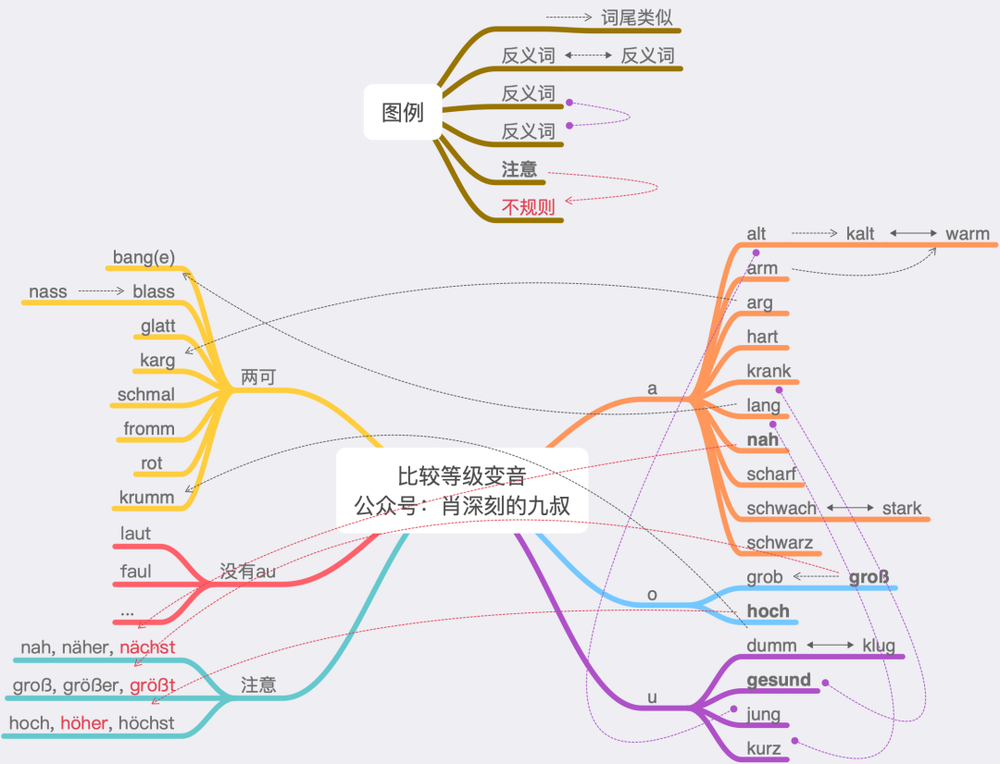

# 形容词

## 形容词比较级

形容词的原级就是原形。形容词的比较级由原级加-er，最高级由原级家-(e)st构成。

#### 不规则变化

| 原型 | 比较级 | 最高级 |
| :--: | :----: | :----: |
| gut  | besser |  best  |
| gern | lieber | liebst |
| viel |  mehr  | meist  |
| hoch | höher  | höchst |
| groß | größer | größt  |
| nahe | näher  | nächst |

### 变音

带a/o/u的单音节大概率是变音的。

德语有且只有29个单音节词能变音，在上图被分成了右边a/o/u的变音和左边两可（可变可不变）的情况。其中“两可”的情况不变音是趋势，那么左边9个词可以不算变音。有一个特例是gesund，是唯一的一个双音节。并且第一个音节是非重读的ge，进化不完全，这样四舍五入其实也可以算单音节。这么一来，那么可以说：德语有且只有21个单音节词能变音。

这21个词也比较好记。其中有6对反义词，也就是12个。再加3个词与其他词词尾类似，这样增加了arm, grob和groß这3个词，加上前面12个，小计15个。grob（粗糙的）和groß（大，高大）是有词源关系的，grob本义是颗粒大的。arg（恶，坏的）使用频率低，schwarz比较等级不常见，可以忽略。这样还剩下hoch, nah, scharf, hart（高进利硬）四个词，像一把40米的长刀，又**高**又**近**又**锋利**又**硬**。

除此以外的形容词，即使是单音节，带a/o/u，也不变音。例如voll的比较等级不变音（尽管有völlig这样的派生词）。

|  原型   |      比较级       |  最高级   |
| :-----: | :---------------: | :-------: |
|   alt   |       älter       |  ältest   |
|  jung   |      jünger       |  jüngst   |
|         |                   |           |
|  kalt   |      kälter       |  kältest  |
|  warm   |      wärmer       |  wärmst   |
|   arm   |       ärmer       |   ärmst   |
|         |                   |           |
|  lang   |      länger       |  längst   |
|  kurz   |      kürzer       |  kürzest  |
|         |                   |           |
|  krank  |      kränker      |  kränkst  |
| gesund  |     gesünder      | gesündest |
|         |                   |           |
|  stark  |      stärker      |  stärkst  |
| schwach | schwächer [ʃvɛçr] | schwächst |
|         |                   |           |
|  dumm   |      dümmer       |  dümmst   |
|  klug   |      klüger       |  klügst   |
|         |                   |           |
|  hart   |      härter       |  härtest  |
| scharf  |     schärfer      | schärfst  |
|  grob   |      gröber       |  gröbst   |

