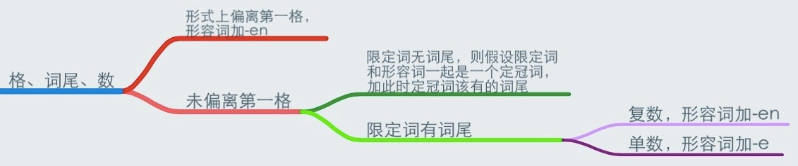
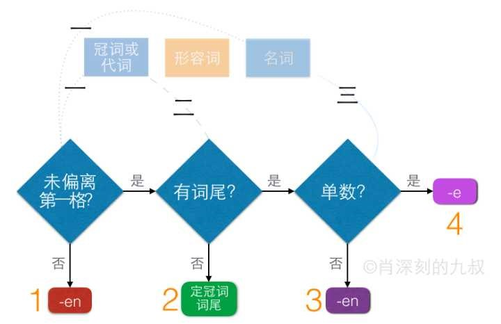

# 形容词变格

形容词变化完全不需要死记硬背。形容词变化的三个表格可以变成「格、词尾、数」三步判断，把一个记忆问题简化为三步逻辑判断，变得超级简单，如下。

第一步：判断限定词（冠词或代词）和中心词（名词）形式上有没有偏离第一格（其实，Deklination来自的拉丁语的意思就是「偏离」主格的意思），偏离第一格，则形容词词尾加-en。表中红色和橙色字体例子都是偏离第一格的：der Milch（注意：先不看形容词）是偏离的，因为第一格是die Milch。Rauchs偏离第一格（因为我们知道阳性的第二格是要加词尾-s或-es的），因为第一格是Rauch。das Wasser没有偏离第一格，即使它实际上是第四格，我们只管形式上没有偏离第一格。

如果形式上没有偏离第一格，则继续第二步：判断限定词（冠词或代词）有没有词尾，没有词尾，则把限定词和形容词整体看作一个定冠词，形容词加定冠词此时该有的词尾（有格变化）。表中绿色字体的例子没有词尾：Rauch没有限定词，也就没有词尾。皮之不存毛将焉附？kein Rauch没有词尾，因为kein没有词尾。keine Milch的限定词keine是有词尾的，词尾是-e。

限定词有词尾，则继续第三步：名词是复数，则形容词加词尾-en；名词是单数则形容词加词尾-e。这样我们听到die schöne 就能预判后面是个单数名词，听到die schönen 就能预判后面是个复数名词了，其实是很合理的语法规则。

特别提示：这三步判断不可跳跃！不能看到是个复数名词就直接越过前两步，加-en，也许他是无限定词的主格呢，那应该加-e。