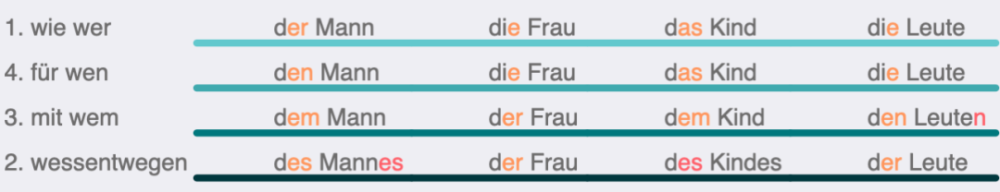

我们要先掌握“三个性四个格”的变化，这个是形容词变化的基础。这也是几乎所有德国原版教材在整个A1阶段慢慢渗透的内容：

看起来内容不多，但是初学的时候心理障碍很大，而且名词性属的规律要慢慢积累。要掌握这个表格，最重要的是：不能光背冠词，而要说整个介词结构。不能der, den ... 这样背，这样必然低效，而是要wie der Mann ... wegen des Kindes ... 这样在心里总结。也可以把er/sie/es的表格和这个表格结合起来，两个表格的词尾是一致的。

有了三个性四个格的基础后，课文中会出现形容词变化的大量例子，传统上会总结为弱变化、强变化和混合变化（不用紧张，术语不那么重要）三个大表格：

观察三个表格，我们容易得出：形容词变化的词尾只有三种，要么加-e（橙色线），要么加-en（紫色线），要么加定冠词三个性四个格的词尾（蓝色线），因为形容词强变化表格和冠词三个性四个格的表格高度重合，除了红色线部分不一致。

观察这三种词尾出现的环境可以得出：如果冠词有词尾，冠词承担了体现性数格的主要作用，那么形容词承担次要作用，要么加-e，要么加-en；如果冠词（也有人把mein这样的词叫代词）没有词尾，那么形容词就得承担表现性数格的主要作用，词尾变化基本和定冠词一致。这样可以把三个表格变成两步判断：

这个示意图上的颜色完全和形容词变化三个表格中的颜色相对应。

**第一步判断“冠词有无词尾”**，例如：

- wie der nett_ Mann 冠词有词尾，der词尾是er（定冠词自带词尾）；
- für nett_ Leute 没有冠词，当然也就没有词尾；
- wie eine nett_ Frau 冠词有词尾，词尾是e。
- für ein nett_ Kind 冠词没有词尾。

其中für nett_ Leute按上面的图示，应该加“定冠词此时该有的词尾”，也就是说，加入这个形容词是定冠词，这个时候应该用什么词，根据最前面三个性四个格的表格，应该是für die Leute，所以für nette Leute。

而für ein nett_ Kind 带入定冠词是für das Kind，所以是für ein nettes Kind。das的词尾算-es。

**第二步判断是否“第一格单数的模样”**，例如：

- (wie) der nett_ Mann 是第一格单数模样，der Mann 是第一格，所以形容词加-e（图中橙色圈）。
- (für) eine nett_ Frau 是第一格单数模样，eine Frau 是第一格的样子（尽管这里für加第四格），所以形容词加-e（橙色圈）。
- (für) keine  nett_ Leute 不是第一格单数模样，Leute是复数，所以形容词加-en（紫色圈）。
- (mit) einem nett_ Mann 不是第一格单数模样，einem Mann是第三格，所以形容词加-en（紫色圈）。

这两步判断有一个不足，或者说一个bug，那就是红色线部分，这个我们最好是用单独记忆的方式，记住Anfang letzten Monats/Jahres和schweren Herzens（怀着沉重的心情）两个例子，就明白无冠词的第二格阳性和中性情况下，形容词是加-en的。这个bug其实在定义有无词尾的时候是可以避免的，比如定义“有词尾”指的是“冠词或名词有词尾”，但是这样会带来复杂的问题，这样对少儿不友好，所以，宁可有个bug，单独挑出来记。

在上一版本的基础上调整了顺序，修改了措辞。这个版本仍然只有两步推理，但是消除了所有的特例和bug。并且有一种对称的美。

其中“无冠词但名词有第二格词尾”指的其实就是“无冠词的阳/中性单数第二格”。

最后那个八爪鱼一样的东西，指的是词尾只有这5种可能性。其实德语三性四格词尾就只有这5种情况，前面圈里的词尾在八爪鱼里也有。

### 特例

* lauter（纯粹，全然），不变格